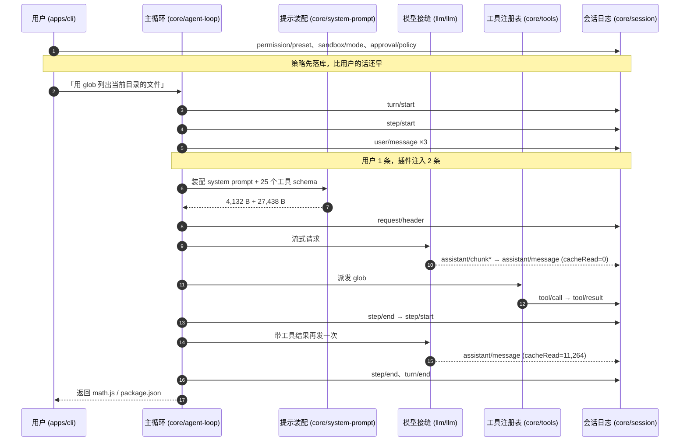

去年我想给 Claude Code 加一个东西：每次它改完文件，自动把 diff 发到团队群里。

这事听起来五分钟能干完。实际做法是写一个 PostToolUse hook，配一段 JSON，让它启动一个子进程，从 stdin 读一坨数据，解析，再决定要不要发。能跑，但一直觉得别扭——我想改的是「工具执行完之后」这个环节，可我碰不到它，只能在它旁边挂一个进程。

后来陆续还想加别的：换掉默认的上下文压缩策略、让工具执行走远程沙箱、在对话里插一个自己的卡片。这些都不是挂个 hook 能解决的。它们要动主路径，而主路径不对外开放。

DeepSeek Harness 给了另一个答案。下面把它装上，让它干一件事，然后看它在磁盘上留下了什么。

---

## 1.1 默认形态是浏览器，不是终端

```sh
npx @deepseek-ai/dsh web
```

打开 `http://127.0.0.1:3080`，是个本地 Web 应用。

Claude Code 和 Codex 都是终端工具，dsh 不是。它有终端形态，但那是另一个 profile，得单独启。默认形态是浏览器。

> **装不上的话**：dsh 依赖 `node-pty`，要编译。Ubuntu 20.04 默认的 g++ 是 9.4，不认 `-std=gnu++20`，直接报错。装个 GCC 10 就好：`CC=gcc-10 CXX=g++-10 npm i @deepseek-ai/dsh`。全程 4 分钟，532 个包。
>
> 另外 npm 上的 `latest` 是 `0.1.0-rc.6`，而 GitHub `master` 上那个 commit 写的是 `0.1.0-rc.5`——rc.5 从没发布过。你装到的比你能读到的源码新一小时。本书的行号都基于 `47f94385`，运行结果都基于 rc.6。

## 1.2 一句话的任务，日志里记了 35 件事

准备一个两文件的目录：

```
demo-project/
  math.js
  package.json
```

跑一句话：

```sh
dsh --profile headless 「用 glob 工具列出当前目录的文件，然后直接回答文件名」
```

输出：

```
math.js
package.json
```

答对了。不过更值得看的是它留下的记录。

会话写在 `$DSH_HOME/sessions/` 下，按 workspace 路径分目录，文件叫 `session.jsonl.zstd`。

这文件不能直接 `zstd -d` 解——解出来只有几百字节。它是**多个 zstd 帧首尾相接**的：日志只追加不重写，每次刷盘压一帧接在后面。想读全得逐帧解。我这次任务是 10 帧，压缩后 23,211 字节，展开 71,602 字节。

展开是 38 行 JSON，一行一个事件：

```
seq  事件                     内容
---  ----------------------  --------------------------------------
  0  permission/preset
  1  sandbox/mode
  2  approval/policy
  ...
  7  user/message            「用 glob 工具列出当前目录的文件...」
  8  user/message            "Current runtime context..."
  9  user/message            "<system-reminder>A skill..."
 13  session/title-llm-request
 14  session/title           List Files with Glob Tool
  ...
 22  tool/call               glob
 23  tool/result             isError=null
  ...
 33  turn/end                turn=1
```

一个 turn，两个 step：第一个 step 模型决定调 `glob`，第二个 step 拿到结果给答案。整个任务 **4.46 秒**。

盯住那两条 `assistant/message` 的用量：

- 第一个 step：`in=11258 cacheRead=0` —— 冷启动，11,258 个 token 全部重算
- 第二个 step：`in=58 cacheRead=11264` —— **11,264 个 token 命中缓存，只有 58 个是新的**

第二次请求带着第一次的全部内容（系统提示、25 个工具的 schema、消息、工具结果），几乎原样命中。**这就是前缀缓存在正常工作时的样子**，第 11 章会把它拆开算账。

完整的 38 个事件按参与方摊开是这样——括号里是这一跳落在哪个包：



**图 1-1：一次 headless 任务的事件流**（实测，原始日志见 `assets/ch01/session-trace.jsonl`）

## 1.3 日志里有三条我没说过的话

seq 7、8、9 是三条 `user/message`。我只说了一句话。

另外两条，一条叫「Current runtime context」，一条是 `<system-reminder>`。它们是插件塞进去的。

插件想让模型看见一段文字，没有走什么私有通道，而是**在会话日志里落了一条 `user/message` 事件**。

模型每次看到的对话历史，是拿这份日志现算出来的——`core/session` 里有个 `deriveMessages()`，每次发请求前扫一遍日志，把该给模型看的事件折成消息数组。日志里不是所有事件都会进去：`request/header`、`session/title` 这些只记账不进模型，`user/message` 和 `assistant/message` 才会。dsh 管进模型的那一部分叫 surface。

dsh 把这条规矩写成一句话：**model-visible ⟺ logged**。凡是模型能看见的，必须是日志里的一个事件。想给模型加一句话，就得新增一个事件类型。没有后门。

顺着这条规矩回头看，日志开头那三条也讲得通了。`permission/preset`、`sandbox/mode`、`approval/policy` 排在 seq 0、1、2，比我的第一句话还早。这次会话被允许做什么，是先记账再执行。

seq 13、14 更能说明问题。那是一次和主任务无关的模型调用——给会话生成标题，标题从截取首句的「用 glob 工具列出当前目录的文」变成了「List Files with Glob Tool」。这么一件边角小事，同样在日志里留两条记录。

这两次调用发出去的东西差别很大：生成标题那次只带了 363 字节的 system prompt，**一个工具都没带**；主链路每次都带满 25 个工具。同一个模型服务，两种用法，都归同一份日志管。

## 1.4 主循环也只是配置里的一行

一个插件凭什么能往会话日志里写东西？在别的 agent 工具里，会话日志是产品内部的实现细节。

答案在这条命令里：

```sh
dsh --profile web --dump-config
```

它什么都不启动，只把这台机器上将要启动的那棵插件树打印出来。我这里 490 行 YAML、129 个插件行，跑完 0.26 秒。

前 12 行：

```yaml
# == @deepseek-ai/dsh-base
- id: timer
  name: '@deepseek-ai/cordis-plugin-timer'
# == @deepseek-ai/dsh-base, patched by @deepseek-ai/dsh-web-app
- id: hmr
  name: '@deepseek-ai/cordis-plugin-hmr'
  config:
    root:
      - .
  disabled: true
# == @deepseek-ai/dsh-base
- id: llm
  name: '@deepseek-ai/dsh-llm'
```

`# ==` 开头的注释是 dump 自己加的，标的是下面这段行来自哪个文件、被哪些层改过。第 4 行那句说明了两件事：`hmr` 这一行是 `dsh-base` 放进来的，`dsh-web-app` 又改了一次，改成 `disabled: true`。Web 形态下热重载是关掉的。

**上层能顶掉下层的任何一行，dump 会告诉你是谁顶的。** 我这份 490 行的输出里有 24 处这样的层标记。

129 行看着多，归一下类就清楚了：

```yaml
# 内核与运行时
- id: timer                    # cordis-plugin-timer
- id: hmr                      # cordis-plugin-hmr（web 下 disabled）

# 模型（4 行）
- id: llm                      # 适配器注册表
- id: llm-pi-ai                # 多 provider 适配器
- id: llm-retry                # 重试策略
- id: agent-default-model
  config:
    provider: deepseek-official
    model: deepseek-v4-flash

# 会话（11 行）
- id: session                  # 事件日志本体
- id: session-persistence-jsonl
- id: session-title
- id: session-projection
  ...

# agent（5 行）
- id: agent                    # Agent 接口与注册表
- id: agent-loop               # 主循环
- id: agent-presets
  ...

# 工具（18 行）
- id: tool-bash
- id: tool-fs
- id: tool-fs-search
  ...

# 前端（32 行）
- id: modules                  # 客户端插件加载器
- id: ui-conversation
- id: ui-tool
  ...
```

`llm` 是一行。`session` 是一行。`agent` 是一行。**`agent-loop`——主循环本身——也是一行。**

这就是「一切皆插件」的字面意思。不是「有一个内核加很多插件」，是没有内核。你以为最核心的那个循环，和一个文件搜索工具在这棵树上地位相同，都是能被换掉的一行。

插件能往日志里写东西，是因为日志本身也是插件，谁都能用它。

## 1.5 四行 YAML 换掉整个模型接入

光看不算数。在 `$DSH_HOME/cordis.patch.yml` 里写四行：

```yaml
- id: agent-default-model
  config:
    provider: mock
    model: mock-sonnet
```

再 dump：

```yaml
- id: agent-default-model
  name: '@deepseek-ai/dsh-agent-default-model'
  config:
    provider: mock
    model: mock-sonnet
```

改掉了。没编译，没改源码，没 fork 任何包。

有个坑现在就得知道：**patch 按 id 定位，整体替换 `config`，不深合并**。原来那行有三个字段、你的 patch 只写一个，另外两个会消失，不是保留。想改一个字段，得把要保留的一起重写。

配置里还能写表达式。dump 里能看到这样的行：

```yaml
- id: session-persistence-jsonl
  config:
    root: !!js dshHomePath('sessions')
- id: session-telemetry-otel
  config:
    mode: !!js process.env.DSH_TELEMETRY_MODE || 'DISABLED'
```

`!!js` 标签的值在插件挂载时才求值，所以路径和开关能跟着环境走。它只在插件的 `config` 和 `disabled` 两个位置生效，别处一律当字面量。

**如果你手上没有 DeepSeek 的 key**，配套仓库里有一个 `examples/mock-llm-server`，它把本机的 `claude` CLI 包成 OpenAI 兼容接口。接上去写两条 patch：

```yaml
- id: llm-pi-ai
  config:
    providers:
      mock:
        api: openai-completions
        baseURL: http://127.0.0.1:3030/v1
        apiKeyEnv: MOCK_API_KEY
        models:
          - id: mock-sonnet
            contextWindow: 200000
```

接一个全新的模型端点，两条配置，零行代码。

用官方端点反而更简单——`dsh-base` 出厂就带 `llm-deepseek`，默认模型就是 `deepseek-v4-flash`，**什么 patch 都不用写**，把 `DEEPSEEK_API_KEY` 放进环境变量就行。1.2 节那次任务走的就是这条路。

> 本书的运行数据分两类：**标了 via mock 的**来自那个假端点（后端是 Claude，模型行为不代表 DeepSeek）；**没标的**来自 DeepSeek 官方端点，包括本章这次任务和第 11 章的全部缓存实验。凡是涉及缓存命中的数字，一律只用官方端点的。

## 1.6 web、headless、acp 是同一棵树的三种叠法

前面用了两个 profile：`web` 和 `headless`。还有第三个 `acp`，给编辑器集成用。

它们不是三个程序。profile 就是 `$DSH_HOME/profiles/<名字>/` 下的一个目录，里面只有两个文件。`web` 的 manifest 全文：

```json
{
  "name": "dsh-profile-web",
  "dsh": {
    "profile": {
      "bundles": ["@deepseek-ai/dsh-base", "@deepseek-ai/dsh-web-app"]
    }
  }
}
```

两层 bundle。`dsh-base` 是所有 profile 的第一层，模型、工具、持久化、沙箱、审批策略都在里面，451 行。`dsh-web-app` 在它上面加浏览器应用，顺手关掉 `hmr`，424 行。

`headless` 的第二层换成 `dsh-headless`，只有 35 行，出来就是个没有服务器的一次性执行器。

```mermaid
flowchart TB
    E[「空 entry list」]
    B1[「@deepseek-ai/dsh-base　451 行<br/>模型 / 工具 / 持久化 / 沙箱 / 审批」]
    B2[「第二层 bundle<br/>web-app 424 行 · headless 35 行」]
    P1[「profiles/&lt;名字&gt;/cordis.patch.yml」]
    P2["$DSH_HOME/cordis.patch.yml"]
    P3[「--patch 覆盖层」]
    R[「129 行插件树」]
    E --> B1 --> B2 --> P1 --> P2 --> P3 --> R
    style B1 fill:#e8f0fe
    style B2 fill:#e8f0fe
    style P2 fill:#fff4e5
    style R fill:#e6f4ea
```

**图 1-2：三层合成**（1.5 节改的是橙色那一层）

把 `dsh-web-app` 从那个数组里删掉，Web UI 就没了，别的照常。「产品形态由配置决定」在这里不是比喻。

`--dump-config` 用的是和真正启动完全相同的那个合成函数，所以它打印的树不可能和实际启动的树不一致。

## 1.7 一百二十九行里，三十二行是前端

回到浏览器，看网页源码，搜 `__DSH_BOOT__`：

```js
window.__DSH_BOOT__ = {
  "rev": "0ba0dcbd4d39",
  "entries": [
    {
      "id": "@deepseek-ai/dsh-typert-registry",
      "url": "/plugins/@deepseek-ai/dsh-typert-registry/client.js?rev=f41d56e0b747",
      "inject": []
    },
    {
      "id": "@deepseek-ai/dsh-api-gateway",
      "url": "/plugins/@deepseek-ai/dsh-api-gateway/client.js?rev=9e83e9d9c076",
      "inject": ["@deepseek-ai/dsh-typert-registry", "@deepseek-ai/dsh-client-connection"]
    }
  ]
}
```

38 个前端插件，每个有自己的 URL、内容哈希和 `inject` 依赖声明。URL 后面那个 `?rev=` 就是内容哈希，改一行前端代码哈希就变，浏览器自然拿到新的那份。

`inject` 这个词在 1.4 节那棵后端树里也出现过——它们是同一个东西。一个 npm 包可以有服务端一半和浏览器一半：服务端那半扫描已加载的插件、组出这张图注入页面，浏览器那半按依赖顺序激活。

回头数那 129 行：**32 行是前端插件，占四分之一。**

所以「一切皆插件」里的「一切」，是把浏览器也算进去的。

## 1.8 hook 改不动的东西，在这里是一行配置

从一个现象开始：dsh 跑完一个任务，往日志里写了三条我没说过的话。

追下去发现，插件要让模型看见什么，只能往日志里写事件。再追下去发现，日志本身、模型适配器、乃至主循环，都只是配置树上的一行。最后动手把模型换掉，四行 YAML，证明这些行确实能改。

这条链回答了开头那个问题。给 Claude Code 加东西只能挂 hook，是因为它的主路径不对外；dsh 没有「主路径」这个概念，因为它没有内核——所有部件平铺在一棵配置树上，谁都能被换掉，谁都能往日志里写。

开头那个「工具执行完之后把 diff 发到群里」的需求，在这里不用挂进程：往 `tools/post-execute` 上注册一个监听器就行，类型是通的，拿得到完整的执行结果，还能改它。

代价也摆在那儿。129 个插件挨个装起来，冷启动 1.34 秒、常驻 196 MB；改一个配置字段，得把整段重写一遍。这些账下一章算。

---

**本章数字**：采集于 2026-08-15，Ubuntu 20.04.6 / Node v24.14.0 / `@deepseek-ai/dsh@0.1.0-rc.6`，模型后端是 mock。每个数字的采集命令列在 [`assets/ch01/environment.md`](../assets/ch01/environment.md)，原始产物在 [`assets/ch01/`](../assets/ch01/)。你机器上的数字会不一样，重要的是量级。
