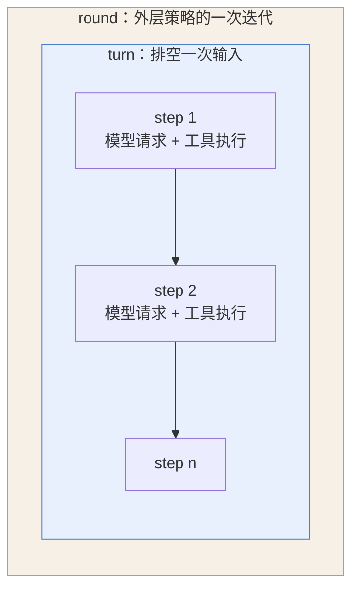

> 这一章不讲 dsh，讲的是所有 agent harness 都要解决的四个问题。**天天造 harness 的人可以直接跳到第 3 章**，只把 2.7 的对照表存下来。从后端转过来、或者只当过 agent 工具使用者的人，这一章值得花二十分钟——后面十九章的每个设计决策，都是在这四个问题上做的选择。

第 1 章结尾说，hook 改不动的东西在 dsh 里是一行配置。要理解这话为什么成立，得先知道 harness 到底在管什么。

## 2.1 模型只会做一件事，剩下全是 harness 的活

大模型的接口简单到有点乏味：给它一串 token，它吐一串 token。就这样。

它不记得上一次说过什么。它没法读文件、跑命令、访问网络。它甚至不知道自己「调用」了工具——它只是在输出里写了一段结构化文本，说「我想调 glob，参数是这些」，然后就停了。

从那一刻起到它下一次开口，中间所有的事都是 harness 干的：

| harness 干的活 | 具体是什么 |
|---|---|
| **攒上下文** | 决定这次请求里放哪些历史、哪些工具描述、哪些临时提示 |
| **发请求** | 拼出请求体、处理流式返回、重试、计量 |
| **执行工具** | 解析模型想调什么、决定准不准调、真去调、把结果塞回去 |
| **记账** | 把发生过的事记下来，让会话能续、能回放、能审计 |

「harness」这个词就是指这一层。它不是 SDK（SDK 是发请求的那一小块），不是框架（框架不替你决定上下文放什么），也不等于 Claude Code 这个产品——Claude Code 是一个 harness 加一套 UI 加一堆预设。

**这四件活里，每一件都有一个反直觉的地方。** 它们是后面所有架构分歧的根源。

## 2.2 上下文窗口是预算，不是缓冲区

第一次做 agent 的人容易把上下文窗口当成一个缓冲区：满了就清一清，没满就随便放。

它其实是预算。三个原因：

**它按次收费，不是按存储收费。** 一段 5,000 token 的历史，只要它还在上下文里，你**每次**请求都在为它付钱。放十轮就付十次。这和数据库缓存的成本模型正好相反——缓存是存着不要钱、读的时候才有开销。

**它有硬上限，超了就整个请求失败。** 不是降级、不是截断，是报错。所以 harness 必须在发请求前就估出这次会用多少，估不准就得留安全余量，而余量本身也是浪费。

**位置有价值。** 同样一句话，放在请求开头和放在最后，成本可能差几十倍。原因在下一节。

于是「往上下文里加东西」这个动作，在 harness 里从来不是免费的。第 1 章那三条 `user/message` 里有两条是插件注入的——每一条都在花读者的钱。dsh 把这件事做成了显式契约：任何进入模型请求的东西，都必须先在日志里落一个事件，跑不掉、藏不住。

## 2.3 请求前缀的顺序，直接换算成钱

现在的推理服务几乎都做前缀缓存：这次请求的开头如果和上次一模一样，那一段就不用重算，价格便宜一大截，延迟也低。

关键在「一模一样」这四个字。**匹配的是逐字节相同的前缀，从第一个 token 开始比，遇到第一个不同就停。** 后面哪怕再多相同的内容，也全部作废。

所以一个请求的结构大致长这样：

```
[ system prompt ][ 工具 schema ][ 历史消息 ...................... ][ 新消息 ]
 ←──────── 每次都一样，希望能命中缓存 ────────→  ←── 只增不改 ──→  ←新增→
```

理想情况是：稳定的东西全排在前面，变动的东西只往后追加。这样每次请求的公共前缀都比上次更长，缓存越用越划算。

一旦有人往 system prompt 里塞了一个会变的东西——比如当前时间、当前工作目录、当前权限模式——整个前缀从那个位置起全部失效。第 1 章测到的数字里，主链路每次请求带 4,138 字节 system prompt 加 26,288 字节工具 schema，这 30 KB 如果因为一个字段变了而重算，代价相当可观。

DeepSeek 自己踩过这个坑，而且量化了：他们本来把沙箱权限模式写在 system prompt 里，用户切一次权限，缓存命中就从一万四千多 token 掉到 **256 token**。修法不是优化文案，是把这段内容整个挪出 system prompt，挪到消息序列的末尾去。

**这件事的结论是：前缀里放什么、按什么顺序放，是架构决策，不是文案问题。** 第 11 章会把这条线单独展开。

## 2.4 工具调用的发起方是模型，不是你的代码

这是从传统后端转过来最容易拧的一个弯。

你写了二十年的代码，调用关系都是你定的：A 调 B，B 调 C，谁先谁后写在代码里。agent 不是。**是模型在决定调什么、传什么参数、调几个。你的代码只负责接住。**

控制权反过来了，跟着反过来的有四件事：

**参数不可信。** 模型给的 JSON 可能字段缺失、类型不对、路径越界。它不是恶意的，是它猜的。所以工具的入口必须有真正的校验，不能靠类型声明兜底。

**并发不是你排的。** 模型可能一次要调五个工具。这五个能不能同时跑？两个 `bash` 同时改一个目录会不会打架？harness 得替你判断，而且判断得保守——不确定就串行。

**结果要能被模型读懂。** 一个工具返回 500 KB 的日志，模型看不完还得为它付钱。harness 得有一套「结果太大怎么办」的策略。

**失败也是一种输出。** 工具报错不能让整个流程崩掉——那是模型的一次尝试，应该把错误信息交回给它，让它换个办法。

这四件事都不属于「工具本身的逻辑」，但每个工具都需要。**所以 harness 里必然有一条工具执行流水线**，你写的工具只是流水线上的一节。谁能往这条流水线上插东西、能插在哪几个位置，直接决定了这个 harness 的扩展能力上限。

## 2.5 日志当产物做，fork 和审计就得各写一遍

大多数 agent 工具的会话日志是这么来的：跑的时候顺手往文件里写一行，方便事后看。日志是**产物**。

这么做的代价，要到你想干别的事情时才显出来：

- 想 fork 一个会话，从第五轮分叉出去试另一条路 → 得单独实现一套「从历史重建状态」
- 想回放一次会话做测试 → 日志里没记模型请求的完整参数，回放不出来
- 想给合规团队一份审计记录，证明模型当时看到了什么 → 日志是给人看的，不是给机器核的
- 想统计成本 → 又得单独埋一套点

四个需求，四套实现，而且互相对不上——回放用的数据和审计用的数据可能是两份，谁也不敢说哪份是准的。

另一条路是把日志当成**源**：模型看到的历史不是另外攒的，就是从日志算出来的。这样上面四件事全都变成同一份数据的不同读法。

代价也很实在：任何要给模型看的东西，都必须先定义成一个日志事件类型。想加一句临时提示？不能直接拼进请求，得新增事件、改数据结构、处理旧日志的兼容。**开发摩擦明显变大，换来的是四种能力共享同一个真相。**

dsh 选了第二条。它把这条规矩写成一句话：**model-visible ⟺ logged**。第 7 章会讲清楚它是怎么被运行时强制的。

## 2.6 turn、step、round 是三层不同的时间单位

聊 agent 时最容易鸡同鸭讲的就是「一轮」。dsh 把它拆成了三个词，各有严格定义：

**step** —— 一次模型请求，加上这次响应引发的工具执行。这是最小单位。

**turn** —— 把已接收的输入排空的一整个过程，直到模型和它的工具都停下来，或者某个终止策略介入。**一个 turn 包含零到多个 step。**

零个 step 的 turn 是存在的：输入被拦截策略拒了，没发出任何模型请求，但这次尝试仍然被记进日志、关掉一个 turn。这个细节看着刁钻，其实是「日志是源」那条规矩的必然结果——发生过的事就得有记录，哪怕它什么都没干成。

**round** —— 外层策略的一次迭代，里面包着一个 turn。比如一次目标推进（goal round），或者一次全新子 agent 的尝试（Ralph round）。**round 的计数属于那个策略，不数会话里的每个 turn。**



**图 2-1：三层时间单位的包含关系**（定义见 `docs/glossary.md#loop-hierarchy`）

第 1 章那次任务是一个 turn、两个 step、零个 round——headless 跑一句话，没有外层策略参与。

## 2.7 黑话对照表

后面会反复出现的词，先在这里对齐。更完整的表在附录 C，那份表对齐了官方 `docs/glossary.zh.md` 的译法。

| 词 | 意思 | 别搞混 |
|---|---|---|
| **harness** | 模型之外的那一整层：攒上下文、发请求、执行工具、记账 | 不是 SDK，不是框架，也不等于某个产品 |
| **step** | 一次模型请求加它引发的工具执行 | 最小单位 |
| **turn** | 排空一次输入的全过程，含零到多个 step | 零 step 的 turn 是合法的 |
| **round** | 外层策略的一次迭代，包一个 turn | 计数属于那个策略 |
| **surface** | 日志里会进入模型请求的那部分事件 | 不是所有日志事件都进模型 |
| **seam（接缝）** | 一个能被整体替换的能力，由「接口 + 实现 + 使用方」三部分构成 | 单有接口不算接缝 |
| **fiber** | 一个插件的运行时实例，带生命周期状态和它注册过的东西 | **不是协程**，和 Boost.Fiber、Ruby Fiber、React Fiber 都无关 |
| **waterfall** | 一种事件分发方式，每个监听器可以选择放行、改写或拦下 | 和 webpack 那个同名钩子语义**相反**，详见第 6 章 |
| **KV cache** | 推理服务对请求前缀的缓存，逐字节匹配 | 匹配的是前缀，不是相似度 |

## 2.8 四个问题，四种答案

回过头看这一章讲的四件事：

上下文是预算，所以得有人管压缩和裁剪。前缀顺序值钱，所以得有人管什么排在前面。工具调用由模型发起，所以得有一条流水线管校验、并发和失败。日志当源还是当产物，决定了 fork、回放、审计是一套实现还是四套。

**每个 agent harness 都在回答这四个问题，区别只在于——它把答案焊死在内核里，还是做成能换的零件。**

Claude Code 和 Codex 选了前者，主路径的正确性握在自己手里，用户在预留的洞上挂东西。dsh 选了后者，四个答案全是配置树上的行。

这不是谁对谁错，是两种成本结构。下一章把这笔账算清楚。

---

> 本章来自《一切皆插件》开源版 · 作者「递归客」  
> 在线阅读完整书系：[inferloop.dev](https://inferloop.dev)  
> 源码仓库：[github.com/diguike/book-deepseek-harness](https://github.com/diguike/book-deepseek-harness)
