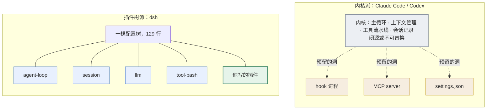
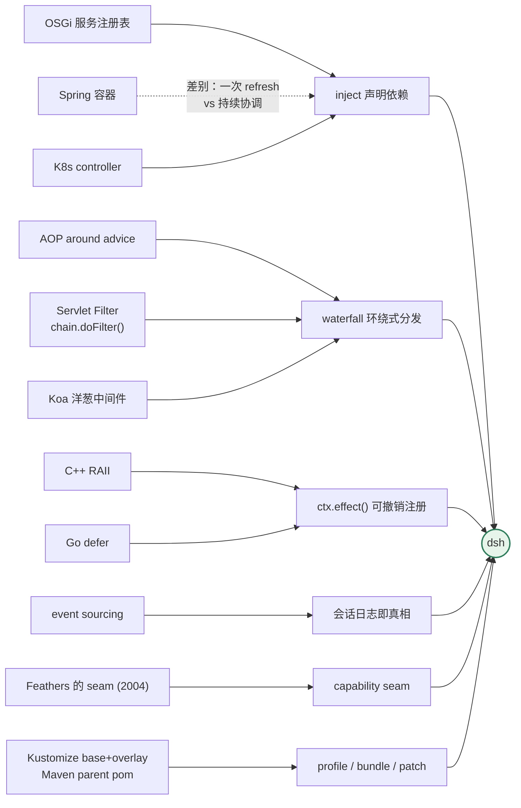

第 2 章说，每个 harness 都在回答四个问题：上下文怎么管、前缀怎么排、工具流水线怎么搭、日志当源还是当产物。

这一章看 DeepSeek 的答案，以及答案背后的账。

## 3.1 同一件事，四家做法的分野

先看结果，再看原因。

| | Claude Code | Codex | OpenClaw | dsh |
|---|---|---|---|---|
| **主循环能不能换** | 不能 | 不能 | 不能 | **能**，`ctx.agentLoop` 只是一个实现 |
| **加一个模型 provider** | 内置 + 网关兼容 | 配置里加 | 配置里加 | **装一个 npm 包** |
| **加一个工具** | MCP server | MCP server | 内置 + 渠道扩展 | **一个 npm 包 `tool-*`** |
| **拦截工具执行** | hook，进程边界 + JSON | hook，能力较窄 | 内部扩展点 | **进程内三段瀑布 + 单调守卫** |
| **改模型看到的消息** | 有限（几个 hook 位） | 有限 | 有限 | **`agent/pre-step`，可改写也可拒绝** |
| **换上下文压缩策略** | 不能 | 不能 | 可配 | **换一个包** |
| **会话状态归谁** | 产品内部实现 | 产品内部实现 | 产品内部实现 | **append-only 日志本身就是契约** |
| **执行环境搬到远端** | 无统一接口 | 无统一接口 | 无统一接口 | **换两个 provider，工具零改动** |
| **前端能不能扩展** | 不开放 | 不开放 | 不开放 | **前端也是插件，129 行里占 32 行** |
| **配置模型** | settings.json 多层深合并 | config.toml + profile | 配置文件 | **bundle → profile → home → --patch，整体替换** |

> Claude Code 闭源，该列只写公开可见的行为。

表里有两个词先记个大概：**三段瀑布**指工具执行前、执行、执行后三个都能挂拦截的位置；**单调守卫**是其中一道只能拒绝、不能放行的关。两个都在第 10 章展开。

这九行差异的根源是同一件事——扩展点摆在哪儿（图 3-1）。

**图 3-1：扩展点的位置决定了扩展能力的上限**。左边你只能碰到预留的洞，右边你写的插件和 `agent-loop` 在树上地位相同

看最后一行之前，前面九行的结论是一致的：**别人给你留了洞，dsh 没有「洞」这个概念，因为它没有墙。**

代价就在最后一行开始的地方。下面六条，每条都写清楚得到什么、放弃什么、怎么补偿，以及——**这条会不会变**。最后一问尤其重要，因为你正在读的是一个 `0.1.0-rc` 阶段的项目。

## 3.2 没有内核，代价是启动过程读不懂

**得到**：产品的每一层都能被换掉。模型适配器、工具注册表、会话日志、主循环，在配置树上地位相同。产品形态由配置决定——`web`、`headless`、`acp` 是同一份代码的三种叠法。

**放弃**：你没法通过读代码搞清楚启动顺序。

传统程序有个 `main()`，从上往下读就知道什么时候初始化什么。dsh 没有这种东西。插件的激活顺序**由服务可用性驱动**：一个插件声明它需要 `ctx.llm`，那它就等着，直到有人提供了 `ctx.llm` 才激活。谁先谁后，取决于依赖关系解析的结果，不取决于配置里的行序。

`dsh-base` 那 451 行 patch 的文件头注释把话说死了：

> Row order carries no load semantics（行序不携带加载语义）；the grouping is for readers（分组只是为了方便阅读）。

对读代码的人来说，这意味着「从哪读起」没有标准答案。你不能顺着调用链走，只能从服务名反查谁提供、谁消费。

**怎么补偿**：两个工具。`--dump-config` 让你看到最终的树；启动时的 `assertEntriesActivated` 会在有插件卡住时报出它缺哪个服务——这是排查「我的插件为什么没反应」的主要抓手。

**还有一个边界要说清楚**：「没有特权内核」这句话在产品语义上成立，在系统语义上不完全成立。引导层——`packages/boot/app-boot` 和 `apps/cli`——不在配置树上。它负责创建根上下文、装 Loader、静态注册 `cordis:include` 和 `cordis:group` 两个内置项、跑完整棵树的挂载与校验。这一层没法被自己 patch 掉。另外每个 profile 的第一层固定是 `dsh-base`。

**会不会变**：不会。这是整个项目的立身之本，改了就不是 dsh 了。

## 3.3 日志当源，代价是加一句话就要改数据结构

**得到**：fork、resume、回放、审计、遥测，五件事共享同一份数据。第 1 章那次任务里，用户输入、插件注入的上下文、生成标题的旁路调用、权限策略，全在同一条流里，顺序明确、有序号。

**放弃**：开发时的摩擦。

想给模型加一句临时提示，在别的 harness 里是拼个字符串的事。在 dsh 里得走完整套：往 `SessionEventMap` 加一个事件类型、决定它进不进 surface、想好旧日志读到这个新类型会怎样。

而且日志格式的读取规则是**严格的**：不认识的事件类型默认让整份日志加载失败，除非那个事件明确标了 `ignorable: true`。宁可拒绝，也不静默丢掉上下文——因为静默丢掉意味着「日志是源」这条规矩已经破了，后面所有基于它的推论都不成立。

代价还有一层：`SESSION_FORMAT_VERSION` 目前是 `0`，官方明说**没有兼容承诺**。你今天攒的会话日志，就是你的审计资产，而它现在没有格式保证。

**怎么补偿**：运行时有断言在守。第 9 章会给出那条等式——每个由主循环发出的请求，它的消息数组必须逐字节等于从日志推导出来的结果。破了这条规矩，运行时会抓到。

**会不会变**：规矩不会变，格式会变。`SESSION_FORMAT_VERSION: 0` 摆在那儿就是在说「还会改」。

## 3.4 进程内瀑布，代价是插件必须同语言同进程

**得到**：拦截是类型安全的，没有序列化开销，能改写模型看到的消息，而且注册可以撤销。

对比一下同一件事的两种做法。Claude Code 的 hook 是：启一个子进程，通过 stdin 递一段 JSON，读它的退出码和 stdout 来决定放行还是拦截。dsh 的做法是：往 `tools/pre-execute` 上注册一个函数，参数是带完整类型的执行对象，返回值直接影响流水线，插件卸载时这个注册自动撤销。

**放弃**：插件必须是 TypeScript/JavaScript，必须跑在同一个进程里。写不了 Python 插件，插件崩了会影响宿主。

Claude Code 那套进程边界的做法，换来的正是这两点——语言无关，故障隔离。这是实打实的优势，不能装作看不见。

**怎么补偿**：dsh 同时提供了两条兜底路径。`hooks-claude-code` 和 `hooks-codex` 两个包能直接跑你现有的 CC / Codex hook 配置，把它们接到 dsh 的拦截点上；`mcp-client` 让 MCP server 照常用。

有意思的是官方对自家这个桥的态度。`hooks-claude-code` 的 README 原话是：一个原生 cordis 插件能做到这个桥做的一切，而且更强、有类型返回、没有序列化边界；**这个桥的存在意义只是兼容路径**，任何自定义的东西都应该写成原生插件。

**会不会变**：不会。这是架构的地基。

## 3.5 patch 整体替换，代价是改一个字段要重写一整段

**得到**：一行配置的来源永远唯一可追。dump 输出里每段前面的 `# ==` 注释会告诉你这段来自哪个文件、被哪些层改过。而且 dump 和真正启动用的是**同一个合成函数**，所以打印出来的树不可能和实际启动的树不一致。

**放弃**：配置人体工学。

`settings.json` 那种深合并里，你想改一个字段就只写那一个字段。dsh 不行——patch 按 id 定位，命中之后**整体替换**这一行的 `config`。原来有三个字段、你只写一个，另外两个会消失。

想只改一个字段？把要保留的一起重写一遍。

这条在实际使用中的摩擦是真实的，也是社区最容易吐槽的一点。

**怎么补偿**：几乎没有补偿，只有一个减轻手段——`--dump-config` 会打出完整的当前值，你可以从那里复制粘贴。

**会不会变**：**这是六条里最可能变的一条。** 它是纯粹的取舍，不是地基，而且用户痛感明显。一旦官方改成深合并，第 12 章的核心论证和本节同时失效。我在第 12 章会讲清楚整体替换在数学上为什么更干净，但那个「更干净」未必抵得过日常的不方便。

## 3.6 vendor 一个 rc 版框架，代价是每次升级要重放补丁

dsh 底下那个插件框架叫 Cordis，不是 DeepSeek 写的。它来自 cordiverse 项目，dsh 用的是 `4.0.0-rc.7`。

DeepSeek 没有从 npm 装它，而是把源码整个复制进了仓库的 `vendor/` 目录，还重命名到自己的 npm scope 下（`cordis` → `@deepseek-ai/cordis`）。

**得到**：不用自己发明依赖注入、热重载、配置协调这套东西。整个 vendor 目录九个包加起来 6,550 行，其中 Cordis 核心只有 **2,693 行**——一个下午能读完。相比之下 `packages/` 下的产品代码是 49.6 万行。

**放弃**：供应链上的自主性变成了维护成本。`vendor/README.md` 里逐条记着 **18 条本地修改**，其中 3 条动到了 Cordis 核心。最重的那条是 fiber 生命周期加固，自述「封掉了三类重入卸载缺陷」。每次要跟上游同步，这些补丁都得重放一遍。

而且被 vendor 的是一个 **rc 版本**。

**关于那篇论文，得说清楚**：Cordis 有一篇配套论文《A Programming Paradigm for Spatiotemporal Composability》，dsh 的 README 直接链了它。但两件事必须讲明白——它是**预印本**，仓库自述内容可能大改；它的评估对象是 Koishi（Cordis 的另一个下游），**不是 dsh**。

所以「有论文背书所以更可靠」这个推理链不成立。论文讲的是那套演算，dsh 用的是打了 18 条补丁的 rc.7 实现，中间隔着一层。这本书会在第 5 章把论文里的概念和源码里的行号对上，但不会拿它当质量证明。

**会不会变**：版本会变，vendor 这个策略不会。

## 3.7 默认开在浏览器，代价是终端用户不买账

**得到**：前端也能是插件。对话界面里的每一种卡片都可以由插件贡献，一个 npm 包可以有服务端一半和浏览器一半。第 1 章数过，129 行插件树里有 32 行是前端。这在终端 UI 里做不到。

**放弃**：习惯了在终端里干活的人得改习惯。Claude Code 和 Codex 都是终端优先，用户的肌肉记忆、tmux 布局、ssh 工作流全在那儿。

而且 dsh 目前**没有官方的 TUI profile**——文档里出现过的 `--profile tui` 只是个假设例子，不是现成的东西。想要终端形态，要么用 `headless` 跑一次性任务，要么自己组一个。

**怎么补偿**：`headless` 和 `acp` 两个 profile 覆盖了脚本化和编辑器集成两个场景。真要 TUI，插件树是开放的，自己搭。

**会不会变**：可能会补上官方 TUI，但默认形态不会从浏览器换回终端——前端插件化这个能力就是靠它换来的。

## 3.8 这些概念一个都不新

上面六条听着新鲜，其实每一样都能在软件史上找到出处。

- **服务注册表 + 声明依赖**：OSGi 的服务注册表和 Declarative Services 三十年前就在做这件事。Spring 的容器也是。差别在于 Spring 启动时 refresh 一次就定型，Cordis 是持续协调的——依赖变了会连带重启消费者，更接近 Kubernetes 的 controller。
- **`waterfall` 这种拦截**：就是 AOP 的 around advice，也是 Servlet Filter 的 `chain.doFilter()`、Koa 的洋葱中间件、Rack 的 middleware。写过 Java 的人对这个模型的直觉是完备的：调 `next()` 等于放行，不调等于在 Filter 里直接把 response 写了。
- **注册可撤销**：C++ 的 RAII、Go 的 `defer`、Python 的 `ExitStack`。差别只在作用域——那些是函数栈，Cordis 是插件生命周期。
- **日志当源**：event sourcing。不过 dsh 有两处和主流做法相反，第 7 章会讲。
- **接缝（seam）**：这个词有明确出处，Michael Feathers 在《修改代码的艺术》(2004) 里定义的——"a seam is a place where you can alter behavior in your program without editing in that place"。dsh 的用法和原义完全吻合。
- **配置分层**：Kustomize 的 base + overlay，Maven 的 parent pom。`--dump-config` 对应的就是 `kustomize build` 或者 `mvn help:effective-pom`。

**图 3-2：六个机制各有出处**，dsh 的新意不在任何单项，而在于把它们全用上之后不给自己留内核

**真正新的只有一件事：把这些东西全部用上，并且不给自己留一个特权内核。** 别的项目会说「核心逻辑我们自己管，扩展点开给你」，dsh 说的是「没有核心逻辑这个东西」。

这不是技术创新，是一个组织决定——**放弃对主路径的控制权**。它带来的所有好处和所有麻烦，都是从这个决定长出来的。

## 3.9 六条里哪几条会变

写一本关于 rc 版项目的书，最诚实的做法是把每条结论的保质期标出来。

| 取舍 | 会不会变 | 依据 |
|---|---|---|
| 没有特权内核 | **不会** | 立身之本 |
| 日志当源 | 规矩不会，**格式会** | `SESSION_FORMAT_VERSION: 0`，官方明说无兼容承诺 |
| 进程内瀑布 | **不会** | 架构地基 |
| patch 整体替换 | **最可能变** | 纯取舍、痛感明显、社区吐槽集中 |
| vendor 框架 | 版本会变，策略不会 | 已有 18 条本地补丁在维护 |
| 默认 Web UI | 可能补 TUI，默认不换 | 前端插件化依赖它 |

第四条一旦变了，这本书的第 12 章要重写，本章 3.5 节要作废。我把话留在这儿，勘误页会跟进。

---

到这里你知道了 dsh 是怎么想的，也知道了代价。还差一个问题：**你的团队该不该上。**

那是一个和技术判断不同的问题，答案取决于你们有多少人、能承受多大的锁定风险、以及——今天的 dsh 到底能不能给一个团队用。下一章有三条硬事实要摊开讲。

---

> 本章来自《一切皆插件》开源版 · 作者「递归客」  
> 在线阅读完整书系：[inferloop.dev](https://inferloop.dev)  
> 源码仓库：[github.com/diguike/book-deepseek-harness](https://github.com/diguike/book-deepseek-harness)
