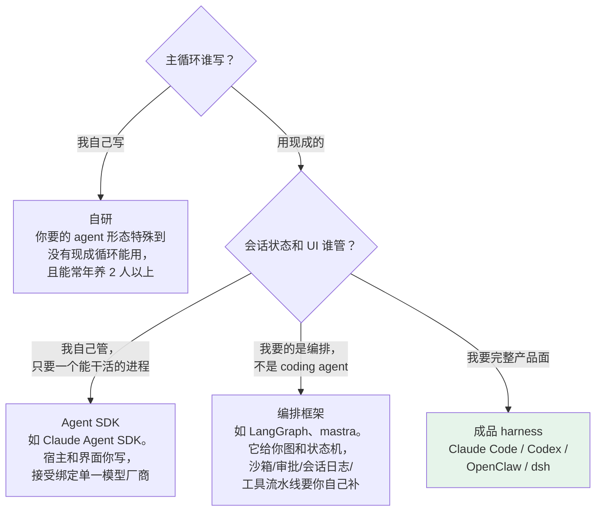

第 3 章讲的是 dsh 怎么想的。这一章讲的是另一件事：**你要不要用它，以及用之前得知道什么。**

如果你是来做技术选型的，这一章是全书对你价值最高的一章。它有三条硬事实、一棵决策树、一张成本表和一份锁定风险清单。读完能开选型会。

## 4.1 今天的 dsh 不是给一个团队用的服务端产品

先说最重要的一件事，它会改变你的整个方案形状。

`dsh web` 起来之后监听在 `127.0.0.1:3080`，你自然会想：改个 `--host 0.0.0.0` 让全组人都能用。

**这条路是被官方主动堵死的。** 三处源码，逐字摘录：

`packages/host/apiproxy/README.md:81`：

> the gateway is a **single-user local service**

`packages/host/webserver/README.md:21`：

> **No TLS, auth, or origin policy** — binding a non-loopback address exposes the server to that network; deployment hardening (or fronting it with a real reverse proxy) is deliberately out of scope for the dev-facing v1.

`packages/client/connection/README.md:9`：

> `dsh web --host 0.0.0.0` is intentionally unsupported until remote access has an authentication layer. **The fence is a reachability policy, not authentication**; the Web carrier provides no authentication layer.

第三条说的「fence」是指它确实有一道防线——每个 `/api` 请求都要校验 `Host` 头，必须是回环地址或者显式声明过的可信主机，用来防 DNS rebinding。但那道防线管的是「谁能连上」，**不管「你是谁」**。没有登录，没有用户，没有权限隔离。

翻译成选型语言：

> **今天的 dsh 不是一个能让 300 人用的服务端产品。它是一个可以被嵌进你自己服务端的引擎。**

这句话决定了后面所有事。你要做的不是「部署 dsh 给大家用」，而是「用 dsh 当内核，外面套一层你自己的服务」。那一层负责认证、租户、配额、审计外送。

好消息是这条路是通的，而且是官方设计过的：`packages/sdk/server` 提供了一个 JSON-RPC over stdio 的服务端插件，配套有 TypeScript 客户端和 Python SDK。你的服务把 dsh 当子进程拉起来，通过 stdio 驱动它。第 18 章整章讲怎么搭。

## 4.2 先判断你要的是哪一类东西

市面上被叫做「agent 框架」的东西不在同一个抽象层上，硬拉到一张表里比会失真。先分类，再比较。

判据只有一条：**主循环归谁、会话状态归谁。**

**图 4-1：四类方案的分野**

编排框架那一支容易被误选。LangGraph 和 mastra 解决的是「多步工作流怎么编排」——图、状态机、人工审批断点。它们**不提供**沙箱、审批策略、会话日志契约、工具执行流水线。如果你要的是「给工程师一个能改代码的 agent」，选它意味着上面那四样全得自己写。

选定了「成品 harness」这一支，再看四家的分野——第 3 章开头那张表就是干这个用的。

## 4.3 我要做 X，得写多少代码

这是选型会上最实际的问题。按 dsh 的接缝结构，答案分四档：

| 你要做的事 | 工作量 | 落在哪 |
|---|---|---|
| **接自建网关 / 换模型厂商** | 一条配置，或一个 adapter 包 | `ctx.llm`，第 8 章 |
| **加一个内部工具** | 一个 `tool-*` 包 | `ctx.tools`，第 14 章 |
| **拦截工具执行（审计、加策略）** | 一个监听器插件 | `tools/pre-execute` / `post-execute`，第 10 章 |
| **改模型看到的上下文** | 一个监听器插件 | `agent/pre-step`，第 9 章 |
| **换上下文压缩策略** | 一个 provider 包 | `ctx.compaction`，第 15 章 |
| **把执行搬进隔离环境** | 换 fs + subprocess 两个 provider，工具零改动 | 第 13 章 |
| **换审批到公司的审批系统** | 一个 provider | `ctx.approval`，第 10 章 |
| **加一种对话卡片** | 一个包，服务端半 + 浏览器半 | 第 17 章 |
| **接 SSO / 多租户 / 配额** | **没有接缝，得在外面套一层** | 第 18 章 |

前八行是配置或者一个小包。最后一行是这张表里唯一的例外，也是最容易被忽略的一行——**它不是 dsh 的扩展点，是你自己服务的活。**

一个粗略的量级判断：把 dsh 接进现有平台，前八项里的任何一项在熟悉之后是**天**级的工作量；第九项是**周**级的，而且和 dsh 关系不大，是你自己那层服务的复杂度。

## 4.4 锁定风险有三条，第三条是一票否决级的

**第一，版本还在 rc。** `0.1.0-rc.5`，README 里那句是全大写的：THERE WILL BE COMPATIBILITY-BREAKING CHANGES。仓库的 AGENTS.md 里还有一节写着「首个正式 release 时删掉本节：目前没有外部消费者，宁可重命名、重打包也不加兼容垫片」。

**第二，官方不接受外部 PR。** `CONTRIBUTING.md` 原文：

> DeepSeek Harness is still at an early stage and under active development. We are sorry that we cannot accept external pull requests at the moment.

反馈走 GitHub Discussions，另外鼓励大家把插件发出来、打 `dsh-plugin` 这个 topic。

这条对平台团队的含义很具体：**你所有的定制只能活在树外插件和 patch 里，上游不会替你合。** 好的一面是这套架构本来就是这么设计的——不收 PR 和「一切皆插件」是配套的，你根本不需要改上游。坏的一面是，如果你发现了一个内核 bug，你只能提 Discussion 然后等。

**第三，会话日志没有格式承诺。** `SESSION_FORMAT_VERSION` 是 `0`，官方明说无兼容承诺。

这条最容易被漏掉，但对合规团队是一票否决级的信息：**在 dsh 里，会话日志就是你的审计资产**——模型看到了什么、执行了什么命令、谁批准的，全在那份 JSONL 里。而它现在没有格式保证。

如果你的场景要求审计记录长期可读，得自己做一层导出：把日志按你们自己的 schema 落到你们的存储里，别直接依赖 dsh 的原始格式。`session-telemetry` 那个接缝就是干这个的入口，第 7 章会讲，但**它自带零脱敏规则**，这一点第 18 章会重点说。

**第四，边缘包的版本会掉队，而且 peer 约束让它们装不上。**

这条是我实测撞到的。核心包在 `0.1.0-rc.6`，但下面这批发到 npm 的版本停在 `0.0.1-rc.1`：

| 包 | npm 版本 | 是什么 |
|---|---|---|
| `dsh-subagent-claude-code` | `0.0.1-rc.1` | 把 Claude Code 挂成子 agent |
| `dsh-subagent-codex` | `0.0.1-rc.1` | 把 Codex 挂成子 agent |
| `dsh-subagent-acp` | `0.0.1-rc.1` | 通过 ACP 连出去 |
| `dsh-subagent-dsh-sdk` | `0.0.1-rc.1` | 另一个 dsh 进程 |
| `dsh-tool-cordis` | `0.0.1-rc.1` | 运行时自修改 |

**装不上**——peer 依赖范围和当前内核对不上，`npm i` 直接拒绝。用 `--legacy-peer-deps` 强装会把整个装置弄坏（详见第 16 章 16.2）。

含义很实际：**你在源码里读到的能力，不等于你在 npm 上能装到的能力。** 做选型时，凡是关键功能都要自己先跑一遍 `npm view <包> version` 确认版本，再试装。

## 4.5 这四类团队该上，这三类不该

判断标准不是团队大小，是你要解决的问题形状。

**该上：**

- **你要给多个团队提供 agent 底座，而各团队的需求不一样。** 这正是「产品形态由配置决定」的用武之地：平台发一套基础 bundle，各团队叠自己的 patch 层。
- **你有合规或审计要求，需要证明模型当时看到了什么。** 「日志是源」这条规矩让这件事变成读一份数据，而不是拼四份数据。
- **你要把 agent 的执行放进隔离环境。** 换两个 provider 就把 Bash、PTY、LSP 整体搬走，工具代码一行不改。这个能力在别处要改产品。
- **你已经在自研 harness，正在为主循环的扩展性头疼。** 哪怕最后不用 dsh，第 5 到 13 章那套接缝设计也值得抄。

**不该上：**

- **你只是想让工程师用上 agent 编码工具。** 那就用 Claude Code 或 Codex。dsh 的概念负担明显更重——要同时理解服务可用性驱动的加载、`waterfall` 的 `next()` 语义、patch 不深合并、`surface` 和日志的关系。为了一个不需要扩展的场景付这个学费不划算。
- **你需要一个今天就能对外提供服务的多用户系统。** 见 4.1 节。外面那层得你自己写，而且没有现成参考。
- **你的团队没有人能常年跟进一个 rc 项目的破坏性变更。** 不收 PR 加上没有兼容承诺，意味着升级这件事得有人负责。三五个人的团队要掂量一下。

## 4.6 上之前先做这三件事

如果决定试，建议按这个顺序，每一步都有明确的止损点：

**第一步，跑通 4.3 表格里和你最相关的那一行。** 别一上来搭平台。挑一个真实的小需求——接自建网关，或者加一个内部工具——用一天时间跑通。这一步验证的是「这套扩展模型对我们的需求成不成立」。

**第二步，把 `--dump-config` 的输出存进版本库。** 这是你后面所有升级的 diff 基线。rc 阶段的破坏性变更，大部分会先反映在这棵树的变化上。

**第三步，写一份「我们能不能承受这个代价」的自评。** 拿第 3 章那六条取舍逐条问：

| 取舍 | 我们能承受吗？ |
|---|---|
| 启动过程读不懂，只能靠 dump 和报错定位 | |
| 加一句模型可见的话要改数据结构 | |
| 插件必须是 TS 且同进程，崩了影响宿主 | |
| 改一个配置字段要重写一整段 | |
| 底层框架是打了 18 条补丁的 rc 版 | |
| 默认是 Web UI，没有官方 TUI | |
| 会话日志没有格式承诺（自评：审计要求有多硬） | |
| 上游不收 PR，定制只能活在树外 | |

八行填完，答案通常就出来了。填不出来的行，说明那件事你们还没想清楚，先别上。

---

第一部分到此结束。你现在知道 dsh 长什么样、它怎么想、代价是什么、该不该上。

从下一章开始换一种读法：不再是看它，而是**动手写一个**。第二部分用 TypeScript 从零重建 dsh 的骨架，六章下来能跑通一个真实任务。目的不是造轮子——是把第 3 章那六条取舍，从道理变成手感。

---

> 本章来自《一切皆插件》开源版 · 作者「递归客」  
> 在线阅读完整书系：[inferloop.dev](https://inferloop.dev)  
> 源码仓库：[github.com/diguike/book-deepseek-harness](https://github.com/diguike/book-deepseek-harness)
