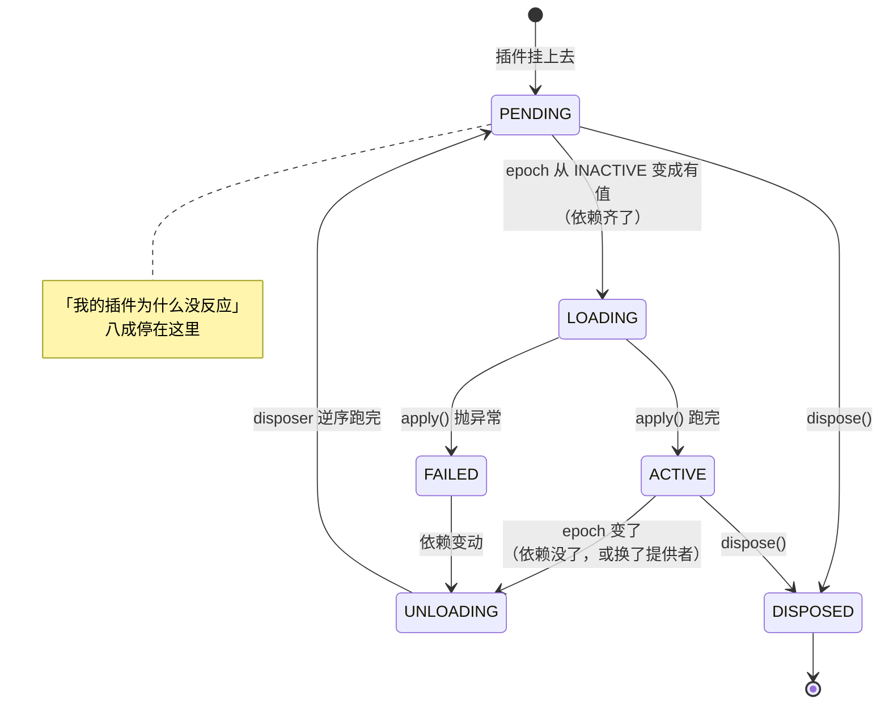
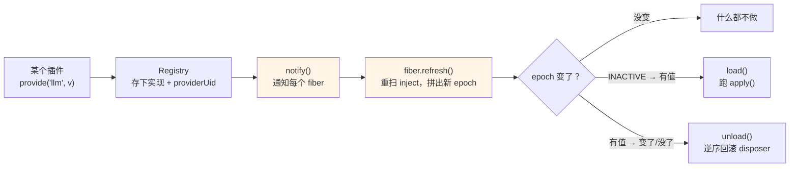

> 本章形态：【必写】。写约 180 行，两到三小时。
> 跳过的后果：第 6、9、12 章的代码都长在这上面，跳了后面看不懂 fiber 状态是怎么来的。
> 起点 `git checkout ch05-start`，参考答案 `ch05-done`，自检 `pnpm verify:ch05`。

第 3 章说，「没有内核」的代价是启动过程读不懂——插件的激活顺序由服务可用性驱动，不由配置里的行序驱动。

这句话听着像个说法。这一章把它拆开：**到底是什么机制让 451 行配置的行序不重要？**

答案是一个字符串。

> **和官方文档的分工**：`docs/cordis-tutorial/` 有 7 课时的教程教你**用** Cordis，`docs/user/develop/` 有 9 篇中文教程教你**写插件**。这一章做第三件事——把它重新实现一遍。只有亲手写过 epoch 怎么算、状态怎么推导，第 3 章那句「行序不携带加载语义」才会从道理变成手感。

## 5.1 一个插件挂上去，不一定会跑

先看现象。挂两个插件，消费者在前、提供者在后：

```ts
const ctx = new Context()

ctx.plugin({
  name: 'consumer',
  inject: ['llm'],                       // 声明：我需要 llm
  apply: (c) => console.log('用上了', c.llm),
})

ctx.plugin({
  name: 'provider',
  apply: (c) => c.provide('llm', 'v1'),  // 提供 llm
})
```

输出是 `用上了 v1`。挂载顺序是消费者在前，执行顺序是提供者在前。

再看反过来的情况：如果 `provider` 那行不存在，`consumer` 的 `apply` **一次都不会执行**。它不报错，不重试，就停在那儿。

这两个行为合起来就是 dsh 那句话的全部含义：

> Row order carries no load semantics（行序不携带加载语义）
> —— `packages/bundle/base/cordis.patch.yml` 文件头

所以 `dsh-base` 那 451 行想怎么排就怎么排，分组只是给人看的。

## 5.2 fiber 是插件的运行时实例，不是协程

要实现上面的行为，得先有个东西记住「这个插件现在活成什么样」。Cordis 管它叫 **fiber**。

**这个词有坑。** 工业界的 fiber 通常指用户态协程——Boost.Fiber、Ruby 的 Fiber、Java Loom 的虚拟线程；前端还有第三个意思，React Fiber 是一个工作单元。

Cordis 的 fiber 和这些**一个都不沾**。它是：

- 一个插件的一次实例化
- 加上它当前的生命周期状态
- 加上它注册过的所有东西（卸载时要逆序回滚）
- 加上它依赖的服务当前由谁提供

要找个类比的话，最近的是 OSGi 里 bundle 的生命周期状态（INSTALLED / RESOLVED / ACTIVE），或者 Spring 的 bean 生命周期。**跟执行流没关系。**

六个状态，和真 dsh 完全一致（`vendor/cordis/src/fiber.ts:147`）：

```ts
export const FiberState = {
  PENDING: 'PENDING',      // 依赖没齐，等着。插件体一次都没跑过
  LOADING: 'LOADING',      // 依赖刚齐，插件体正在跑
  ACTIVE: 'ACTIVE',        // 跑完了，它注册的东西都生效了
  FAILED: 'FAILED',        // 插件体抛了异常，不会自动重试
  UNLOADING: 'UNLOADING',  // 正在卸载，注册过的东西正在逆序回滚
  DISPOSED: 'DISPOSED',    // 已移除，不会再启动
} as const
```



**图 5-1：fiber 的六个状态**。除 DISPOSED 外的每一次流转，起因都是 epoch 变了

**`PENDING` 是排查问题时最常见到的那个。** 官方教程第 2 课自己写着：PENDING 通常就是「为什么我的插件没有输出」的答案。

## 5.3 状态是算出来的，不是存的

现在到了本章最值钱的一处设计。

直觉的做法是把 `state` 当成一个字段，在各个时机去改它：依赖齐了改成 ACTIVE，出错了改成 FAILED，卸载时改成 UNLOADING。这么写迟早会出现状态和实际情况对不上的 bug——某条路径忘了改，或者两条路径抢着改。

Cordis 不这么干。它**从三个更基础的值推导状态**：

```ts
private computeState(): FiberState {
  if (this.uid === null) return FiberState.DISPOSED
  if (this.error !== undefined) return FiberState.FAILED
  if (this.epoch !== INACTIVE) return FiberState.ACTIVE
  return FiberState.PENDING
}
```

三行判断，对应真 dsh 的 `_getState()`（`fiber.ts:574`），一字不差的结构。

`uid` 是身份，被移除时置空。`error` 是插件体抛的异常。第三个 `epoch` 是核心，下一节讲。

**这个设计的价值在于它让一整类 bug 不可能发生**：状态和依赖不可能不同步，因为状态压根不是一个独立变量。你没法"忘记更新它"。

## 5.4 epoch：把依赖拍成一个字符串

`epoch` 是什么？它是**当前依赖快照的指纹**：

```ts
refresh(): void {
  const inject = this.plugin.inject ?? []
  let epoch: string | typeof INACTIVE = ''
  for (const name of inject) {
    const impl = this.root.registry.get(name)
    if (!impl) {
      epoch = INACTIVE          // 缺一个就不启动，没有「部分可用」
      break
    }
    epoch += ':' + impl.providerUid
  }
  this.setEpoch(epoch)
}
```

把每个被注入服务的**提供者 fiber 的 uid** 串起来。一个依赖 `['llm', 'session']` 的插件，它的 epoch 可能是 `":3:7"` —— llm 由 3 号 fiber 提供，session 由 7 号提供。

真 dsh 的 `_refresh()`（`fiber.ts:611`）做的是同一件事。

然后：

```ts
private setEpoch(next: string | typeof INACTIVE): void {
  const prev = this.epoch
  if (next === prev) return              // 没变，不动
  this.epoch = next
  if (this.inertia) return               // 有一次加载/卸载在跑，让它跑完

  if (next !== INACTIVE && prev === INACTIVE) {
    this.setState(FiberState.LOADING)
    this.run(() => this.load())          // 依赖刚齐，启动
  } else {
    this.setState(FiberState.UNLOADING)
    this.run(() => this.unload())        // 依赖没了或换人了，卸载
  }
}
```

整条链路是这样（图 5-2）：



**图 5-2：服务变动如何驱动激活**。橙色那两步是全部机制所在

**这一小段就是整个激活机制。** 服务注册表一有变动就通知每个 fiber `refresh()`，各自算出新 epoch；变了的就重启，没变的不动。

三个推论直接跟着出来，它们回答了你在第 1、3 章会反复冒出来的疑问：

**第一，配置行序为什么无所谓。** 因为激活时机取决于服务什么时候出现，不取决于插件什么时候被挂上去。挂在前面的插件，依赖没齐就在 PENDING 里等着。

**第二，换一个 provider 为什么会连带重启所有消费者。** 因为 epoch 是拿**提供者的 uid** 拼的。换了实现就是换了 fiber，uid 变了，epoch 跟着变，所有消费者被 unload 再 load。

这不是保守，是必须的——消费者手里那份服务引用已经指向一个被卸载的实例了。第 13 章"换一个 provider 搬走整个执行世界"能成立，靠的就是这条。

**第三，为什么缺一个依赖就完全不启动。** 看那个 `break`：只要有一个服务缺席，整个 epoch 就是 INACTIVE。没有"部分可用"这种状态。这条约束让插件作者可以在 `apply` 里放心地假设所有依赖都在。

## 5.5 服务注册表只干两件事

```ts
provide(name: string, value: unknown, providerUid: number): Disposer {
  if (this.impls.has(name)) throw new Error(`service "${name}" already provided`)
  this.impls.set(name, { name, value, providerUid })
  this.notify()                          // ← 关键在这
  return () => {
    const current = this.impls.get(name)
    if (current?.providerUid !== providerUid) return   // 不是我提供的，不删
    this.impls.delete(name)
    this.notify()
  }
}

notify(): void {
  for (const fiber of [...this.fibers]) fiber.refresh()
}
```

第一件事是存实现，第二件事是**变动时通知所有 fiber 重算 epoch**。第二件才是激活机制的动力来源。

注意 `provide` 返回的那个 disposer 里有一句检查：只有当前实现确实是我提供的才删。这防的是「A 提供了 llm，卸载前 B 顶替了 llm，A 的 disposer 跑起来把 B 的删了」这种串号。

还要注意同名服务是**冲突**的，直接抛错，不是后来者覆盖。dsh 里"换一个 provider"是通过卸载旧的、挂载新的来做的，不是靠覆盖。

## 5.6 `ctx.llm` 这种写法是怎么来的

dsh 里到处是 `ctx.llm`、`ctx.tools`、`ctx.sessions`。这些属性不是声明出来的，是一层 Proxy 转发到注册表：

```ts
return new Proxy(this, {
  get(target, prop, receiver) {
    if (typeof prop === 'string' && !(prop in target)) {
      return target.registry.get(prop)?.value
    }
    return Reflect.get(target, prop, receiver)
  },
})
```

十行。真 dsh 的 `reflect.ts` 是 **418 行**，多出来的部分在处理调用链追踪、隔离域、跨 realm 的品牌检查——那些是生产环境要的，理解机制不需要。

TypeScript 那边靠**声明合并**把这些属性补上类型：

```ts
declare module '@deepseek-ai/cordis' {
  interface Context {
    llm: LlmService
  }
}
```

这个语法在 Java 和 Go 里没有对应物——不是"像什么"，是"没有"。它让一个包能往别人的接口上加成员，而且是编译期的。附录 D 有一节专门讲它。

## 5.7 我写这段代码时踩的一个坑

mini 版第一次跑测试直接卡死。原因值得写出来，因为它正是真 Cordis 那 18 条本地补丁在处理的同一类问题。

出问题的写法是这样：

```ts
this.inertia = this.unload()    // ← 有 bug
```

`inertia` 是"当前有一次加载或卸载在跑"的标记，等待的人靠 `while (this.inertia) await this.inertia` 挂住。

问题在于：如果这个 fiber 没有注册过任何东西，`unload()` 里的 for 循环一次都不执行，整个函数**同步跑完**——它先把 `this.inertia` 清成 `undefined`，然后返回。返回之后外层那句赋值才执行，又把 promise 塞了回去。

于是 `inertia` 永远不为空，等它的人死在那里。

正确的写法是让任务自己负责清理，而且要确认清的是自己：

```ts
private run(task: () => Promise<void>): Promise<void> {
  const p = task().finally(() => {
    if (this.inertia === p) this.inertia = undefined   // 只清自己那次
  })
  this.inertia = p
  return p
}
```

这类问题在真 Cordis 里被系统性处理过。`vendor/README.md` 记着 18 条本地修改，其中第 6 条整条在讲 fiber 生命周期加固，自述"封掉了三类重入卸载缺陷"：effect 的 owner 包装要在 setup 体跑之前就注册好，这样从 setup 内部发起的卸载能等到 setup 完成并收集到全部清理；异步清理在完成前对 owner 保持可见；**UNLOADING 期间禁止创建新 effect**。

最后一条尤其值得记住。第 6 章会给出它的数学理由：**卸载集合必须在卸载开始时就封闭**，否则逆序序列跑到一半又被追加，逆元就不再是逆元了。

## 5.8 mini 426 行，真的 1,655 行

对照一下：

| | mini-dsh | 真 Cordis |
|---|---|---|
| context / registry | 184 行 | `context.ts` 146 + `registry.ts` 337 + `reflect.ts` 418 |
| fiber | 180 行 | `fiber.ts` 754 |
| 类型 | 59 行 | 分散在各处 |
| **合计** | **426 行** | **1,655 行** |

多出来的 1,200 行主要在四件事上：重入与并发的严谨处理（我上一节只解决了最表层的一个）、隔离域与作用域路由、调用链追踪与错误归属、配置校验与热更新协调。

**但激活机制本身，就是你写的这 426 行里的那一小段。** epoch 那十几行，和 754 行版本里的逻辑是同一个。

## 5.9 排查「我的插件没反应」

有了这套机制，排查手段也就清楚了。mini 版给了一个方法：

```ts
pending(): { name: string; missing: string[] }[] {
  return this.fibers
    .filter((f) => f.state === FiberState.PENDING)
    .map((f) => ({
      name: f.name,
      missing: (f.plugin.inject ?? []).filter((n) => !this.registry.get(n)),
    }))
}
```

真 dsh 里对应的是启动时的 `assertEntriesActivated`——它在树稳定后检查每个启用的配置行，把卡住的插件连同它缺的服务一起报出来。

所以「我的插件没反应」的第一步永远是：**看它是不是停在 PENDING，缺哪个服务。** 第 12 章会把这条扩成一份完整的排查手册。

---

现在你手里有了一棵能挂插件、能自动排激活顺序、能干净卸载的树。

但它还太弱：插件之间只能通过服务互相调用，没法互相拦截。dsh 里那些「在工具执行前插一脚」「改写模型看到的消息」的能力，靠的是另一套东西——类型化事件，以及它的四种分发方式。

下一章写它，顺便把这一章埋的那个数学理由补上：**为什么卸载必须逆序。**
