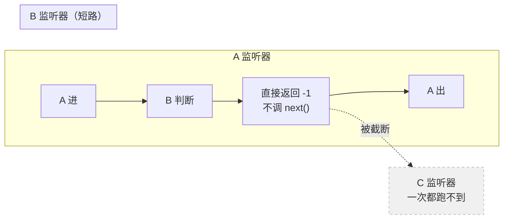

> 本章形态：【必写】。写约 130 行，两小时。
> 跳过的后果：第 9、10 章的拦截机制全靠这里的 waterfall，跳了就看不懂「改写模型看到的消息」是怎么做到的。
> 起点 `ch06-start`，答案 `ch06-done`，自检 `pnpm verify:ch06`。

第 5 章造出了一棵能自动排激活顺序的树。但那些插件之间只能互相调用，不能互相**拦截**。

dsh 里最值钱的那些能力——在工具执行前加一道审批、改写模型将要看到的消息、给超长结果落盘——全都不是"调用"，是"插队"。这一章造出插队的能力，顺便解决一个更基础的问题：**插件卸载时，它插的那些队怎么撤干净。**

## 6.1 先说清楚两个会认错的词

这一章有两个术语，直觉几乎一定是错的。先拆，省得后面一路误会。

**`effect` 不是"副作用"。**

学界说 effect 通常指 effect system（Lucassen & Gifford, 1988）或者代数效应（algebraic effects），描述的是"一段计算会做出什么副作用"。Cordis 的 `effect` 是另一回事：**一次带逆元的注册**。你做一件有后果的事，同时把撤销它的方法交出来。

中文别译成"副作用"，译「可逆注册」或者干脆保留原词。顺带一提，Cordis 那篇配套论文用的词是 **revertible**，不是常见的 reversible。

**`waterfall` 和 webpack 那个同名钩子语义相反。**

webpack/Tapable 的 `SyncWaterfallHook` 是：上一个钩子的返回值喂给下一个，像 `reduce`，是个 fold。

Cordis 的 `waterfall` 是**环绕式中间件**：每个监听器拿到 `(...args, next)`，调 `next()` 把控制权交给下一层并拿回它的结果，不调就在这里截断。它是洋葱，不是流水线。

写过 Java 的读者对这个模型的直觉是完备的——**它就是 Servlet Filter 的 `chain.doFilter()`**：调了等于放行，不调等于在 Filter 里直接把 response 写了。Koa 的中间件、Rack、AOP 的 around advice 都是同一个东西。

中文别译成"瀑布"，那会让人以为是值在往下流。译「环绕式分发」，或者不译。

## 6.2 五种分发方式，不是四种

事件的分发方式是**公开契约的一部分**，不是实现细节。原因很实际：`waterfall` 的监听器要多收一个 `next` 参数，写法和 `emit` 的完全不同。同一个事件名不能今天 emit 明天 waterfall。

| 方式 | 等不等 | 有没有返回值 | 干什么用 |
|---|---|---|---|
| `emit` | 不等 | 无 | 广播，观察者不影响流程 |
| `parallel` | 等 | 无 | 都得跑完，互不依赖 |
| `serial` | 等 | 无 | 按顺序挨个跑 |
| `bail` | 等 | 有 | 第一个给出答案的胜出 |
| `waterfall` | 等 | 有 | 环绕拦截，可放行可截断可改写 |

**官方的 `docs/cordis-primer.md` 只列了前四个。** 源码里是五个：

```ts
// vendor/cordis/src/events.ts:32
export type DispatchMode = 'emit' | 'parallel' | 'serial' | 'bail' | 'waterfall'
```

漏掉的 `bail` 只用在 client 侧（`packages/client/ui-input-trigger`），服务端读者确实见不到。实测 `@mode` 标注的分布是：emit 65、waterfall 20、bail 5、parallel 4、serial 2。

这是个有意思的分工示范：**官方文档为了教学做了简化，书回到源码就该说清楚有五种、以及为什么你在服务端只会遇到四种。** 照抄文档就会漏掉这一条。

还有一处要修正。primer 说 `@mode` 标注让"生成的目录**可以**检查声明和实际分发点是否一致"。原文是 "can check"。实际情况是：`scripts/gen-doc-graphs.ts:1207` 只在"某个事件声明了却没有任何分发者"时抛错；声明的 mode 和实际用的分发方法是**并排渲染进同一张表**，不一致靠人在 review 的 diff 里看出来。

这个更弱的说法反而更有教学价值——它示范了一种低成本的一致性手段：**把两个真相并排摆在一起，让不一致自己现形**，而不是写一个校验器。

## 6.3 waterfall 只有十行

```ts
async waterfall<T>(event: string, args: any[], final: () => T | Promise<T>): Promise<T> {
  const chain = this.listeners(event)
  const step = async (i: number): Promise<T> => {
    if (i >= chain.length) return final()      // 走到底，执行默认行为
    const next = () => step(i + 1)             // 把「下一层」包成一个函数
    return await chain[i](...args, next)       // 交给监听器，它决定调不调
  }
  return step(0)
}
```

递归闭包，就这些。`final` 是最里层——没有任何监听器时的默认行为。

用起来是这样：

```ts
ev.on('pipe', async (x, next) => {
  log.push('A 进'); const r = await next(); log.push('A 出'); return r
})
ev.on('pipe', async (x, next) => {
  log.push('B 短路'); return -1               // 不调 next
})
ev.on('pipe', async () => { log.push('C 永远跑不到'); return 99 })

await ev.waterfall('pipe', [1], () => 0)      // 得到 -1
// log: ['A 进', 'B 短路', 'A 出']
```

注意 log 的形状：**A 包着 B**。B 短路之后，控制权还是要交回给 A 让它跑完后半段。这就是洋葱。C 一次都没跑。

**两种监听器，两种写法：**

- **策略型**：它对这件事有决定权，该短路就短路。审批拒绝、权限不足、缓存命中——这些都应该直接返回，不调 `next()`。
- **观察型**：它只是想看看、记个账、改点参数，**必须调 `next()`**。不调就把下游全吞了。

这条规矩在 dsh 的 AGENTS.md 里是硬规定。违反的症状很难查：**下游消息凭空消失，没有报错，没有栈。** 排查方法是从后往前摘监听器，看哪一个摘掉之后下游就活了。

协作式的改写长这样——改共享对象，然后放行：

```ts
ev.on('req', async (req, next) => {
  req.model = 'cheap'      // 改
  return next()            // 放行
})
```

第 9 章那个「改写模型看到的消息」用的就是这个形状。



**图 6-1：waterfall 是洋葱不是流水线**。B 短路之后控制权仍要交回 A 跑完后半段；排在 B 后面的 C 一次都不执行

## 6.4 为什么卸载必须逆序

第 5 章留了个尾巴：`unload()` 里那句 `.reverse()` 凭什么。

不是工程习惯，是**复合逆的定义**。

加载时你依次做了 e₁、e₂、…、eₙ 这些事，系统状态的变换是它们的复合：

```
eₙ ∘ … ∘ e₂ ∘ e₁
```

要把系统还原，需要这个复合的逆。而复合的逆有个固定形式：

```
(g ∘ f)⁻¹ = f⁻¹ ∘ g⁻¹
```

推广到 n 个就是 e₁⁻¹ ∘ … ∘ eₙ⁻¹ ——**后做的先撤**。

这不是"这样比较安全"，是唯一正确的顺序。想想具体场景就明白：先开文件再开连接，撤销时必须先关连接再关文件；反过来的话，关文件时连接还在用它。

```ts
// 真 Cordis：vendor/cordis/src/fiber.ts:431
const pending = this.disposers.splice(0).reverse()
for (const dispose of pending) await dispose()
```

**还有一个边界条件容易漏：卸载集合必须在卸载开始时就封闭。**

如果卸载跑到一半，某个 disposer 又注册了新的 effect，那么逆序序列在执行过程中被追加了——追加进来的那个既没有对应的"正操作"排在它前面，也不在原来那个复合里。逆元不再是逆元。

真 Cordis 的做法是直接禁止：

```ts
// UNLOADING 期间创建 effect 抛 INACTIVE_EFFECT
// vendor/cordis/src/fiber.ts:419-422
```

mini 版照抄：

```ts
effect(setup: () => Disposer): Disposer {
  if (this.fiber?.state === FiberState.UNLOADING) {
    throw new Error('INACTIVE_EFFECT: 不能在卸载过程中创建新的 effect')
  }
  const dispose = setup()
  return this.own(dispose)
}
```

`vendor/README.md` 里那 18 条本地修改的第 6 条，整条就在补这一类洞——它自述"封掉了三类重入卸载缺陷"：effect 的 owner 包装要在 setup 体运行之前就注册好，这样从 setup 内部发起的卸载能等到 setup 完成并收集到全部清理；异步清理在完成前对 owner 保持可见；以及上面这条。

**三条洞，一条数学理由。** 这就是第 3 章说的「vendor 一个 rc 版框架，代价是每次升级要重放补丁」的具体样子——补丁不是随便打的，每一条背后都有一个不变式。

## 6.5 `ctx.effect()` 是那三件事的统称

有了逆序律，`provide` 和 `on` 就都是 `effect` 的特例：

```ts
// 提供服务 = 做一件事（登记实现）+ 交出逆操作（撤销登记）
provide(name, value) {
  const dispose = this.registry.provide(name, value, this.fiber?.uid ?? 0)
  return this.own(dispose)
}

// 注册监听器 = 做一件事（挂上去）+ 交出逆操作（摘下来）
on(event, listener, prepend = false) {
  return this.own(this.events.on(event, listener, prepend))
}

// 任意有后果的事
effect(setup) {
  const dispose = setup()
  return this.own(dispose)
}
```

`own()` 干的事只有一件：把 disposer 挂到当前 fiber 上，并且做成一次性的。

```ts
own(dispose: Disposer): Disposer {
  let done = false
  const once: Disposer = () => {
    if (done) return
    done = true
    return dispose()
  }
  this.fiber?.disposers.push(once)
  return once
}
```

**一次性很重要。** 调用方可能提前手动撤销，卸载时又会撤一遍——第二次必须无害。

这套东西合起来，就是「插件卸载时它注册的一切自动回滚」这个承诺的全部实现。插件作者不写任何清理代码：

```ts
ctx.plugin({
  name: 'p',
  apply: (c) => {
    c.provide('llm', adapter)         // 服务
    c.on('tool/call', audit)          // 监听器
    c.effect(() => {                  // 任意资源
      const t = setInterval(tick, 1000)
      return () => clearInterval(t)
    })
  },
})
// 卸载时：定时器先清，监听器再摘，服务最后撤。全自动。
```

给 Java / Go 读者一个类比：**这就是 try-with-resources 和 `defer`**，只不过作用域不是函数栈，是插件的生命周期。

## 6.6 没有干净的卸载，就没有「换掉主循环」

回头看第 3 章那六个取舍，第一条是「没有特权内核」。现在能说清它为什么可能了：

**因为每个部件都能被干净地撤下来。** 如果卸载会留残渣——监听器摘不干净、服务撤不掉、定时器还在跑——那"换掉主循环"就是一句空话，你只能重启进程。可撤销注册是插件树能在运行中重组的前提。

顺着这条往下，第 12 章的热重载（改一行 YAML，插件活着换掉）和第 17 章那个更极端的能力（agent 在活进程里写一个插件挂进去，跑完再卸掉），地基都在这一章。

而 waterfall 解锁的是另一半：**插件不光能提供能力，还能拦在别人前面。** 第 9 章的 `agent/pre-step`（决定模型看到什么）、第 10 章的三段工具流水线，都是它。

---

现在树有了，拦截有了。下一章开始装真东西：**会话日志**。

那是全书最重要的一条不变量所在——第 1 章那三条"我没说过的话"，第 3 章那条"日志是源不是产物"，都要在下一章落到代码上。

---

> 本章来自《一切皆插件》开源版 · 作者「递归客」  
> 在线阅读完整书系：[inferloop.dev](https://inferloop.dev)  
> 源码仓库：[github.com/diguike/book-deepseek-harness](https://github.com/diguike/book-deepseek-harness)
