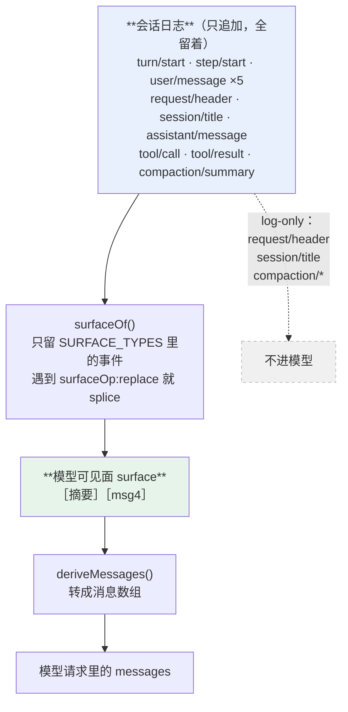

> 本章形态：【必写】。写约 230 行，三小时。
> 跳过的后果：第 9 章那条运行时等式、第 15 章的压缩机制，都建在这一章的 surface 概念上。
> 起点 `ch07-start`，答案 `ch07-done`，自检 `pnpm verify:ch07`。

第 1 章看到日志里有三条我没说过的话。第 3 章说这叫「日志是源不是产物」，代价是加一句话就要改数据结构。

这一章把这条规矩写成代码，然后回答一个第 1 章没答的问题：**为什么插件不能直接把一句话塞进请求里，非得绕道日志？**

## 7.1 用 Git 想这件事

先给个类比，后面就好办了。

Git 里有两样东西：`.git/objects` 里的 commit 链，和你 `checkout` 出来的工作区。commit 链只追加不修改；工作区是**算出来的**——每次 checkout 都从 commit 链现算。

dsh 的会话是同一个结构：

| Git | dsh |
|---|---|
| commit 链，只追加 | 会话事件日志，只追加 |
| 工作区，checkout 时现算 | 模型看到的对话历史，每次请求前现算 |
| `git branch` | `session.fork()` |
| `git rebase -i` 的 squash | `surfaceOp: replace`，压缩用它 |

这个类比一次解释四件事：为什么 fork 便宜、为什么能回放、为什么审计有据、为什么压缩不会丢原始数据。

多数 agent 工具的日志是"跑的时候顺手写一行，方便事后看"——那是**产物**。dsh 反过来，日志是**源**。

## 7.2 想给模型加一句话，得先加一个事件类型

```ts
export type SessionEvent = EventEnvelope & (
  | { type: 'turn/start';        data: { turn: number } }
  | { type: 'step/start';        data: { step: number } }
  | { type: 'user/message';      data: { content: ContentBlock[]; surfaceOp?: SurfaceOp } }
  | { type: 'assistant/message'; data: { content: ContentBlock[]; usage?: Usage } }
  | { type: 'tool/call';         data: { callId: string; name: string; args: unknown } }
  | { type: 'tool/result';       data: { callId: string; result: unknown } }
  | { type: 'request/header';    data: RequestHeader }
  | { type: 'session/title';     data: { title: string } }
  // ...
)
```

真 dsh 那个类型叫 `SessionEventMap`，而且是**可合并扩展**的——任何包都能用 TypeScript 的声明合并往里加自己的事件类型。第 15 章的压缩、第 10 章的工具审批，各自加各自的。

这就是「想给模型加一句话就得新增一个事件类型」那条规矩的落地方式：你没法绕过它，因为往模型请求里放东西的唯一入口就是这个类型。

## 7.3 surface：不是所有事件都进模型

这是本章第一个要点，也是最容易漏的一个。

日志里躺着很多事件，但只有一部分会进入模型请求。dsh 管进模型的那部分叫 **surface**（模型可见面）。

```ts
export const SURFACE_TYPES = new Set<SessionEventType>([
  'user/message',
  'assistant/message',
])
```

`request/header` 记的是这次请求用了什么模型、什么参数——只记账，不给模型看。`session/title` 是会话标题——不给模型看。`assistant/chunk` 是流式片段，用来回放和 UI 保真——也不进模型历史（模型看到的是折叠好的 `assistant/message`）。

于是投影就是两步：

```ts
deriveMessages(): Message[] {
  return surfaceOf(this.log).map(toMessage)
}
```

先折出 surface，再把 surface 上的事件转成消息。

**第 1 章那个问题现在有答案了。** 插件为什么不能直接把一句话塞进请求？因为请求里的消息数组是 `deriveMessages()` 的返回值，而这个函数只认日志。想让模型看见，唯一的办法是往日志里落一条 `user/message`。

这就是那条规矩的机制形态：

> **model-visible ⟺ logged**

不是靠规范约束，是靠**没有第二条路**。



**图 7-1：模型历史是日志的投影，不是另一份数据**。日志里六条 `user/message` 一条没删，surface 上只剩两条

## 7.4 replace：压缩怎么把历史换掉

`user/message` 上有个可选字段 `surfaceOp`：

```ts
export interface SurfaceOp {
  op: 'replace'
  start: number
  end: number
}
```

折 surface 时它这么用：

```ts
export function surfaceOf(log: readonly SessionEvent[]): SessionEvent[] {
  const surface: SessionEvent[] = []
  for (const e of log) {
    if (!SURFACE_TYPES.has(e.type)) continue
    const op = e.type === 'user/message' ? e.data.surfaceOp : undefined
    if (op?.op === 'replace') {
      surface.splice(op.start, op.end - op.start, e)   // 把这一段换成自己
    } else {
      surface.push(e)
    }
  }
  return surface
}
```

上下文压缩就靠它：把前四轮对话在 surface 上换成一条摘要，而**日志里那四轮一条没删**。

```
日志：  [msg0] [msg1] [msg2] [msg3] [msg4] [摘要 replace(0,4)]     ← 6 条，全在
surface：[摘要] [msg4]                                             ← 模型看到 2 条
```

回到 Git 类比：这就是 `rebase -i` 的 squash。底层 commit 一条没删，checkout 出来的历史被压扁了。

**有个坑必须现在说：`start` 和 `end` 是 surface 上的位置，不是 seq 区间。** 真 dsh 的注释原话是 "a surface-POSITION span, not a numeric seq interval"，而且 replace 之后 `start` 可以**大于** `end`。任何"按 seq 区间理解 surface"的心智模型都会在第 15 章翻车。

有意思的是，dsh 明确**没有**把压缩摘要做成一个新的 surface 事件类型——它复用 `user/message` 加一个 `surfaceOp`。三个 `compaction/*` 事件全是 log-only，只记账。理由是：只有产生消息的事件才该进模型，摘要本质上就是一条消息。

## 7.5 append-only 序列上，哪些位置能切

这一节是本章的技术核心。

`fork` 听起来简单：取前缀，重放。但**哪些前缀是合法前缀**？

日志是 append-only 序列，可它上面还压着两层结构：

- **括号结构**：`turn/start`…`turn/end`、`step/start`…`step/end`
- **配对结构**：`tool/call`…`tool/result`，按 `callId` 配

这不是君子协定，是有状态机在查的。mini 版的状态是这五个字段：

```ts
export interface Trace {
  lastSeq: number
  openTurn: number | null
  openStep: number | null
  nextTurn: number
  nextStep: number
  pendingCalls: Set<string>
}
```

对照真 dsh 的 `packages/core/session/src/invariant.ts`，同名同结构。

四条不变式：

| | 规则 | 违反时的错误码 |
|---|---|---|
| **I1** | seq 严格递增 | `SEQ_NOT_MONOTONIC` |
| **I2** | turn / step 开闭配对，且序号连续 | `TURN_ALREADY_OPEN` / `STEP_OUT_OF_ORDER` |
| **I3** | `tool/result` 的 callId 必须在同一 step 的 pendingCalls 里 | `UNKNOWN_CALL` |
| **I4** | `turn/end` 时不能还有开着的 step | `STEP_STILL_OPEN` |

推论直接给出 fork 的判据：

> **合法的 fork 前缀 = 让状态机处于「没有打开的 turn」的那些前缀。**

```ts
export function isForkable(t: Trace): boolean {
  return t.openTurn === null
}
```

真 dsh 的 `fork()`（`packages/core/session/src/index.ts:1081`）抛的那个 `OPEN_TURN` 错误码就是这条。

我之前的调研笔记里写过一句"fork 只有三行"——那是错的，`fork()` 方法体十余行，配套的 `_forkSeed()` 还有四种错误码。**准确的说法更有意思：fork 的本体确实只是取前缀加重放，全部难度在「什么样的前缀是合法前缀」。**

这条判断可以直接搬走：**任何 append-only 日志想支持截断或分叉，第一步都是回答"哪些位置是可切点"，而可切点由日志上压着的括号结构决定。**

## 7.6 校验是纯的，提交是分开的

`validateEvent` 有个细节值得单独说：它**不改传进来的状态**，而是返回一个新状态。

```ts
export function validateEvent(t: Trace, e: SessionEvent): Trace {
  if (e.seq <= t.lastSeq) throw new InvariantError('SEQ_NOT_MONOTONIC', ...)
  const next: Trace = { ...t, lastSeq: e.seq, pendingCalls: new Set(t.pendingCalls) }
  // ...按事件类型算出 next
  return next
}
```

调用方拿到 `next` 之后才提交：

```ts
const next = validateEvent(this.trace, event)   // 纯校验
this.log.push(event)                            // 提交
this.trace = next
```

**分开的好处是：「校验通过了，但后续某个监听器否决了这个事件」不会污染状态。** 真 dsh 的源码注释原话是 "Validation is pure, so abandoning this weakly keyed transition does not advance or retain the session"。

这个模式——**纯转移函数 + 显式提交**——值得单独推荐。它比"先改再回滚"稳得多，因为回滚本身也可能出错。

## 7.7 读不懂的事件，宁可拒绝整份日志

大多数 event sourcing 的建议是读侧宽容：碰到不认识的事件类型，跳过就好，别影响别的。

dsh 反着来：

```ts
if (!KNOWN.has(e.type)) {
  if (e.ignorable) continue
  throw new Error(`UNKNOWN_EVENT_TYPE: 不认识 "${e.type}"，且它没有标 ignorable。拒绝加载整份日志。`)
}
```

**默认拒绝，除非那个事件明确标了 `ignorable: true`。**

理由很硬：静默跳过一个不认识的事件，意味着"日志是源"这条规矩已经破了——你算出来的模型历史和真实发生过的不一样，而你不知道。基于它的所有推论（回放能复现、审计有据、fork 正确）全部失效。

**宁可加载失败，也不给出一份看起来正常但其实缺了东西的历史。**

代价是升级摩擦：新版本加的事件类型，旧版本读不了。所以那个 `ignorable` 标记就是给"确实可以跳过的"事件留的口子，而这个判断由事件的定义者来做，不由读取方来猜。

顺带解释了第 3、4 章反复提的那个风险：`SESSION_FORMAT_VERSION` 是 `0`、无兼容承诺。在这套读取规则下，格式变动的杀伤力比一般系统大——不是降级读取，是拒绝加载。

## 7.8 日志外送：这个接缝自带零脱敏

平台团队会关心的一件事：这份日志怎么送到公司的可观测系统里。

dsh 有现成接缝，`session-telemetry` 加 `session-telemetry-otel`，是标准的 OTLP/HTTP 导出。三档模式：`FULL`、`FEEDBACK_ONLY`、`DISABLED`，**默认 DISABLED，且是 fail-closed**。

有两件事必须写清楚，因为它们直接关系到合规：

**第一，这个接缝不自带任何脱敏规则。** `FULL` 模式下离开这台机器的是完整的 `event.data`——用户与助手的消息全文、工具参数和结果（意味着命令输出、文件内容）、完整的 system prompt 和工具 schema、会话的工作目录。想脱敏得自己在 `sessionTelemetry/record` 这个 waterfall 上挂一个监听器。

**第二，`shutdownTimeoutMillis` 到点会丢掉还没导出的记录。** 对审计场景这是不可接受的行为，得自己兜。

第 14 章那个实战插件会真的挂一条脱敏监听器把它跑通，第 18 章讲平台化时会再展开。

## 7.9 mini 230 行，真的 3,156 行

| | mini-dsh | 真 dsh |
|---|---|---|
| 事件类型与词汇 | 88 行 | 分散在 `types.ts` 等 |
| 不变式状态机 | 96 行 | `invariant.ts` |
| 日志本体 + 投影 + fork | 130 行 | `index.ts` 等 |
| **合计** | **314 行** | **`packages/core/session/src` 3,156 行** |

多出来的部分：持久化（jsonl 和 sqlite 两种后端）、多帧 zstd 压缩、日志修复、跨会话检索、投影缓存、事件的可合并类型体系。

**但「日志是源」这件事本身，就是 `deriveMessages()` 那两行加 `surfaceOf()` 那十行。**

---

日志有了。下一章接模型：请求怎么拼出来、流式怎么处理，以及一个第 11 章会算成钱的东西——**为什么请求配置的变动要单独记一条快照，而不是让它静默漂移。**

---

> 本章来自《一切皆插件》开源版 · 作者「递归客」  
> 在线阅读完整书系：[inferloop.dev](https://inferloop.dev)  
> 源码仓库：[github.com/diguike/book-deepseek-harness](https://github.com/diguike/book-deepseek-harness)
