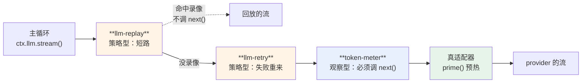

> 这一章要动手写代码：约 140 行，两小时。
> 跳过的后果：第 9 章主循环要用 `ctx.llm`，第 11 章整章建在 request header 上。
> 起点 `ch08-start`，答案 `ch08-done`，自检 `pnpm verify:ch08`。

官方 cookbook 用 43 行就把「怎么接一个 provider」讲完了（`docs/cookbook/adding-an-llm-adapter.md`）。这一章不重复那个。

要问的是另一个问题：**为什么 `ctx.llm.stream()` 不是一个普通函数调用，而要穿过一条 waterfall？**

答案关系到三件生产级的事：重试、计量、免 key 回放测试。它们本来都该写进调用路径，在 dsh 里全是外挂的监听器。

## 8.1 接缝只做两件事

```ts
export class LlmService {
  private readonly adapters = new Map<string, LlmAdapter>()

  register(adapter: LlmAdapter): Disposer { /* 存进表，返回撤销 */ }

  async stream(options: GenerateOptions): Promise<AsyncIterable<StreamChunk>> {
    return this.ctx.waterfall('llm/stream', [options], async () => {
      const adapter = this.adapters.get(options.provider)
      if (!adapter) throw new Error(`UNKNOWN_PROVIDER: ${options.provider}`)
      return prime(adapter.stream(options))
    })
  }
}
```

它自己不发任何 HTTP 请求。管一张适配器表，然后把每次调用**穿过 `llm/stream` 这条 waterfall**，最里层才落到真适配器上。

十几行。生产级的复杂度全在别处——不在这个函数里，这正是重点。

## 8.2 register 不该自己决定归属

这是我写这段代码时改的第一个 bug。

最初的写法：

```ts
register(adapter: LlmAdapter): Disposer {
  this.adapters.set(adapter.provider, adapter)
  return this.ctx.effect(() => () => this.adapters.delete(adapter.provider))  // ← 错
}
```

看起来很贴心：注册完自动登记撤销。问题是 `this.ctx` 是**llm 这个插件自己的 context**，不是调用方的。于是 disposer 挂在了 llm 插件的 fiber 上——调用方插件卸载时，它注册的适配器纹丝不动。

测试立刻抓到了：卸载 `fake-adapter` 插件之后，`llm.providers()` 还是 `['fake']`。

正确的做法是**注册表不猜归属，把 disposer 交出去**：

```ts
register(adapter: LlmAdapter): Disposer {
  this.adapters.set(adapter.provider, adapter)
  return () => this.adapters.delete(adapter.provider)
}
```

调用方自己决定挂在谁身上：

```ts
ctx.plugin({
  name: 'my-adapter',
  inject: ['llm'],
  apply: (c) => {
    c.effect(() => c.llm.register(new MyAdapter()))   // 挂在我自己的 fiber 上
  },
})
```

dsh 把这条写成了硬规矩，AGENTS.md 原文：**注册表的 `register()` 返回 disposer。**

真 dsh 里能少写这一步，是因为它的 `reflect.ts`（418 行）做了调用链追踪——服务能知道是哪个 context 在调它。mini 版没有那套，反而把归属这件事暴露得更清楚。

## 8.3 流式是硬约束，不是可选优化

适配器的抽象方法只有一个：

```ts
export abstract class LlmAdapter {
  abstract readonly provider: string
  abstract stream(options: GenerateOptions): AsyncIterable<StreamChunk>
}
```

**返回的是 `AsyncIterable`，不是 `Promise<string>`。** 真 dsh 的签名一模一样（`packages/llm/llm/src/index.ts:232`）。

这不是"支持流式更好"，是**不支持流式就接不上**。我给这本书写配套的假端点时就撞到了：从 `book-agent-evals` 移植过来的那个 mock server 原本明确不支持 SSE（"评测不需要"），接 dsh 时必须先把流式补上。

代价是所有中间层都得处理流。收益是模型吐第一个字时用户就能看到，而且——下一节那三件事全靠它。

## 8.4 一个 async generator 的坑

写这段时踩的第二个 bug，值得单独讲，因为它决定了拦截链能不能正常工作。

我先写了一个重试监听器：

```ts
c.on('llm/stream', async (opts, next) => {
  for (let i = 0; i < 5; i++) {
    try { return await next() } catch (e) { if (i === 4) throw e }
  }
})
```

看着没问题。测试里让适配器前两次抛 `RATE_LIMIT`，第三次成功。结果：**一次都没重试，异常直接漏到最外层。**

原因是 `async *stream()` 的**函数体要到第一次迭代才执行**。调用 `adapter.stream(options)` 只是造了个迭代器对象，立刻返回，body 里那句 `throw` 根本还没跑。等主循环开始 `for await` 消费流的时候才炸——那时候早就出了 waterfall，拦截链一个都不在栈上了。

修法是**预热**：在接缝里先把第一个片段拉出来，再把它接回去。

```ts
async function prime(inner: AsyncIterable<StreamChunk>): Promise<AsyncIterable<StreamChunk>> {
  const it = inner[Symbol.asyncIterator]()
  const first = await it.next()          // ← 异常在这里抛，还在 waterfall 里
  return (async function* () {
    if (first.done) return
    yield first.value
    while (true) {
      const n = await it.next()
      if (n.done) return
      yield n.value
    }
  })()
}
```

这样，连接失败、鉴权失败、限流这些**发生在建立连接阶段**的错误，就能被拦截链看见了。

真 dsh 做同一件事。`packages/llm/llm/src/types.ts` 那段注释写着：适配器可以抛，但 `LlmRuntime.stream()` 会把这个失败**规范化成接缝层面的终止**，不让它从迭代器里漏出去。

**这条经验可以直接搬走**：任何把 async generator 放进拦截链的设计，都要考虑"body 延迟执行"这件事，否则拦截器形同虚设。



**图 8-1：三个监听器挂在同一条 waterfall 上**。橙色是策略型（可短路），蓝色是观察型（必须委托）；产品代码一行没改

## 8.5 waterfall 换来的三件事

现在看为什么值得绕这一圈。三个测试，三个监听器，产品代码一行没动。

**重试**——挂上去就有，短路重来：

```ts
c.on('llm/stream', async (opts, next) => {
  for (let i = 0; i < 5; i++) {
    try { return await next() } catch (e) { if (i === 4) throw e }
  }
})
```

**免 key 回放**——直接短路，真适配器一次都不碰：

```ts
c.on('llm/stream', async () => {
  return (async function* () { yield { kind: 'text', text: '录像回放' } })()
})
```

这就是 dsh 的 `test-support/llm-replay` 的原理。它的 fixture 就是持久化的会话 JSONL——按 `(turn, step)` 分组 `assistant/chunk` 事件，就能重建每一次 `stream()` 调用。**不需要 API key 就能跑完整的端到端测试**，第 20 章会展开。

**计量**——观察型监听器，必须调 `next()`，然后包一层流：

```ts
c.on('llm/stream', async (opts, next) => {
  const inner = await next()
  return (async function* () {
    for await (const chunk of inner) {
      if (chunk.kind === 'done' && chunk.usage) record(chunk.usage)
      yield chunk
    }
  })()
})
```

注意这三个监听器的形态差异，正好对应第 6 章那条规矩：**重试和回放是策略型（可以短路），计量是观察型（必须委托）。**

如果 `stream()` 是个普通函数，这三件事只能写进它内部，靠开关和参数控制。写成 waterfall 之后，它们变成三个可装可卸的包——`llm-retry` 在真 dsh 里就是一个独立 npm 包。

## 8.6 请求配置是一种可审计状态

`GenerateOptions` 里有一组字段被单独拎出来了：

```ts
export interface CallConfig {
  provider: string
  model: string
  temperature?: number
  maxTokens?: number
  reasoningEffort?: 'off' | 'low' | 'high'
}
```

`packages/llm/llm/src/call-config.ts` 开头的注释解释了为什么单独拎：这些是 **request-header state**，它们**会影响缓存复用**。waterfall 上的监听器可以替换它们，但主循环要**记一条快照**，而不是允许它静默漂移。

于是有了这个函数：

```ts
export function callConfigEquals(a: CallConfig, b: CallConfig): boolean {
  return a.provider === b.provider && a.model === b.model &&
         a.temperature === b.temperature && a.maxTokens === b.maxTokens &&
         a.reasoningEffort === b.reasoningEffort
}
```

它回答的是：**这次改动值不值得往日志里记一条新的 `request/header`？**

第 1 章那次实测的日志里，seq 11 就是一条 `request/header`。当时看不出它有什么用，现在清楚了——**它把「这次请求用了什么配置」变成了可审计的状态**，而不是一个转瞬即逝的函数参数。

为什么这很重要，第 11 章会算成钱：换一次模型、改一次采样参数，都会让前缀缓存从那个位置起全部失效。能审计的前提是有记录。

## 8.7 mini 140 行，真的 2,625 行

| | mini-dsh | 真 dsh |
|---|---|---|
| 接缝 + 词汇 + 预热 + 折叠 | 140 行 | `packages/llm/llm/src` 2,625 行 |

多出来的部分在这些文件里，名字就说明了它们在管什么：`adapter-failure.ts`（适配器失败分类）、`api-key.ts`、`assembler.ts`（流式装配）、`attribution.ts`（用量归属）、`call-config.ts`、`content.ts`、`error.ts`、`retry-policy.ts`。

另外还有两个独立包：`llm-pi-ai`（2,706 行的多 provider 适配器，第 1 章那个假端点就是通过它接进去的）和 `llm-retry`。

**但接缝本身，就是那个十几行的 `stream()`。** 剩下的都是挂在它上面的东西。

---

树有了、日志有了、模型接入有了。下一章把它们串起来：**主循环**。

那是全书代码最少、决策最密的一章——真 dsh 的 `agent-loop` 只有 1,643 行，mini 版 250 行就能跑通一个完整任务。差出来的 1,400 行在防什么，也在那一章讲清楚。

---

> 本章来自《一切皆插件》开源版 · 作者「递归客」  
> 在线阅读完整书系：[inferloop.dev](https://inferloop.dev)  
> 源码仓库：[github.com/diguike/book-deepseek-harness](https://github.com/diguike/book-deepseek-harness)
