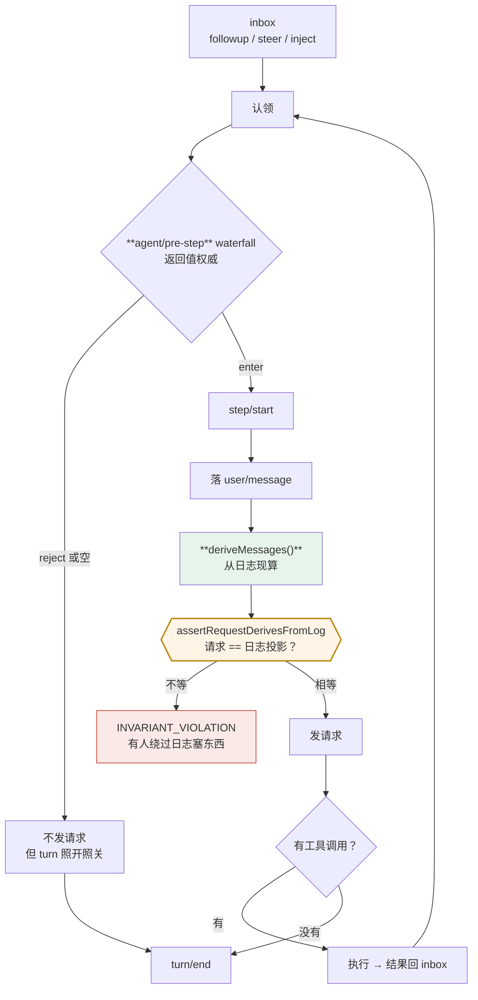

> 本章形态：【必写】。写约 250 行，三小时。跑完这一章 mini-dsh 能完成一个真实任务。
> 起点 `ch09-start`，答案 `ch09-done`，自检 `pnpm verify:ch09`。

这是你买这本书的直接原因，它排在第 9 章。

**先给结论，跳过代码的读者也能拿走**：真 dsh 的 `agent-loop` 是 1,643 行，mini 版 250 行就能跑通一个完整任务。多出来的 1,400 行不在业务逻辑上，全在防四件事——**取消竞态、并发工具的顺序保证、错误分类、幂等 teardown**。

## 9.1 turn 和 step 的定义要抠字眼

第 2 章给过定义，这里再抠一遍，因为它们决定了代码结构：

- **step** = 一次模型请求，加上这次响应引发的工具执行
- **turn** = 排空一次已接收输入的全过程，直到模型和它的工具都停下来

一个 turn 包含**零到多个** step。

零个 step 的 turn 不是边界情况，是设计的一部分。输入被拦截策略拒了，一次模型请求都没发，但这个 turn 照开照关：

```ts
test('被 pre-step 拒掉的输入，仍然关掉一个零 step 的 turn', async () => {
  ctx.plugin({ name: 'blocker', apply: (c) => {
    c.on('agent/pre-step', async () => ({ action: 'reject', reason: '这次不许发' }))
  }})
  loop.followup('随便说点什么')
  const steps = await loop.runTurn()

  assert.equal(steps, 0)
  assert.deepEqual(
    session.events().map(e => e.type),
    ['turn/start', 'turn/end'],     // 日志里留了痕
  )
})
```

**为什么要这么设计？** 因为第 7 章那条规矩：发生过的事就得有记录。一次被拒的尝试也是发生过的事。如果不记，审计的时候你会看到一段"用户说了话但什么都没发生"的空白，而没法区分"用户没说话"和"说了被拦了"。

## 9.2 一个 inbox，三种投递

输入不是直接进循环的，先进 inbox：

```ts
followup(text) { this.inbox.push({ text, target: 'followup' }) }   // 普通输入，唤醒驱动
steer(text)    { this.inbox.push({ text, target: 'steer' }) }      // 打断，也唤醒
inject(text)   { this.inbox.push({ text, target: 'inject' }) }     // 不唤醒
```

区别只在**要不要唤醒驱动**。`inject` 投进去的东西会在 inbox 里等着，直到某条 followup 或 steer 把它一起带走。

这个设计解决的问题是：插件想给模型加点背景信息，但不想因此触发一轮对话。第 1 章日志里那条「Current runtime context」走的就是 `inject`。

```ts
test('inject 不唤醒驱动，等下一条 followup 一起带走', async () => {
  loop.inject('这是背景信息')
  loop.followup('这是问题')
  await loop.runTurn()
  assert.equal(userMessages.length, 2, '两条一起进了同一个 step')
})
```

## 9.3 pre-step 的返回值是权威的

循环的第一个决策点：

```ts
const decision = await this.ctx.waterfall<PreStepDecision>(
  'agent/pre-step',
  [claimed, { turn, step: steps + 1 }],
  async () => ({ action: 'enter', messages: claimed.map(c => c.text) }),
)

if (decision.action === 'reject' || decision.messages.length === 0) {
  break     // 被拒的认领不退回 inbox
}
```

**「权威」的意思是：驱动照单执行，不做二次判断。** 监听器说 reject 就 reject，说 enter 哪几条就是哪几条。

这给了插件一个很强的能力——**改写模型将要看到的东西**：

```ts
c.on('agent/pre-step', async (claimed, pos, next) => {
  const d = await next()
  if (d.action !== 'enter') return d
  return { action: 'enter', messages: [...d.messages, '【团队规约】提交前必须跑测试'] }
})
```

注意这个监听器的形态：**它调了 `next()`**。第 6 章那条规矩在这里的具体含义是——包裹 `next()` 的监听器必须保留下游的决定，除非它是有意要替换。上面这个是在下游结果的基础上追加，不是覆盖。

写成不调 `next()` 的话，排在它后面的所有 pre-step 监听器全部失效，而且没有任何报错。



**图 9-1：那条不变式卡在请求发出之前**。pre-step 能改模型看到什么，但改动必须先落进日志

## 9.4 那条运行时等式

现在到本章、也是全书最重要的一处。

第 3 章说「日志是源」，第 7 章说「model-visible ⟺ logged」。这两句话怎么保证不被绕过？

答案在这一行：

```ts
const options: GenerateOptions = {
  ...config,
  system: this.opts.systemPrompt,
  tools: this.tools.schemas(),
  messages: this.session.deriveMessages(),   // ★ 不是攒的，是现算的
}
assertRequestDerivesFromLog(options, this.session)
```

以及那个断言：

```ts
export function assertRequestDerivesFromLog(options, session): void {
  const derived = session.deriveMessages()
  if (JSON.stringify(options.messages) !== JSON.stringify(derived)) {
    throw new Error('INVARIANT_VIOLATION: 请求里的消息和从日志推导的结果不一致。')
  }
}
```

写成等式的形式：

> 对每个由主循环发出的请求 r：
> - `r.messages = deriveMessages(events(sessionId))`
> - `r.header = foldRequestHeader(events(sessionId))`
> - `frozen(r) ∧ frozen(r.messages)`

**它的含义是：pre-step 的监听器可以改模型看到什么，但改的结果必须先落进日志再被投影出来，不能直接塞进请求。**

这就把「日志是源」从一句设计口号，变成了一条**能在运行时被违反并被抓到**的等式。

```ts
test('请求里的消息必须逐字节等于从日志推导的结果', () => {
  const good = { messages: s.deriveMessages() }
  assert.doesNotThrow(() => assertRequestDerivesFromLog(good, s))

  const bad = { messages: [...s.deriveMessages(), { role: 'user', content: [...] }] }
  assert.throws(() => assertRequestDerivesFromLog(bad, s), /INVARIANT_VIOLATION/)
})
```

真 dsh 的 `packages/core/agent-loop/src/invariant.ts` 就是照这个写的，而且比 mini 版严格——它还检查请求对象和消息数组都被冻结过。

**两个诚实的限定，必须写清楚：**

**第一，这是监视器，不是证明。** runtime verification，不是 Hoare 逻辑那种静态验证。它只在被调用时检查，抓不到不等于成立。真 dsh 把它注册成 `llm/stream` 上的一个监听器，而且用了 `prepend: true`——源码注释原话是 "Prepend prevents a short-circuiting replay listener from silencing the check"。

**第二，它的有效性依赖监听器顺序。** 如果有个短路的监听器排在它前面，检查就被跳过了。`prepend` 是为这个存在的，但这也意味着这条不变式的保障是**工程性的**，不是数学性的。

写出来比假装它是定理好。

## 9.5 请求配置变了才记快照

第 8 章讲了 `callConfigEquals`，这里是它的用处：

```ts
const config = await this.ctx.waterfall<CallConfig>(
  'agent/request', [{ ...this.opts.config }], async () => ({ ...this.opts.config }),
)
if (!this.lastHeader || !callConfigEquals(this.lastHeader, config)) {
  this.session.append('request/header', config)
  this.lastHeader = { ...config }
}
```

`agent/request` 是另一条 waterfall，监听器可以在这里换模型、改采样参数。**换了就记一条新的 `request/header`，没换就不记。**

两个测试盯着这个行为：

```ts
test('请求配置没变就不记新快照，变了才记', ...)      // 两个 step，一条 header
test('agent/request 上的监听器能换模型，换了就多一条快照', ...)   // 两条 header
```

为什么不干脆每次都记？因为**日志本身也是要读的**，每个 step 都记一条完全相同的 header 是噪音。更重要的是，这个"变了才记"的判定本身就是一份文档——**它告诉你哪些字段的变动是值得留痕的**，而那批字段恰好就是会影响前缀缓存的字段。

第 11 章会把这件事换算成钱。

## 9.6 派发可以重叠，结果必须按模型顺序

工具执行这一段的注释，真 dsh 写得比什么解释都清楚（`packages/core/agent-loop/src/tool-calls.ts` 模块头）：

> **Dispatch may overlap, while policy, results, and result context remain model-ordered.**
> 派发可以重叠，但策略、结果和结果上下文保持模型顺序。

mini 版的实现：

```ts
async executeBatch(calls: ToolExecution[], maxParallel = 4): Promise<ToolResult[]> {
  const results = new Array<ToolResult>(calls.length)
  let i = 0
  while (i < calls.length) {
    if (this.executionMode(calls[i]) === 'exclusive') {
      results[i] = await this.execute(calls[i])   // 独占的自己跑，形成 barrier
      i++
      continue
    }
    const batch: number[] = []
    while (i < calls.length && this.executionMode(calls[i]) === 'parallel' && batch.length < maxParallel) {
      batch.push(i); i++
    }
    const settled = await Promise.all(batch.map(k => this.execute(calls[k])))
    batch.forEach((k, n) => { results[k] = settled[n] })
  }
  return results
}
```

结果写回的是 `results[k]`——**按原始下标**，不是按完成顺序。

**为什么顺序这么重要？** 因为第 7 章那条链：模型历史是从日志算出来的。如果工具结果落库的顺序不确定，那么同样一次执行、跑两遍会得到两份不同的日志，于是：

- 回放对不上
- 重试时重建的历史和第一次不一样
- 前缀缓存从分歧点开始全部失效

**并发在这里不是性能话题，是确定性话题。** 这是第 10 章会展开的角度。

**给 Java / Go 读者一句必要的反类比**：这个 barrier 防的**不是数据竞争**。JS 是单线程的，没有两个工具同时修改同一块内存这种事。它防的是**副作用顺序**——两个 `bash` 调用都往同一个工作目录写文件，谁先谁后结果不一样。

如果你把它映射成 goroutine 或者线程池，整章的直觉都会是错的。

## 9.7 mini 250 行，真的 1,643 行——差在哪

这是本章开头那个结论的展开。

**一、取消竞态。** 真 dsh 的 `ReactLoopAgent` 里有 `AbortController`、`raceAbort`、`raceAbortCall` 这一套。用户中途按 Ctrl+C，正在跑的模型请求要断、正在跑的工具要停、已经拿到的部分结果要不要落库、`turn/end` 还要不要写——每一条路径都得想清楚。mini 版一条都没处理。

**二、并发工具的完整调度。** mini 版是「一段连续的可并发调用凑一批」。真 dsh 是**有界滚动池**：`maxParallelToolCalls` 默认 10，而且 `fillPool()` 在每次有序提交之后**重新分类**后续调用——因为工具注册表可能在执行过程中变化，一个原本可并发的调用可能突然需要独占，凭空造出一道 barrier。

**三、错误分类。** mini 版是 `try/catch` 一把抓。真 dsh 要区分：适配器失败、上下文溢出、限流、鉴权失败、工具自身报错、被守卫拒绝、用户取消。分类结果决定走哪条恢复路径——`llm-retry` 挂在 `agent/request-error` 上做重试，`compaction-basic` 挂在同一个事件上但只认"规范化的上下文溢出"。分不清就没法自动恢复。

**四、幂等 teardown。** `FactoryOwnership` 里有 `liveAgents` 和 `startupTasks` 两个集合要协调。一个 agent 被 dispose 时，它可能正在 LOADING、可能正在跑工具、可能有子 agent 没结束。dispose 要能被重复调用而不出错。

**这四件事有个共同点：它们都不是"功能"，是"在意外情况下不出错"。** 教学版可以不管，生产版一件都躲不掉。

这也是这本书对「读源码」的态度——**先用 250 行看清骨架，再回头问那 1,400 行在防什么**，比一头扎进 1,643 行有效得多。

## 9.8 mini 跑出来的事件序列，和第 1 章那次真任务同构

到这里 mini-dsh 能完成一个真实任务：

```ts
test('一个 turn 两个 step：模型先调工具，拿到结果再作答', async () => {
  tools.register({ name: 'glob', description: '列出文件', parameters: {},
    execute: async () => ['math.js', 'package.json'] })

  loop.followup('列出当前目录的文件')
  const steps = await loop.runTurn()

  assert.equal(steps, 2)
  assert.equal(session.openTurn, null)
})
```

事件序列和第 1 章那次真实任务同构：`turn/start` → `step/start` → `user/message` → `request/header` → `assistant/message` → `tool/call` → `tool/result` → `step/end` → `step/start` → … → `turn/end`。

**你现在有一个能跑的 agent harness 骨架了。**

---

下一章不加新功能，只把工具执行那一段拆开细看：三段瀑布各能干什么、单调守卫为什么不给 allow 这个返回值、模型会犯的四类错各有哪道防线。

---

> 本章来自《一切皆插件》开源版 · 作者「递归客」  
> 在线阅读完整书系：[inferloop.dev](https://inferloop.dev)  
> 源码仓库：[github.com/diguike/book-deepseek-harness](https://github.com/diguike/book-deepseek-harness)
