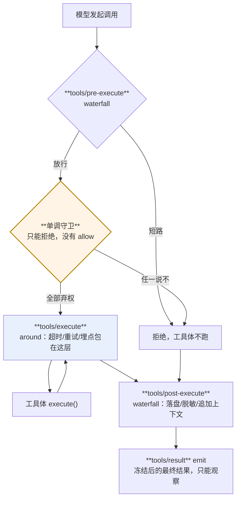

> 本章形态：【必写】。写约 160 行，两小时。
> 起点 `ch10-start`，答案 `ch10-done`，自检 `pnpm verify:ch10`。

第 9 章为了跑通流程，工具执行那一段是一笔带过的。这一章把它拆开。

官方 `docs/cookbook/adding-a-tool.md` 只有 94 行，但把参数校验、执行身份保护、Code Mode（`run_code`，让模型写一段程序批量调工具）、UI 渲染意图这些契约细节都写全了。**那些不重复**，正文直接引用。这一章讲三件官方 cookbook 不讲的事：三段瀑布各自的位置为什么这么定、守卫为什么不给 allow 这个返回值、以及模型会犯的四类错各有哪道防线。

## 10.1 一次工具调用要过五道关

```
tools/pre-execute (waterfall)     hook、权限、沙箱包装。可短路成拒绝
        ↓
单调守卫 (guard)                   只能拒绝，不能放行
        ↓
tools/execute (around waterfall)   超时、重试、埋点包在这一层
        ↓
工具体 execute()
        ↓
tools/post-execute (waterfall)     改写结果：落盘、脱敏、追加上下文
        ↓
tools/result (emit)                冻结后的最终结果，只能观察
```

真 dsh 的图比这个复杂——还有 `ctx.approval` 一次性审批、`fs/write-intent` 之类的细粒度门、`finalizeContent` 这个最后的内容不变式（`docs/tool-execution-pipeline.md` 有生成的完整流程图）。但骨架是这五道。

**为什么要分这么多层？** 因为每一层的能力不同，而能力不同是有意设计的。



**图 10-1：五道关，能力各不相同**。橙色那道只能拒绝——正因为如此，加再多守卫也不会互相翻案

## 10.2 pre-execute 能拒绝，post-execute 能改写

`tools/pre-execute` 在工具体之前，它能做的是**不让它跑**：

```ts
c.on('tools/pre-execute', async (e, next) => {
  if (e.name === 'rm' && isProduction()) {
    return { callId: e.callId, name: e.name, content: '生产环境不许删', isError: true, denied: 'policy' }
  }
  return next()      // 观察型必须委托
})
```

短路返回一个结果对象，工具体一次都不会跑。测试盯住了这一点：

```ts
assert.equal(ran, false, '工具体一次都没跑')
```

`tools/post-execute` 在工具体之后，它能做的是**改写结果**：

```ts
c.on('tools/post-execute', async (e, r, next) => {
  const settled = await next()
  const text = String(settled.content)
  if (text.length <= 100) return settled
  return { ...settled, content: `【结果太长已落盘，${text.length} 字节，用 spill_read 取回】` }
})
```

这就是 `spill` 的原理——工具吐了 500 KB 日志，模型看不完还得为它付钱，于是落盘换一个取回凭据。真 dsh 里这是三个包：`spill`（接口）、`spill-local`（会话私有文件）、`spill-policy`（挂在 post-execute 上的这个监听器）。

第 3 章那张表里「拦截工具执行」那一行的具体形态，就是这两个监听器。对比 Claude Code 的 hook：那边是启一个子进程、递一段 JSON、读退出码；这边是一个带完整类型的函数，返回值直接进流水线，插件卸载时自动摘掉。

## 10.3 守卫的返回类型里没有 allow

这是本章标题那件事，也是最值得抄走的一个设计。

```ts
export type ToolGuard = (exec: ToolExecution) => string | undefined
```

返回一个字符串 = 拒绝，理由是这个字符串。返回 `undefined` = 弃权。

**没有第三种返回值。守卫无法说"我批准"。**

真 dsh 的 `ToolGuard` 签名一样（`docs/subsystems/tools.md:313-322`），而且配套的工具限制规则是「按交集复合」——多个限制叠加只会让可用工具变少。

这个设计有个很硬的性质：**整套策略在权限集合上是单调的，只会往更严走。** 由此直接得到：

> **监听器的注册顺序不影响最终决定。**

测试证了这一点：

```ts
test('守卫是单调的：加再多守卫只会更严，顺序不影响最终决定', async () => {
  // 三个守卫：弃权、拒绝、弃权
  // 换个顺序再来一遍
  assert.equal(r1.isError, r2.isError, '顺序不影响最终决定')
})
```

**为什么这条性质值钱？** 因为它把"策略链"从一个需要小心排序的东西，变成了一个可以随便往里加的集合。你写一个新的安全策略插件时，不需要知道别人的插件排在哪、会不会被别人翻案。加进去只会更安全，不会更危险。

对比一下能"投票放行"的设计：那种设计里，A 说拒绝、B 说批准，最终结果取决于谁排后面、或者某个仲裁规则。每加一个策略都得重新审一遍全局。

**这条可以直接搬进你自己的项目**：安全策略链的返回类型里不要放 allow。要表达"我确认这个安全"，那是另一个概念（审批），走另一条路。

真 dsh 里那条路就是 `ctx.approval`——一次性审批，而且是 fail-closed 的：**非 `allowed-once` 一律拒绝**。它还带一对 log-only 的审计事件 `approval/asked` 和 `approval/decided`。把审批接到公司的审批系统或者机器人上，是内部平台最常见的第一个定制需求，第 14 章会做一个。

## 10.4 execute 是 around，所以超时能包在外面

`tools/execute` 和前后两个不一样：它是**环绕**工具体的，不是排在它前后。

```ts
c.on('tools/execute', async (e, next) => {
  const timeout = new Promise(resolve =>
    setTimeout(() => resolve({ ...e, content: '超时了', isError: true }), 20))
  return Promise.race([next(), timeout])
})
```

`next()` 就是工具体。能包住它，才能做超时、重试、埋点这些**围绕一次调用**的事。

这就是第 6 章那个洋葱模型的用武之地。真 dsh 的 `timeout-policy` 包就挂在这里。

顺带一个真 dsh 的细节：`tools/execute` 的包装器可以替换执行用的 signal，**但不能移除它**——注册表会把每次替换和调用方原始的 signal 融合。防的是"某个包装器把取消能力搞丢了"。

## 10.5 fail-closed：不确定就串行

并发分类只有一行判断，但那行判断的方向很讲究：

```ts
executionMode(exec: ToolExecution): ExecutionMode {
  const def = this.defs.get(exec.name)
  if (!def?.isConcurrencySafe) return 'exclusive'
  try {
    return def.isConcurrencySafe(exec.args) === true ? 'parallel' : 'exclusive'
  } catch {
    return 'exclusive'
  }
}
```

**只有精确返回 `true` 才算安全。** 没声明、返回别的值、抛异常，一律独占。

真 dsh 的 `executionMode()`（`packages/core/tools/src/index.ts:1276`）是同样的判定方向。

```ts
assert.equal(tools.executionMode(exec('unknown')), 'exclusive', '没声明 = 独占')
assert.equal(tools.executionMode(exec('throws')), 'exclusive', '抛异常 = 独占')
```

这是安全设计的通用姿势：**默认值应该是安全的那一边，而不是方便的那一边。** 一个工具作者忘了声明并发安全，代价是慢一点；如果默认可并发，代价是数据被踩坏。

## 10.6 并发是确定性话题，不是性能话题

第 9 章提过这个角度，这里展开。

真 dsh 的 `tool-calls.ts` 模块头一句话讲透：

> **Dispatch may overlap, while policy, results, and result context remain model-ordered.**

测试把这两件事分开验证：

```ts
assert.deepEqual(finished, ['fast', 'slow', 'lock'], '执行是重叠的：快的先完')
assert.deepEqual(results.map(r => r.name), ['slow', 'fast', 'lock'], '但结果按模型顺序')
```

**为什么结果顺序必须确定？** 顺着第 7 章那条链走一遍就明白：

模型历史是从日志算出来的 → 日志里工具结果的顺序如果不确定 → 同一次执行跑两遍会得到两份不同的历史 → 于是回放对不上、重试重建的上下文和第一次不一样、前缀缓存从分歧点开始全部失效。

**一个"性能优化"如果破坏了历史的确定性，它破坏的是整个日志契约。**

独占的工具还会形成 barrier，把并发池劈成两段：

```ts
assert.equal(log.indexOf('开X') > log.indexOf('完b'), true, 'X 必须等 a、b 都完')
assert.equal(log.indexOf('开c') > log.indexOf('完X'), true, 'c 必须等 X 完')
```

真 dsh 在这里比 mini 版狠一层：它的 `fillPool()` 在**每次有序提交之后重新分类**后续调用。因为工具注册表可能在执行过程中变化——一个原本可并发的调用可能突然需要独占，凭空造出一道新的 barrier。

## 10.7 模型会犯的四类错，四道防线

工具流水线的存在意义，说到底是第 2 章那句话：**调用方是模型，参数不可信，并发不是你排的，失败也是一种输出。**

dsh 对模型的四类典型错误各有一道防线，都是独立插件：

**一、死循环重复调同一个工具。** `guard/repeat-tool-reminder` 按 `(工具名, 规范化参数)` 数连续重复，阈值默认 `[3, 5, 8]`——第一档给泛泛提醒，之后给点名工具和参数的详细提醒。

三个实现细节值得抄：

- **被拒绝的调用也计数。** 它挂在 `tools/post-execute` 上，而不是只数成功的——模型死磕一个被拒绝的调用，正是最该打断的循环。
- **被排除的工具对链条透明。** 配了 `exclude` 的工具不参与计数，但也不打断连续性：`grep X → todo_write → grep X` 仍然算连续两次 grep。防的是"记账类工具给死循环洗白"。
- **提醒走 `additionalContexts`，不替换 `content`。** `tool/result` 里保持工具的原始输出，以备审计。

**二、没读就改文件。** `fs/fs-observation-policy` 是一道新鲜度门：改一个文件之前必须先读过它，而且读的内容不能太旧。

**三、绕过策略直接调工具。** Code Mode（`run_code` 让模型写一段程序批量调工具）下，模型如果直接在程序里写原生工具名，会在策略流水线**之前**就被判 `UNKNOWN_TOOL`——只有 `run_code` 的子调用才能命名原生工具，而子调用带着父级 token，照样要过完整流水线。

**四、以为自己有权限。** `sandbox-policy` 把当前的沙箱模式作为上下文告诉模型，免得它先声称能写、被拒了才发现。

**这四道防线的共同点：它们都不在工具里，也不在主循环里，都是插件。** 你可以卸掉任何一道，也可以加自己的第五道。

## 10.8 mini 160 行，真的 5,620 行

| | mini-dsh | 真 dsh |
|---|---|---|
| 注册表 + 五道关 + 并发调度 | 160 行 | `packages/core/tools/src` 5,620 行 |

差距是本书最大的一处，多出来的部分包括：JSON Schema 与 TS/Python 类型的双向生成（`ts-types.ts`、`py-types.ts`、`json-schema.ts`）、Code Mode 的完整实现（`code-mode.ts`）、UI 渲染意图（`presentation.ts`）、参数的无损 JSON 物化与深冻结、执行身份与父子调用 token、`finalizeContent` 这个最后的内容不变式。

**其中「UI 渲染意图是工具设计的一部分」值得单独提一句。** 真 dsh 要求每个工具在设计时就决定它怎么显示——`generic` / `terminal` / `diff`，以及要不要标注涉及的文件位置。而且展示方法必须是 `args` 的**纯函数**。这条约束的好处是：会话回放时，UI 不需要重新执行任何东西就能画出当时的卡片。

---

第二部分还剩最后一章。前面九章讲的都是"怎么组织代码"，下一章讲一件不一样的事——**这套架构在账单上的代价**。

那一章有 DeepSeek 自己量出来的数字：一次权限切换，让缓存命中从一万四千多 token 掉到 256。

---

> 本章来自《一切皆插件》开源版 · 作者「递归客」  
> 在线阅读完整书系：[inferloop.dev](https://inferloop.dev)  
> 源码仓库：[github.com/diguike/book-deepseek-harness](https://github.com/diguike/book-deepseek-harness)
