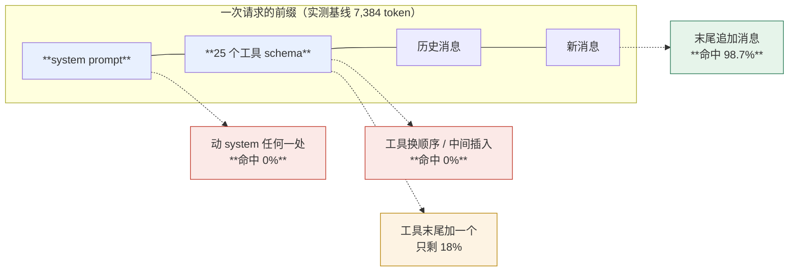
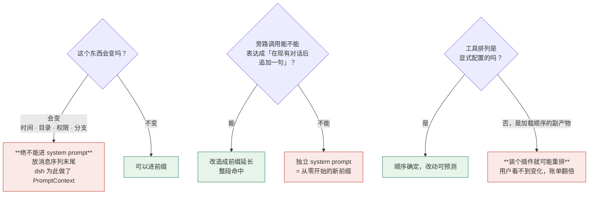

> 本章形态：【选写】。不写代码也能读完，但建议跑一遍 11.2 的实验——它只要几行 Python 和一份录制的请求。
> 实验脚本和数据在 `assets/ch11/`。

前面十章讲的都是怎么组织代码。这一章讲一件不一样的事：**这套架构在账单上的代价，以及 DeepSeek 为此做了什么。**

先说结论：**把请求里两个工具的顺序对调，前缀缓存命中直接归零。** 这个数字是在 DeepSeek 官方端点上真跑出来的，下一节给方法和完整数据。

## 11.1 前缀缓存匹配的是字节，不是相似度

现在的推理服务几乎都做前缀缓存：这次请求的开头如果和上次一样，那一段就不用重算，价格便宜一大截，延迟也低。

关键是"一样"这两个字的定义：**从第一个 token 开始逐字节比，遇到第一个不同就停，后面全部作废。**

不是相似度匹配，不是分段匹配。**一个字符的差异，作废它后面的所有内容。**

一个请求的结构大致是这样：

```
[ system prompt ][ 工具 schema ][ 历史消息 …………………… ][ 新消息 ]
 ←──────── 每次都一样，希望命中 ────────→ ←── 只增不改 ──→ ←新增→
```

理想状态：稳定的排前面，变动的只往后追加。这样每次请求的公共前缀都比上次更长。

理论就这些。下面看它在真实请求上是什么量级。

## 11.2 十个变量，一张表

DeepSeek 的响应里直接带缓存字段：

```json
"usage": {
  "prompt_tokens": 7384,
  "prompt_cache_hit_tokens": 7296,
  "prompt_cache_miss_tokens": 88
}
```

所以不用估算，直接量。

**方法**（这一步我第一次做错了，值得说）：要测的是「基线已经缓存的前提下，改动之后的**第一次**请求命中多少」。我第一版对每个变体连发两次、读第二次——那测的是**变体自己的缓存**，结果所有变体都是 98.9%，看着毫无差别。

正确做法是每个变体一次：

```python
for name, mutate in VARIANTS:
    salt = f'lineage-{i:02d}'          # 每个变体独立的缓存谱系，避免互相污染
    call(salted(salt))                  # 先把这一支的基线捂热
    r = call(mutate(salted(salt)))      # 改动之后的第一次请求 ← 读这个
```

基线是一个 7,384 token 的请求：system prompt + 25 个工具 schema + 一条用户消息，量级和第 1 章测到的真实 dsh 请求相当。

结果（`deepseek-v4-flash`，2026-08-17）：

| 改动 | 命中 | 未命中 | 命中率 |
|---|---:|---:|---:|
| A　什么都不改 | 7,296 | 90 | **98.8%** |
| B　末尾追加一条消息 | 7,296 | 94 | **98.7%** |
| C　system **末尾**加一行 | 0 | 7,394 | **0.0%** |
| D　system **开头**插一行 | 0 | 7,394 | **0.0%** |
| E　工具加在**最末尾** | 1,408 | 6,279 | 18.3% |
| F　工具加在**正中间** | 0 | 7,687 | **0.0%** |
| G　工具加在**最前面** | 0 | 7,687 | **0.0%** |
| H　前两个工具**换位置** | 0 | 7,386 | **0.0%** |
| I　改最后一个工具描述**一个字** | 1,280 | 6,107 | 17.3% |
| J　换一个**模型** | 0 | 7,386 | **0.0%** |

数据和脚本在 `assets/ch11/`，`DEEPSEEK_API_KEY=... python3 assets/ch11/prefix-experiment.py` 可以复现。

**四条结论：**

**一、往消息末尾追加是免费的。** B 保住 98.7%，和什么都不改（98.8%）没有实质差别。正常的对话推进不损失任何东西——这是整个设计要保护的东西。

**二、动 system prompt，无论动哪里，全废。** C 和 D 都是 0%。**注意 C**：我只在 system prompt 的**末尾**加了一句无关紧要的话，命中照样归零。因为 system 排在工具 schema 和消息之前，动它末尾就等于动了后面一切的起始位置。

**三、动工具 schema，最好的情况也只保住不到两成。** 加在末尾（E）和改最后一个工具描述的一个字（I）都只剩 17–18%；加在中间、加在最前、换两个工具的顺序（F、G、H），**全部归零**。

**四、换模型全废**（J）。缓存按模型索引，换一个就是从零开始。

第三条最值得盯着看。**改一个工具描述的一个标点，损失八成以上的缓存**——语义上什么都没变。

那 17–18% 是什么？大约 1,300–1,400 个 token，量级上接近 system prompt。也就是说改动工具区之后，**只有它前面那一段还能复用**。

**一个诚实的限定**：请求各部分在 prompt 里的确切拼装顺序是 provider 内部实现，我只能观测结果。上面那些结论是**可操作层面**的，不依赖对内部序列化的猜测，而且换一家 provider 数值会变——但"逐字节匹配前缀、从第一个不同处全废"这个机制是通用的。



**图 11-1：越靠前的东西动一下，作废得越多**。数据来自 11.2 在 DeepSeek 官方端点的十变量实测，脚本在 `assets/ch11/prefix-experiment.py`

## 11.3 为什么工具顺序要中心化配置

`system-prompt` 包有个配置项叫 `toolOrder`，是一个中心化的列表，还带一个 `'<unlisted-tools>'` 的占位项表示"其余的排这儿"。

直觉上更自然的做法是让每个工具插件自带一个权重，各报各的，框架排序。**dsh 明确没这么做**，理由写在一篇 Agent Note 里（`.agents/notes/implemented/feature/2026-07-06-explicit-tool-order.md`），README 里也点了：

> Why a central list and not per-plugin weights

现在你知道理由了：**工具的注册顺序是插件加载的偶然产物**。而根据上面那张表，顺序变一下缓存命中直接归零。

如果顺序由各插件的权重决定，那么装一个新插件、改一个插件的加载时机、甚至依赖解析顺序变了，都可能悄悄改变工具排列——**用户看不到任何变化，账单翻倍。**

中心化列表把这件事变成了显式的、可 review 的配置。README 里那句话说得很准：

> like the sections' `order` sort, it canonicalizes what the registry contributed (registration order is a plugin-load artifact)

**规范化（canonicalize）** 是关键词。它把一个偶然的东西钉成确定的东西。

配错了还会 fail loud：列表里没有恰好一个 rest 占位、有重复项，加载时就抛；列出一个不存在的工具名，每次 assemble 都拒绝。

系统提示的 section 也有类似机制——排序带：`-100` 是 harness 身份，`0` 是部署 persona，`100–199` 是工具指引。不过这里有个已知的弱点，README 的 Known Limitations 里自己写着：

> Sections sharing an `order` value tie-break by registration order — a plugin-load artifact

**同 order 的 section 靠注册顺序决胜负，而那是插件加载的偶然产物。** 所以确定性靠的是"用不同 order 带"这个约定，不像工具顺序那样被规范化了。这是一处真实的不对称。

## 11.4 DeepSeek 自己量的那次

上面是我的实验。DeepSeek 有一次自己量的，数字更狠。

`.agents/notes/implemented/feature/2026-07-30-current-sandbox-policy-context.md` 记录了这样一件事：当前的沙箱权限模式，原本是写在 system prompt 里的。用户切一次权限，会发生什么？

> The first `danger-full-access` and `workspace-write` requests each reported only **256 cache-read tokens** against **14,691 and 14,782 uncached input tokens**. Later steps under an unchanged policy reported approximately **14.7k–15.5k cache-read tokens**.

翻译：**切换权限之后的第一个请求，缓存命中从一万四千多掉到 256。**

修法不是优化文案，是把这段内容整个挪出 system prompt——dsh 为此引入了一个和 `PromptSection` 并列的概念 `PromptContext`，它作为动态上下文出现在**消息序列里**，而不是 system prompt 里。

改完之后同一篇 Note 记录的数字：

> cache reads were **14,848–15,872** tokens while uncached input was **59–306 tokens per request**

每次请求只有几十到三百个 token 是新算的。

这篇 Note 还逐条否决了两个别的方案，其中一个特别值得看：

> **Put current policy in a dynamic system section.** Rejected after real provider evidence showed that a first-time permission switch reduced cache reads to 256 tokens while roughly 14.7k input tokens missed. DeepSeek matches complete prefixes; changing the first wire message prevents reuse of the longer system-plus-history prefix.

**"changing the first wire message"** —— 改第一条 wire 消息，就毁掉了"system + 全部历史"这个更长的前缀。位置比内容重要。

## 11.5 一个反直觉的省钱失败案例

另一篇 Note 更有意思：`.agents/notes/implemented/bug-fix/2026-07-21-compaction-summary-prefix-cache-reuse.md`。

上下文压缩要调一次模型来生成摘要。原本的做法很自然：给这次调用一套专门的 summarizer system prompt——**它是一次独立的调用嘛，跟主对话没关系。**

结果是每次压缩都把整段历史重算两遍：一遍给主对话，一遍给摘要调用。因为 system prompt 不一样，前缀从第一个 token 就分叉了。

修法是**把压缩指令从请求头挪到最后一条 user message**。这样摘要调用变成了会话请求的**前缀延长**——system 和历史全都命中，只有末尾那句"请总结上面的对话"是新的。

这篇 Note 还否决了三个优化方案，其中一个是绝佳的反直觉教学点：

> **摘要请求可以省掉 tools**（反正模型不会在总结时调工具）

听起来纯赚：25 个工具 schema 是 27 KB，省掉它们能省一大笔。

**否决理由是：tool schema 是缓存 token 序列的一部分。** 省掉它们，后面每一个 token 的位置都错位了，整段历史的复用全部作废。

**省 27 KB 的代价是重算 40 KB。** 这就是"位置比内容重要"的另一面——你不能只看某段内容值多少钱，得看动了它之后有多少东西跟着作废。

## 11.6 每加一个碰请求的插件，都在动 token 序列

现在可以回答一个第 3 章埋下的问题了：「一切皆插件」的代价，在缓存这件事上表现得最锋利。

插件可以随便加。但**每加一个碰请求的插件，你都在动模型看到的 token 序列**：

- 加一个贡献 prompt section 的插件 → 从那个 section 的位置起，后面全废
- 加一个工具 → 如果它排在中间，从它的位置起全废（排末尾则只废它自己那一段，见 11.2 的 76.7%）
- MCP 一次 re-sync 改了某个工具的 schema → `packages/mcp/mcp-client` 的 README 明写：从第一个变化的 token 起失效

第 5 章那条「换一个 provider，所有消费者被整体重启」的机制，在这里有了成本上的对应：**换一个 provider，前缀也从它影响的位置起全部作废。**

一个具体例子能说明这套约束被贯彻得多细。`packages/subagent/subagent-fork-in-process` 是"从当前会话 fork 出一个子 agent"的实现，它把子 agent 固定成 `backgroundMode: one-shot`（一次性，不能续跑）。

**理由纯粹是缓存**：可续跑的子 agent 需要多带一个 `report` 工具和它的 prompt section，而这段增量排在继承来的历史**之前**——于是整段继承历史的复用全部作废。

**一个功能特性，因为缓存代价被砍掉了。** 这是"把 KV cache 当架构约束"最直白的证据。

## 11.7 215 个包的 README 里，有 58 篇写了真东西

到这里应该问一句：DeepSeek 怎么保证几百个包的作者都记得这件事？

答案是**把它变成 README 的必填项**。

`docs/cookbook/adding-a-package.md` 规定每个包的 README 必须有 `## Model Experience` 小节，里面必须有 `#### KV Cache effect`，而且要落进四种语义分类之一：

| 分类 | 含义 |
|---|---|
| `append-only` | 只往后追加，不动已有前缀 |
| `prefix-stable` | 在某些条件下前缀保持不变，条件要写清楚 |
| `replacing` | 会替换更早的请求 token（比如压缩） |
| `independent` | 独立的模型请求，和主链路前缀无关 |

还要点名"本包哪些改动会让复用失效"。`scripts/verify-package-readme-model-experience.ts` 是机器门禁。

**实测分布**（我自己跑的统计）：

- 268 个包 README 里，**215 个**有 `#### KV Cache effect`
- 其中 **110 篇不到 80 字符**，是样板话（最多的一句是 "None; this package neither assembles nor sends a provider request."）
- **58 篇超过 150 字符**，是实质分析

**这个分布要如实说。** 覆盖率是真的、门禁是真的，但"215 个包都写了硬货"不是真的——实质内容集中在真正碰请求的那六十到一百个包上。不碰请求的包写一句"与我无关"，这恰恰是这套机制该有的样子。

写得好的长什么样，看 `system-prompt` 包自己那两条：

> Prefix-stable while identity, persona, variables, section text, and order render identically. **Any change may invalidate reuse from the first changed system-prompt token.**

> Schema tokens repeat on every request. Restricting a tool removes its entire schema cost for that agent but not a separate prompt section; **reordering changes cache shape but not semantic content.**

第二句就是我 11.2 节量到的那 9.9%。它被写在 README 里，作为这个包的公开契约的一部分。



**图 11-2：三个判断，不用 dsh 也适用**。左边那三个问题问完，你的前缀策略基本就定了

## 11.8 三个能带走的问题

你不一定用 dsh，但只要在做 agent，就得回答这三个问题。

**一、我的动态状态放哪一段？**

当前时间、当前目录、当前权限、当前分支——这些每次都在变的东西，放 system prompt 里等于每次全废。正确的位置是消息序列的末尾。dsh 为此专门做了 `PromptContext` 这个和 `PromptSection` 并列的概念。

判据很简单：**这个东西会变吗？会变就不能进前缀。**

**二、我的旁路模型调用要不要复用主对话的前缀？**

生成标题、生成摘要、做一次分类——这些调用如果自带一套 system prompt，就是从零开始的新前缀。如果能改造成"主对话前缀 + 一句指令"，就能整段命中。

判据：**这次调用能不能表达成"在现有对话后面追加一句话"？** 能就改造。

**三、我加一个工具会作废多少缓存？**

排在末尾，只废它自己那段（本章测到 76.7% 存活）。排在中间，从它的位置起全废。工具顺序如果是由加载顺序决定的，那你根本无法预测——所以要么中心化配置，要么至少保证顺序是确定的。

判据：**我的工具排列是显式配置的，还是加载顺序的副产物？**

---

第二部分到此结束。你手里有一个能跑的 harness 骨架，也知道了它在账单上的成本结构。

第三部分回到真 dsh：配置怎么合成、能力接缝怎么换掉整个执行世界，以及——**怎么写一个能真正发布上线的插件**。
