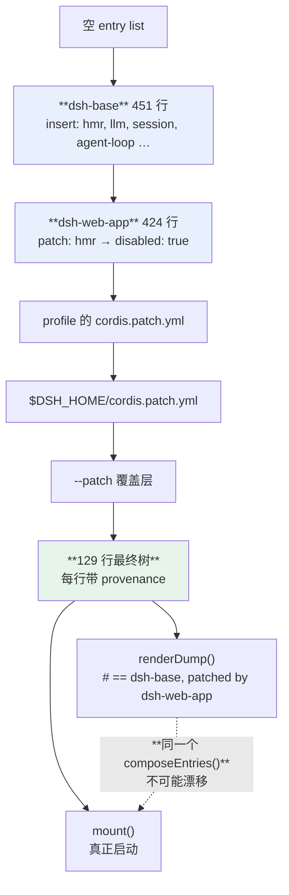

> 本章形态：【必写】。写约 130 行，一个半小时。
> 起点 `ch12-start`，答案 `ch12-done`，自检 `pnpm verify:ch12`。
> 本章末尾那份排查手册，建议直接抄进你的内部 wiki。

第 1 章敲的第一条命令是 `--dump-config`，第 3 章把 patch 的整体替换列为六个取舍之一，而且判定它**最可能被改掉**。

这一章把合成算法写出来，然后回答那个悬着的问题：**整体替换到底换来了什么，值不值得忍受"改一个字段要重写一整段"。**

## 12.1 一棵树是怎么叠出来的

```
空列表
  ← 每个 bundle 按 profile 声明的顺序各打一层
  ← profile 自己的 cordis.patch.yml
  ← $DSH_HOME/cordis.patch.yml（家目录层，排在 profile 之上）
  ← --patch 覆盖层（可重复）
```

profile 就是 `$DSH_HOME/profiles/<名字>/` 下的一个目录，里面两个文件。`web` 的 manifest 第 1 章看过：两层 bundle，`dsh-base` 加 `dsh-web-app`。

mini 版把这件事抽象成「若干层 patch 叠到一个空列表上」：

```ts
export function composeEntries(layers: Layer[], warn = () => {}): ComposedEntry[] {
  const out: ComposedEntry[] = []
  for (const layer of layers) {
    for (const patch of layer.patches) {
      if (patch.insert) { /* 追加新行 */ continue }
      const target = out.find(x => x.id === patch.id)
      if (!target) { warn(`patch 指向的 id "${patch.id}" 在树里不存在`); continue }
      if ('config' in patch) target.config = patch.config      // ★ 整体替换
      if ('disabled' in patch) target.disabled = patch.disabled
      target.provenance.patchedBy.push(layer.label)
    }
  }
  return out
}
```

三十行不到，整个配置系统的核心就是它。

注意两个行为：

**patch 定位不到 id 只告警，不报错。** 这个选择有道理——bundle 版本升级可能改了某行的 id，用户的 patch 一时对不上，不该让整个进程起不来。真 dsh 也是这个行为，输出一行 stderr 警告。

**插入重复 id 直接报错。** 因为那是明确的冲突，不是版本漂移。

## 12.2 整体替换：先看它有多疼

```ts
test('patch 是整体替换，不深合并——没写的字段会消失', () => {
  // 原来那行：{ provider: 'deepseek', model: 'v4', temperature: 0.2 }
  const home = { label: 'home', patches: [{ id: 'agent-default-model', config: { provider: 'mock' } }] }
  const row = composeEntries([base, home]).find(e => e.id === 'agent-default-model')!

  assert.deepEqual(row.config, { provider: 'mock' })
  assert.equal(row.config.model, undefined, 'model 和 temperature 都没了')
})
```

你只想换个 provider，结果 `model` 和 `temperature` 一起消失了。

**这是真实的日常摩擦**，不是理论上的不便。`settings.json` 那种深合并里，改一个字段就写一个字段。

唯一的减轻手段是：`--dump-config` 会打出完整的当前值，从那里复制粘贴。

## 12.3 深合并没有公认的定义

现在说它换来了什么。第一个理由是数学性的。

整体替换让"叠加"成为一个**结合律成立**的运算：

```
(a ⊕ b) ⊕ c  ==  a ⊕ (b ⊕ c)
```

测试直接验证了这一点：

```ts
test('层的叠加满足结合律：怎么分组都一样', () => {
  const abc = composeEntries([base, L2, L3])
  const merged = { label: 'L2', patches: [...L2.patches, ...L3.patches] }
  const ab_c = composeEntries([base, merged])
  assert.deepEqual(abc, ab_c)
})
```

**深合并做不到这一点**，因为它一碰到数组和嵌套对象就没有公认定义：

- 数组是拼接还是覆盖？
- 拼接的话，按 index 对齐还是按某个 key 对齐？
- `null` 是"设成 null"还是"删掉这个键"？
- 嵌套三层的对象，第三层的数组按哪条规则？

每个实现给的答案都不一样（Kustomize 有 strategic merge patch，Helm 有另一套，Lodash 的 `merge` 又是一套）。**结合律成不成立取决于实现细节**，而实现细节会变。

一旦结合律不成立，"这一行的最终值是怎么来的"就没有确定答案——你得知道那些层是按什么顺序、什么分组被应用的。

整体替换下，答案永远唯一：**最后一个写了这一行的层说了算。**



**图 12-1：预览和启动共用一个合成函数**。整体替换保证了每行的来源唯一，`# ==` 注释才写得出来

## 12.4 所以 dump 能告诉你是谁改的

这是第二个理由，也是日常最有用的那个。

因为每一行的来源唯一，合成时可以顺手记下来：

```ts
target.provenance.patchedBy.push(layer.label)
```

渲染成 dump 里那句注释：

```yaml
# == mini-base, patched by mini-web-app
- id: hmr
  name: 'mini-hmr'
  disabled: true
```

第 1 章看到的真实输出是同一个形状：

```yaml
# == @deepseek-ai/dsh-base, patched by @deepseek-ai/dsh-web-app
```

我那份 490 行的 dump 里有 24 处这样的层标记。

**如果是深合并，这行注释写不出来。** 一行的最终值可能是三层各贡献一半拼起来的，"谁改的"没有单一答案，只能说"这三层都掺和了"。而排查配置问题时你要的恰恰是单一答案。

## 12.5 dump 和 boot 是同一个函数

第三个理由更硬。

一个配置系统最容易出的 bug 是：**打印出来的和实际生效的不一样。** 因为通常这是两条代码路径——一条负责渲染给人看，一条负责真正加载。

dsh 从构造上消灭了这类 bug：**dump 和 boot 调用同一个合成函数。**

```ts
test('dump 用的就是 boot 用的那个函数，不可能漂移', () => {
  const entries = composeEntries([base])
  const ids = [...renderDump(entries).matchAll(/^- id: (.+)$/gm)].map(m => m[1])
  assert.deepEqual(ids, entries.map(e => e.id))
})
```

真 dsh 为此专门做过一次重构。`vendor/README.md` 的本地修改第 11 条，把 include 插件里的 `applyPatches` 从私有方法提成了导出的纯函数 `applyEntryPatches`，理由原话是：

> config tooling must never reimplement (and drift from) the patch algorithm

**配置工具永远不许重新实现（并因此漂移出）这个 patch 算法。**

这是"用构造消灭一类 bug"的教科书例子。不是写测试去比对两条路径的结果——是让它们根本只有一条路径。

**这条可以直接搬走。** 任何"有个命令能预览最终配置"的系统，都该问一句：预览和实际执行走的是不是同一段代码？

## 12.6 行序在这里不携带任何语义

第 5 章讲 epoch 时说过，激活顺序由服务可用性驱动。这一章能验证它了：

```ts
test('行序不影响结果——第 5 章那条规矩在这里兑现', async () => {
  const forward  = /* provider 在前，consumer 在后 */
  const backward = /* 反过来 */
  assert.deepEqual(await run(forward),  ['p', 'c'])
  assert.deepEqual(await run(backward), ['p', 'c'], '配置行序反过来，执行顺序不变')
})
```

所以 `dsh-base` 那 451 行想怎么排就怎么排。文件头的注释写得很清楚：

> Row order carries no load semantics; the grouping is for readers.

这对读配置的人是好消息：**你不用担心"这行放错位置会不会出问题"，只需要关心 id 和 config。**

## 12.7 比 profile 更小的分发单元：agent preset

平台团队会遇到一个 profile 解决不了的问题：**平台想发一套标准配置，各团队要能在上面微调，但不能改坏平台那份。**

dsh 为此有一层比 profile 更小的东西——**agent preset**（`packages/preset/agent-presets`）。

一个 preset 是一个目录，里面有个 `agent.cordis.yml`。特点是：

- **roster 每进程只挂一次**（standing scope），多个 session 共享同一份工具和 prompt 注册，不重复付内存
- **roots 带信任级别**：只有 `user` 信任级别的 root 可写。平台发的那份放只读 root，团队自己的放可写 root
- **坏掉的 preset 以 `broken` 加原因列出，而不是被跳过**——这一条很重要，静默跳过意味着某个团队的配置失效了却没人知道

这正是"平台发一套、各团队只读用、要改就 copy 出来改"的分发模型。第 18 章讲内部平台时会用到它。

## 12.8 出事怎么退：HMR 的事务性重组

配置能热改，就必然要回答"改错了怎么办"。

dsh 的用户 patch 层是被 watcher 全程盯着的。改文件即触发重组，而重组是**事务性**的：

- 先读取、校验、在克隆上应用 patch
- 用新的候选树去协调
- **失败就保留上一棵好树**，并广播 `hmr/config-update-failed`

理论上这叫 shadow structure + atomic swap——先在影子上建好，成功了才整体切换。工程上它对应的是配置中心（Nacos、Apollo）推送校验失败时回滚上一版的做法。

`vendor/README.md` 的本地修改第 8 条整条在讲这个：Loader 在改动某个 entry 时**先导入新的再销毁旧的**，等生命周期稳定，候选应用失败就恢复上一个插件或配置；group 更新并发启动候选、等所有结果、失败时撤销新增和改动。

**按团队灰度就建在这个机制上**：同一个 bundle 的两个版本可以在不同 profile 里并存，出事把那一层 patch 撤掉，树自己会退回去。

## 12.9 插件不工作时的排查顺序

这一节是全书最实用的两页，建议直接抄进内部 wiki。

沉默失败是新手唯一真正会被卡死的东西——**没有报错，没有栈，插件就是不响应**。按下面的顺序查，覆盖绝大多数情况。

### 第一步：它在树里吗

```sh
dsh --profile web --dump-config | grep -A5 'id: 你的插件id'
```

**查不到** → 你的 patch 没生效。往下看两种常见原因：

- patch 里写的 id 和树里的对不上。dsh 对"patch 指向不存在的 id"只发一行 stderr 警告，很容易被淹没。**把启动输出完整看一遍**。
- patch 文件本身没被读到。确认它在 `$DSH_HOME/cordis.patch.yml` 或者 profile 目录下，而且是**顶层 YAML 数组**。空文件或只有注释的文件会解析成 nothing 而不是空列表，会抛错；想禁用这一层，写 `[]`。

**查到了但 `disabled: true`** → 被某一层关掉了。看那行上面的 `# ==` 注释，它会告诉你是谁关的。

### 第二步：它激活了吗

这是最常见的一种。插件在树里、配置也对，但 `apply` 一次都没跑。

原因几乎总是**依赖没齐**——第 5 章讲过，缺一个服务就整个不启动，状态停在 `PENDING`。

真 dsh 启动时的 `assertEntriesActivated` 会把卡住的插件连同它缺的服务一起报出来。mini 版的等价物：

```ts
export function assertEntriesActivated(ctx: Context): void {
  const stuck = ctx.pending()
  if (stuck.length === 0) return
  const detail = stuck.map(s => `  ${s.name} 缺 [${s.missing.join(', ')}]`).join('\n')
  throw new Error(`STARTUP_INCOMPLETE: 有 ${stuck.length} 个插件没能激活\n${detail}`)
}
```

**看到「缺 [xxx]」，就去找谁该提供 xxx。** 通常是那个提供者插件自己也卡住了，或者压根没装。官方教程第 2 课自己写着这句：PENDING 通常就是"为什么我的插件没有输出"的答案。

### 第三步：它注册的东西被谁截了吗

插件跑了，注册也成功了，但行为没出现。

如果你注册的是 waterfall 监听器，**很可能被排在你前面的某个监听器短路了**——它没调 `next()`，你就永远收不到。

症状：下游消息凭空消失，没有报错。

排查方法：从后往前一个个摘监听器，看摘掉哪个之后你的就活了。找到之后确认那个监听器是不是该短路——第 6 章那条规矩：策略型可以短路，观察型必须委托。

### 第四步：它是不是被卸载了

如果插件的依赖服务被换了提供者，第 5 章那条 epoch 规则会让它**整体重启**——unload 再 load。重启期间它注册的东西都是撤销状态。

看 `internal/status` 事件，或者直接打印 fiber 的 state。反复在 `LOADING` 和 `UNLOADING` 之间跳，说明有个服务在反复被替换。

### 一张表

| 症状 | 先查 | 常见原因 |
|---|---|---|
| dump 里没有这一行 | patch 的 id 拼写、patch 文件位置 | 只有 stderr 警告，被淹没了 |
| 有这一行但 `disabled: true` | 该行上面的 `# ==` 注释 | 某个上层 bundle 关掉了它 |
| 在树里但 `apply` 没跑 | 启动自检的报错 | 依赖服务缺席，停在 PENDING |
| 跑了但行为不出现 | 前面的 waterfall 监听器 | 有人没调 `next()` |
| 时灵时不灵 | fiber 的 state 变化 | 依赖的 provider 在反复换 |
| 改一个字段其他字段没了 | patch 语义 | 整体替换，本章 12.2 |

---

配置合成讲完了。下一章是全书最强的那个演示：**换两个 provider，把 Bash、PTY、LSP 整体搬到另一个执行环境，而工具代码一行不改。**
