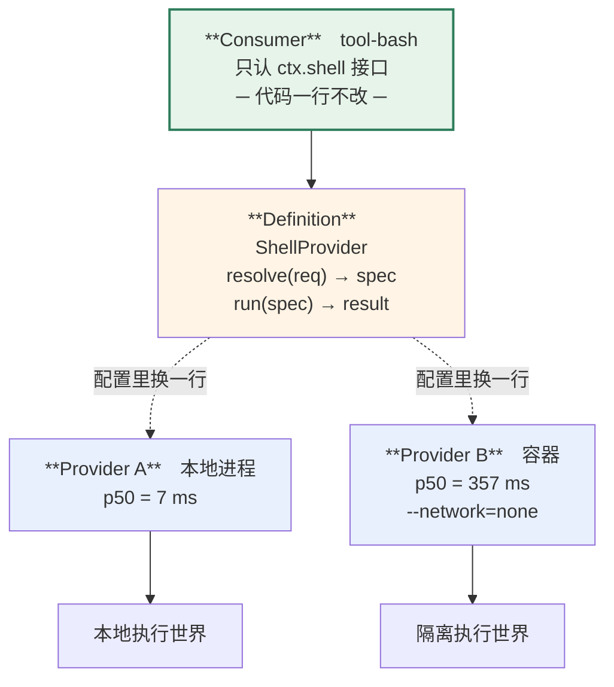

> 这一章要动手写代码：约 190 行，两小时。容器那部分需要本机有 Docker，没有也能读，测试会自动跳过。
> 起点 `ch13-start`，答案 `ch13-done`，自检 `pnpm verify:ch13`。

这是全书最强的一个演示，也是最容易被吹过头的一个。所以先把话说全：**它成立，而且我跑通了；它有代价，代价是 51 倍延迟。**

## 13.1 接缝这个词有出处

先认领来历。**seam** 出自 Michael Feathers 的《修改代码的艺术》（2004）：

> a seam is a place where you can alter behavior in your program without editing in that place.

**接缝是这样一个位置：你能在那里改变程序的行为，而不需要在那里改代码。**

dsh 的用法和原义完全吻合。而且 Feathers 还有个配套概念叫 **enabling point**（启用点）——改变行为的开关在哪。dsh 的启用点就是 profile/bundle/patch 里的一行配置。

有了这组词，你就能自己判断"我项目里这个接口算不算接缝"：**能在不改调用点的前提下换掉行为，而且有明确的启用点，才算。** 光有一个 interface 不算。

## 13.2 三个角色，少一个都不成立

dsh 的规定很硬：一个能力接缝由三个角色构成，**单独一个角色不构成接缝**。

| 角色 | 干什么 | 本章的例子 |
|---|---|---|
| **Service Definition** | 声明这个能力是什么，不说怎么做 | `ShellProvider` 抽象类 + `ctx.shell` |
| **Service Provider** | 具体实现 | `LocalShellProvider` / `ContainerShellProvider` |
| **Consumer** | 用它，通常是模型可见的工具 | `tool-bash` |

bash 三件套是 dsh 里的模板，官方 README 直接说"the bash trio is the template"。真 dsh 那套是：`dsh-shell`（定义）、`bash-local` / `bash-sandbox` / `pwsh-local` / `pwsh-sandbox`（实现）、`tool-bash` / `tool-bash-persistent`（消费者）。

**为什么强调"少一个不算"？** 因为只写接口不写实现，等于把这个能力做成了空壳；只写实现不写接口，等于把消费者焊死在这个实现上。两种都换不掉。

测试直接验证了缺角色的后果：

```ts
test('三个角色齐全才叫接缝：少了 provider，消费者压根起不来', async () => {
  ctx.plugin(toolsPlugin); ctx.plugin(shellPlugin); ctx.plugin(toolBashPlugin)
  await ctx.settled()
  assert.equal(shell.kind, 'none')
  await assert.rejects(() => shell.run({ command: 'echo hi' }), /SHELL_UNAVAILABLE/)
})
```

注意它是**报错**，不是静默降级成本地执行。这一点在沙箱那节还会再出现。

## 13.3 defaulting 是显式的一步

`ShellProvider` 上有个看着多余的方法：

```ts
abstract class ShellProvider {
  resolve(req: ShellRequest): ShellSpec {
    return { cwd: req.cwd ?? process.cwd(), timeoutMs: req.timeoutMs ?? 30_000, command: req.command }
  }
  abstract run(spec: ShellSpec): Promise<ShellResult>
}
```

为什么不在 `run()` 里写 `req.cwd ?? process.cwd()` 就完了？

dsh 把这条写成了规矩（AGENTS.md）：

> **Explicit > implicit at package boundaries**：defaulting 是一个明确的 `resolve(request): Spec` 步骤，不是藏在 `run()` 里的 `?? default`（`dsh-shell` 的 request/spec 分离就是模板）。

**好处是"最终用了什么参数"变成可检查的。** 排查问题时你能单独调 `resolve()` 看它补出了什么，而不用去 `run()` 里逐行找默认值散落在哪。

```ts
const spec = provider.resolve({ command: 'x' })
assert.equal(spec.timeoutMs, 30_000)    // 补出来的值，看得见
```

这条可以直接搬走：**在包边界上，把"补默认值"做成一个能单独调用的纯函数。**

## 13.4 换一行配置，执行世界整个换掉

现在是演示。两个 provider，同一个消费者：

```ts
// 本地
ctx.plugin(shellPlugin)
ctx.plugin(shellLocalPlugin)
ctx.plugin(toolBashPlugin)

// 容器
ctx.plugin(shellPlugin)
ctx.plugin(shellContainerPlugin, { image: 'node:22-alpine' })
ctx.plugin(toolBashPlugin)      // ← 一模一样
```

跑同一条命令：

```ts
const call = { callId: 'c1', name: 'bash', args: { command: 'cat /etc/os-release | head -1' } }
const a = await local.tools.execute(call)
const b = await inContainer.tools.execute(call)

assert.equal((a.content as any).where, 'local')
assert.equal((b.content as any).where, 'container:node:22-alpine')
assert.notEqual(a.content.stdout, b.content.stdout)   // 两个世界的 os-release 不一样
```

`tool-bash` 的代码一个字符都没改。它只认 `ctx.shell` 这个接口，不知道底下是本地进程还是容器。

**而且隔离属性跟着 provider 走：**

```ts
test('容器 provider 默认断网', async () => {
  const r = await tools.execute({ ..., args: { command: 'wget -T2 -q -O- http://example.com || echo BLOCKED' } })
  assert.match(r.content.stdout, /BLOCKED/)
})
```

容器 provider 里带了 `--network=none`。消费者不知道这件事，但模型的执行环境确实断网了。

**这就是「一次 provider swap 改变整个产品」的字面意思。**



**图 13-1：三个角色，换中间一层就换掉整个执行世界**。延迟差 51 倍是实测（`assets/ch13/latency.json`）

## 13.5 代价：51 倍

现在说代价。同样一条 `echo ok`，跑 12 次取分位数：

| | p50 | p95 | 最快 |
|---|---:|---:|---:|
| 本地进程 | **7 ms** | 16 ms | 5 ms |
| 容器（同机隔离） | **357 ms** | 473 ms | 326 ms |

**51 倍。** 数据在 `assets/ch13/latency.json`。

而且这还是**同机**容器。真正的远程沙箱要再加一跳网络往返，那个数字我这边测不到——本机到公网不通，`e2b` 那条路跑不起来。

**这一点必须说清楚，不能拿本地容器的数字冒充远程。**

对 agent 来说这个开销意味着什么？一个任务如果调 20 次 bash，本地是 0.14 秒，容器是 7 秒。**如果每次调用都起一个新容器，这个设计就不实用。** 生产做法是常驻容器 + exec 进去，或者按会话池化——那是这个 provider 该优化的事，而**消费者依然不需要知道**。

这恰恰是接缝的价值：优化执行环境是 provider 的事，和二十几个工具无关。

## 13.6 真 dsh 的耦合半径，以及它的边界

mini 版只换了一个接缝。真 dsh 的演示更狠：**fs 和 subprocess 两个 provider 一起换，Bash、PTY、LSP 三个消费者整体跟着搬。**

`packages/e2b/README.md` 白纸黑字写了这三个消费者 "need no E2B-specific forks"——不需要为 E2B 做任何分叉。论点站得住。

**但同一页还写了两件事，必须放在同一屏里说：**

第一，这是 **"experimental provider-composition POC"**，官方自己标的实验性。

第二，有一份明确的**不搬清单**：harness 进程本身、Cordis 对象、模型调用、会话状态与持久化、skills、SDK 缓冲。

也就是说搬走的是"执行世界"，不是"整个 agent"。这个边界很重要，写方案的时候不能含糊。

## 13.7 一个 dsh 没解决的问题

这一节是我读源码时发现的，值得单独讲——**因为它说明接缝的粒度该切在哪里。**

fs 和 subprocess 是两个**独立**的接缝。但它们必须指向同一个执行世界才有意义：文件系统在容器里、进程在本地，那模型读到的文件和它跑命令看到的文件就不是一回事了。

**这个约束在哪里表达？**

答案是：**没有地方表达。** 它靠一个约定维持——两个 provider 都 inject `ctx.e2b`，共享同一个生命周期所有者。类型系统不管这件事，`packages/e2b/subprocess-e2b/src/invariant.ts` 是个空的 installer，也不检查。

于是存在一个**合法但错误**的配置：

```yaml
- id: fs
  name: '@deepseek-ai/dsh-fs-e2b'          # 文件系统在远端
- id: subprocess
  name: '@deepseek-ai/dsh-subprocess-local' # 进程在本地
```

它能启动，能跑，行为诡异。

由此可以提炼一条可迁移的原则：

> **接缝的粒度应该切在「可以独立替换」的地方，不是「可以独立实现」的地方。**

fs 和 subprocess 确实可以独立实现——它们是两套 API。但它们**不能独立替换**，因为换了一个不换另一个就出问题。这种情况下要么合成一个接缝，要么把关联显式建模出来（比如让 Definition 声明"我和某某必须同源"）。

dsh 用共享生命周期所有者隐式做了一半。这是真实的设计空白，不是我在挑刺——它正好说明"接缝"这个概念本身也需要设计判断，不是划几个 interface 就完事。

## 13.8 安全边界也是接缝

沙箱是这套接缝模型的另一个案例，而且它有个值得单独学的性质。

`ctx.sandbox` 有四个后端：

| 平台 | 后端 |
|---|---|
| Linux | 优先 `bwrap`（bubblewrap），其次 Landlock（dsh 自带 `native/landlock-run` 原生 addon） |
| macOS | Seatbelt（`sandbox-exec`） |
| Windows | ACL 受限令牌 |

选择方式是**功能探针**：多个候选按顺序探测，能用的才选；只有一个候选就直接选。结果会缓存。

**关键性质是失败关闭（fail closed）：**

> Unsupported platforms and unusable runners fail closed with `SANDBOX_UNAVAILABLE`; execution never silently falls through unconfined.
> —— `packages/sandbox/sandbox-local/README.md`

**沙箱不可用时报错，绝不静默降级成无约束执行。** 这和 13.2 节那个"没有 provider 就报 `SHELL_UNAVAILABLE`"是同一条原则。

安全设施的默认行为应该是"不确定就拒绝"，而不是"不确定就放行"。这条听着理所当然，但实现里很容易写成后者——因为"降级还能用"看起来更友好。

还有一个细节值得抄：**怎么区分"沙箱坏了"和"命令本身失败了"。**

这两件事的处理方式完全不同：前者要报警、要拒绝执行；后者是正常的工具失败，把错误交回给模型就行。dsh 给每个后端配了结构化的失败签名——比如 Landlock 要求**退出码 125 加上一行 `landlock-run:` 开头的致命输出**才算是沙箱自身失败，否则就是子进程的正常失败。

bubblewrap 和 Seatbelt 只能靠签名匹配，因为它们的公开契约里没有保留专门的启动器失败码。这是真实的限制，README 里也写了。

Seatbelt 的 profile 设计也有教学价值：**allow-default 加 `(deny file-write*)` 再加白名单**——默认允许，但禁掉所有写，然后精确开放该写的地方。`read-only` 模式只放开 `/dev/null` 这一个字面量；`workspace-write` 加上工作区根目录、`/tmp` 和每用户的 darwin 临时目录。所有路径都要 canonicalize，因为 Seatbelt 匹配的是解析后的路径——**`/tmp` 就是 `/private/tmp`**。

> **平台提示**：Landlock 和 bubblewrap 是 Linux 专有，Seatbelt 是 macOS。用 Mac 的读者跑不了 Landlock 那部分，反之亦然。这不是配置问题，是内核能力问题。

## 13.9 现有的接缝有哪些

盘一遍，方便你找对应的扩展点：

| 接缝 | Definition | 常见 Provider | Consumer |
|---|---|---|---|
| shell | `dsh-shell` | `bash-local` / `bash-sandbox` / `pwsh-*` | `tool-bash` / `tool-bash-persistent` |
| subprocess | `dsh-subprocess` | `subprocess-local` / `subprocess-e2b` | 上面那些的底座 |
| fs | `dsh-fs` | `fs-local` / `fs-sandbox` / `fs-e2b` | `tool-fs` / `tool-fs-search` / `tool-str-replace-editor` |
| web | `dsh-web` | `web-search-{deepseek,exa,perplexity}` / `web-fetch-http` | `tool-web` |
| spill | `dsh-spill` | `spill-local` | `spill-policy` |
| compaction | `dsh-compaction` | `compaction-basic` | `command-compact` |
| code-runtime | `dsh-code-runtime` | `code-runtime-worker-thread` | tools 的 Code Mode |
| subagent | `dsh-subagent` | 7 种，见第 16 章 | `tool-subagent` 等 |
| sandbox | `dsh-sandbox` | `sandbox-local` / `sandbox-windows-acl` | 各执行类 provider |
| storage | `dsh-storage` | `storage-json` / `storage-sqlite` | 各域插件 |
| settings | `dsh-settings` | `settings-file` | 各配置消费者 |
| credentials | `dsh-credentials` | `credentials-local` | llm 适配器等 |
| skill | `dsh-skill` | `skill-filesystem` | `tool-skill` |
| lsp / terminal / jobs / attachment / sessionTitle / telemetry | 各自 | 各自 | 各自 |

## 13.10 一个非执行类的接缝：凭证

上面清一色是"执行"相关的，容易让人以为接缝只适合那类东西。看一个不一样的：`packages/credentials`。

它的教条是一句话：**配置只携带引用，不携带密钥。**

配置里写的是 `apiKeyEnv: DEEPSEEK_API_KEY` —— 一个环境变量名，不是值。

三个设计细节值得抄：

- **`resolve()` 每次操作重解一次**，不缓存。所以轮换密钥不需要重启进程。
- **`describe()` 只回答"配没配、来自哪、能不能写"，从不返回值。** 配置界面要显示"已配置"，不需要拿到密钥本身。
- **遮蔽（shadowing）要 fail loud**：同一个凭证在多处定义时报错，不静默取其中一个。

对平台团队来说这个接缝是现成的口子：**把 provider 换成你们的 KMS 或 keyring，配置文件永远只有引用。** 第 18 章会用到。

---

接缝讲完了。下一章是第三部分的落点，也是这本书对"能上线"这个承诺的兑现：**给真 dsh 写一个插件，从需求走到 npm 发布。**

那一章全程不碰 mini-dsh。

---

> 本章来自《一切皆插件》开源版 · 作者「递归客」  
> 在线阅读完整书系：[inferloop.dev](https://inferloop.dev)  
> 源码仓库：[github.com/diguike/book-deepseek-harness](https://github.com/diguike/book-deepseek-harness)
