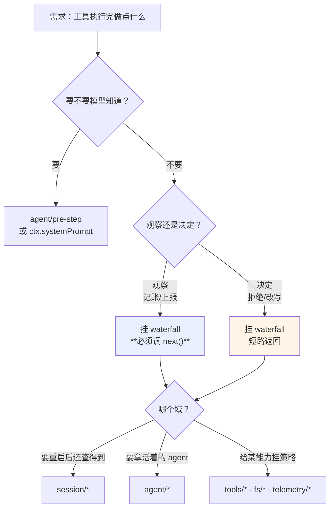

> 本章形态：【必写·实战】。**全章不碰 mini-dsh**，写的是能装到真 dsh 上的插件。
> 成品在配套仓库 `extensions/dsh-plugin-audit/`，本章所有输出都是它真跑出来的。

前言里那个需求：**每次 agent 改完文件，把 diff 发到群里**。在 Claude Code 里我只能挂一个 hook 进程。

这一章把它做出来，而且做得比原需求更完整一点——**工具调用审计加团队规约注入，带脱敏**。因为审计比发消息更能说明问题：它要碰参数、碰结果、碰敏感数据，还要保证自己出错不能拖垮主流程。

> **和官方文档的分工**：`docs/user/develop/` 有 9 篇中文教程，`basic/publish.zh.md` 183 行把发布流程一步不缺地写完了。**那些不重复**。这一章讲官方教程不讲的三件事：需求怎么落到扩展点、原生插件和 hook / MCP 怎么选、以及**签名对不上时怎么查**——那才是真正卡住人的地方。

## 14.1 先决定写在哪一层

拿到需求第一件事不是写代码，是**选扩展点**。选错了后面全白干。

dsh 的官方文档有一张「Where new behavior goes」的决策表（`docs/architecture.md`）。把它压缩成三个问题：

**问题一：这件事需不需要模型知道？**

需要 → 它得进模型请求，那就是 `agent/pre-step`（改模型看到的消息）或者 `ctx.systemPrompt`（改系统提示）。
不需要 → 往下。

**问题二：它是在观察，还是在决定？**

观察（记账、上报、统计）→ 挂 `emit` 类事件或者 waterfall 但必须调 `next()`。
决定（拒绝、改写、替换）→ 挂对应的 waterfall 并短路。

**问题三：它属于哪个域？**

| 域 | 事件前缀 | 什么时候用 |
|---|---|---|
| 会话 | `session/*` | 这件事必须在重启后还能被查到 |
| agent 生命周期 | `agent/*` | 需要拿到活着的 agent：拦截、状态、续跑 |
| 能力 | `tools/*`、`fs/*`、`telemetry/*` | 给某个能力挂策略或适配器，不想碰主循环 |

我这个需求的答案：规约注入要模型知道 → `agent/pre-step`；审计是观察 → `tools/post-execute` 且必须调 `next()`；属于工具能力域。

## 14.2 原生插件、hook、还是 MCP

这是选型会上真会吵起来的问题，正面回答。

| | 原生插件 | hook 桥 | MCP server |
|---|---|---|---|
| 语言 | 必须 TS/JS | 任意（子进程） | 任意（独立进程） |
| 类型安全 | 有 | 无，走 JSON | 无，走协议 |
| 能改模型看到的消息 | **能** | 有限 | 不能 |
| 能拒绝工具执行 | **能** | 能 | 不能 |
| 性能 | 进程内，零序列化 | 每次起子进程 | 一次连接，每次往返 |
| 崩了会怎样 | **影响宿主** | 隔离 | 隔离 |
| 卸载 | 自动回滚注册 | 杀进程 | 断连接 |

**判据：**

- **要改模型看到什么、要拦截执行、要类型安全** → 原生插件。这一章走这条。
- **已经有一堆 Claude Code / Codex 的 hook 配置，想先跑起来** → 用 `hooks-claude-code` / `hooks-codex` 桥。但要知道官方对自家这个桥的定位：`hooks-claude-code` 的 README 原话是「一个原生 cordis 插件能做到这个桥做的一切，而且更强、有类型返回、没有序列化边界；**这个桥的存在意义只是兼容路径**」。
- **能力本身是个独立服务，别的工具也要用，或者不是 TS 写的** → MCP。

一句话：**hook 和 MCP 是接进来，原生插件是长进去。**



**图 14-1：三个问题定扩展点**。本章那个审计插件的答案是：规约注入走 `agent/pre-step`，审计走 `tools/post-execute` 且必须委托

## 14.3 插件的最小形状

官方教程说得很干脆：

```ts
import type { Context } from '@deepseek-ai/cordis'

export const name = 'my-plugin'

export function apply(ctx: Context) {
  // 在这里注册能力
}
```

**就这些。** 导出一个 `name` 和一个 `apply`。

第二个参数是配置：

```js
export function apply(ctx, config = {}) {
  const { conventions = '', auditFile = '', redactionEnabled = true } = config
}
```

配置从哪来？从 patch 里那一行的 `config` 字段。

我这个插件用纯 JavaScript 写，不是 TypeScript——因为它要被装到**已经构建好的** dsh 里，用 JS 就不需要任何构建步骤，读者复制过去就能用。

## 14.4 装上去

patch 里插一行：

```yaml
# $DSH_HOME/cordis.patch.yml
- insert:
    - id: audit
      name: '/绝对路径/dsh-plugin-audit/src/index.js'
      config:
        conventions: |
          1. 改动任何文件前先读它
          2. 提交前必须跑测试
        auditFile: /tmp/audit.jsonl
        redactionEnabled: true
```

**路径必须是绝对的。** 官方教程特意强调了这一点——patch 文件只贡献配置，不改变 loader 解析模块路径时用的基准目录。

先确认它真的进树了：

```sh
dsh --profile headless --dump-config | grep -A9 "id: audit"
```

```yaml
- id: audit
  name: >-
    /home/.../extensions/dsh-plugin-audit/src/index.js
  config:
    conventions: |
      1. 改动任何文件前先读它
      2. 提交前必须跑测试
    auditFile: /tmp/audit.jsonl
    redactionEnabled: true
```

**这是第 12 章那份排查手册的第一步。** dump 里看不到，后面什么都别查了。

## 14.5 我在这一步卡了三次

现在讲真正会卡住人的部分。上面那些照着官方教程都能做，下面这三个坑官方教程不会告诉你。

### 坑一：事件签名的参数个数

第一次跑，直接报错：

```
dsh: UNKNOWN: next is not a function
```

我按第 6 章的心智模型写的监听器：

```js
ctx.on('agent/pre-step', async (agent, proposal, next) => { ... })   // ← 错
```

三个参数。但 `agent/pre-step` 的真实签名是**两个**：

```ts
// packages/core/agent/src/runtime-types.ts:231
'agent/pre-step'(
  payload: { agent: Agent; messages: UserMessage[]; turn: number; step: number; signal: AbortSignal },
  next: () => Promise<PreStepDecision>
): Promise<PreStepDecision>
```

**一个 payload 对象加一个 `next`。** 我把 payload 里的字段当成了独立参数，于是 `next` 拿到的是 `undefined`。

而 `tools/post-execute` 确实是**三个**：

```ts
// packages/core/tools/src/index.ts:175
'tools/post-execute'(exec: ToolExecution, result: Readonly<ToolExecutionResult>, next): Promise<PostToolDecision>
```

**没有统一规律，必须查签名。** 官方有生成的事件目录，但最快的办法是直接看声明处——`docs/event-producer-consumer.md` 那张表里每个事件都标了声明文件和行号。

### 坑二：返回值的形状

改对参数之后又炸：

```
dsh: UNKNOWN: Cannot read properties of undefined (reading 'kind')
```

这次是返回值的问题。`PreStepDecision` 的定义是：

```ts
// runtime-types.ts:53
export type PreStepDecision =
  | { kind: 'reject' }
  | { kind: 'enter'; messages: UserMessage[] }
```

我返回的对象里有 `messages`，但**没有 `kind`**——我照着 mini-dsh 的形状写的，那边用的是 `action` 字段。

改完还是炸，同一个错。这次是**我注入的那条消息**本身有问题。

### 坑三：打印真实 payload

查了两轮没结果，最后加了一句 debug 打印：

```js
ctx.on('agent/pre-step', async (payload, next) => {
  console.error('[debug] payload keys:', Object.keys(payload), '| next:', typeof next)
  const decision = await next()
  console.error('[debug] decision:', JSON.stringify(decision)?.slice(0, 200))
  ...
})
```

输出：

```
[debug] payload keys: [ 'messages', 'turn', 'step', 'signal', 'agent' ] next type: function
[debug] decision: {"kind":"enter","messages":[{"content":[{"type":"text","text":"读一下 secrets.txt"}],
                   "source":{"kind":"user"},"role":"user","id":"8325abd9-b51c-46d6-9e5a-e5ba88646777"}]}
```

答案就在这一行里。真实的 `UserMessage` 有四个字段：

```js
{ content: [...], role: 'user', id: '<uuid>', source: { kind: 'user' } }
```

我注入的只有 `content` 和 `role`。下游读 `source.kind` 时就炸了——**那个 `undefined` 是我的 `source`，不是别的。**

修好之后：

```js
import { randomUUID } from 'node:crypto'

return {
  kind: 'enter',
  messages: [
    ...(decision.messages ?? []),
    {
      id: randomUUID(),
      role: 'user',
      content: [{ type: 'text', text: `【团队规约】\n${conventions.trim()}` }],
      source: { kind: 'user' },
    },
  ],
}
```

**这三个坑合起来是本章最实用的一节。** 排查方法总结成一句话：

> **不确定就打印真实 payload。** 三分钟能解决翻一小时源码解决不了的问题。

顺带说，`exec.args` 也是错的——真实字段叫 `arguments`：

```ts
/** Losslessly JSON-serializable parsed arguments (tools validate their own schema). */
readonly arguments: unknown
```

同一个方法查出来的。

## 14.6 审计部分：观察型监听器的纪律

```js
ctx.on('tools/post-execute', async (exec, result, next) => {
  const settled = await next()          // ← 必须调，我们只观察
  try {
    const args = redact(exec?.arguments, rules)
    const out = redact(settled?.content ?? result?.content, rules)
    write({
      at: new Date().toISOString(),
      sessionId: exec?.agent?.id ?? null,
      callId: exec?.callId ?? null,
      tool: exec?.name ?? null,
      isError: Boolean(settled?.isError ?? result?.isError),
      args: truncate(args.text, maxFieldChars),
      result: truncate(out.text, maxFieldChars),
      redacted: [...new Set([...args.hits, ...out.hits])],
    })
  } catch (err) {
    ctx.logger?.warn?.(`[audit] 记录失败：${err?.message ?? err}`)   // 不往外抛
  }
  return settled                        // ← 原样返回，不改写
})
```

三条纪律：

**一、必须调 `next()`。** 第 6 章那条规矩：观察型监听器不调 `next()` 就把下游全吞了。

**二、整个记录逻辑包在 `try/catch` 里。** 审计失败不能拖垮工具执行。一个记日志的插件把 agent 搞崩了，是最不能接受的事故。

**三、原样返回 `settled`。** 我们不改写结果——想改写是另一件事，得明确说明。

## 14.7 脱敏必须自己写

第 7 章提过一句，这里落实。

dsh 的遥测接缝（`session-telemetry` + `session-telemetry-otel`）是现成的 OTLP 导出，但**它不自带任何脱敏规则**。`FULL` 模式下离开这台机器的是完整的 `event.data`：用户和助手的消息全文、工具参数和结果（意味着命令输出、文件内容）、完整的系统提示和工具 schema、会话工作目录。

所以脱敏得自己挂。我这个插件的规则：

```js
const DEFAULT_REDACTIONS = [
  { label: 'API key',     re: /\b(sk|ghp|glpat|xox[baprs])-[A-Za-z0-9_-]{8,}\b/g },
  { label: 'Bearer token', re: /\bBearer\s+[A-Za-z0-9._-]{16,}/gi },
  { label: '私钥',        re: /-----BEGIN [A-Z ]*PRIVATE KEY-----[\s\S]*?-----END [A-Z ]*PRIVATE KEY-----/g },
  { label: '邮箱',        re: /\b[\w.+-]+@[\w-]+\.[\w.]{2,}\b/g },
]
```

**一条设计判断：命中就整段替换，不做部分遮蔽。**

常见做法是显示 `sk-abc***xyz` 这种前后保留几位的形式，方便人辨认。但那样多条日志拼起来可能把原值还原出来，而且"保留几位"这个决定本身就是在赌。整段换成 `[已脱敏:API key]` 更安全，代价是不好辨认——那就在记录里单独存一个 `redacted` 字段列出命中了哪些类型。

## 14.8 跑一次真的

准备一个带敏感内容的文件：

```
API_KEY=sk-abcdefghij1234567890
contact: dev@example.com
```

让它读：

```sh
dsh --profile headless "读一下 secrets.txt 并原样告诉我内容"
```

审计日志：

```
共 2 条审计记录

tool=bash  isError=True   脱敏=[]
  args  : {"command":"ls -la .","description":"List demo project directory"}
  result: Error: sandbox mode "workspace-write" is requested but no sandbox backend
          is usable on this host; refusing to run the command unconfined.

tool=read  isError=False  脱敏=['API key', '邮箱']
  args  : {"file_path":"secrets.txt"}
  result: <path>.../secrets.txt</path><type>file</type>...
```

两条记录，各说明一件事。

**第一条是第 13 章那条原则的实况。** 这台机器上没有可用的沙箱后端（没装 bubblewrap，Landlock 也用不了），`bash` 工具**拒绝执行**，而不是降级成无约束运行。fail closed 不是文档里的说法，是你会真的撞到的行为。

**第二条证明脱敏在工作。** 模型用 `read` 工具读到了文件，`redacted` 字段记下命中了 API key 和邮箱两类，落盘的内容里那两处已经被替换掉了。

注意一个细节：**审计日志里脱敏了，但模型看到的是原文。** 这是有意的——脱敏保护的是"离开这台机器的数据"，不是"模型的上下文"。想连模型也不给看，那是另一个需求，得挂在 `tools/post-execute` 里改写 `content`，而不是只改审计副本。

## 14.9 发布出去

```json
{
  "name": "dsh-plugin-audit",
  "version": "0.1.0",
  "type": "module",
  "main": "src/index.js",
  "exports": { ".": "./src/index.js" },
  "keywords": ["dsh-plugin", "deepseek-harness", "audit"],
  "peerDependencies": { "@deepseek-ai/cordis": "*" },
  "files": ["src", "README.md"]
}
```

三个要点：

**`keywords` 里带 `dsh-plugin`。** 官方 `CONTRIBUTING.md` 里说了，插件生态靠 GitHub 的 `dsh-plugin` topic 聚合。这个生态目前基本是空的——对你是机会。

**`@deepseek-ai/cordis` 用 `peerDependencies`。** 你的插件要和宿主用**同一个** cordis 实例，装成普通依赖会拉出第二份，服务注册表对不上，插件永远激活不了。

**`files` 只列该发的。** 别把测试和开发脚本发出去。

发布之后装法从绝对路径换成包名：

```sh
dsh plugin --profile web add dsh-plugin-audit
```

```yaml
- insert:
    - id: audit
      name: 'dsh-plugin-audit'      # 包名，不再是路径
      config: { ... }
```

`dsh plugin` 这条命令做的事很简单：把后面的参数转发给 profile 目录里的 pnpm。

## 14.10 破坏性变更来了怎么办

这是 rc 阶段绕不开的问题，给三条实际做法。

**一、把 `--dump-config` 的输出纳入版本管理。** 升级之后 diff 它。大部分破坏性变更会先反映在这棵树的变化上——某一行的 id 改了、config 字段换名了、某个包被拆了。

**二、事件签名靠打印验证，不靠记忆。** 本章 14.5 那三个坑，升级之后可能会重现。保留那几行 debug 打印，用环境变量控制开关：

```js
if (process.env.AUDIT_DEBUG) console.error('[debug] payload keys:', Object.keys(payload))
```

**三、监听器要对 payload 的形状宽容。** 我全程用了可选链和兜底：

```js
sessionId: exec?.agent?.id ?? null,
const out = redact(settled?.content ?? result?.content, rules)
```

上游多一个字段少一个字段，插件不会崩，只是记录里少一项。**对一个观察型插件来说，宽容比精确重要。**

（一个决策型插件——比如权限拦截——反过来：形状不对时应该 fail loud，因为静默放行比崩溃危险。）

---

第三部分结束。你现在能给真 dsh 写一个能上线的插件，也知道升级来了怎么扛。

第四部分转向精读：真 dsh 在上下文治理、子 agent、前端插件这三块多做了什么。**那一部分是本书的易腐区**，每章开头都会标验证日期。
