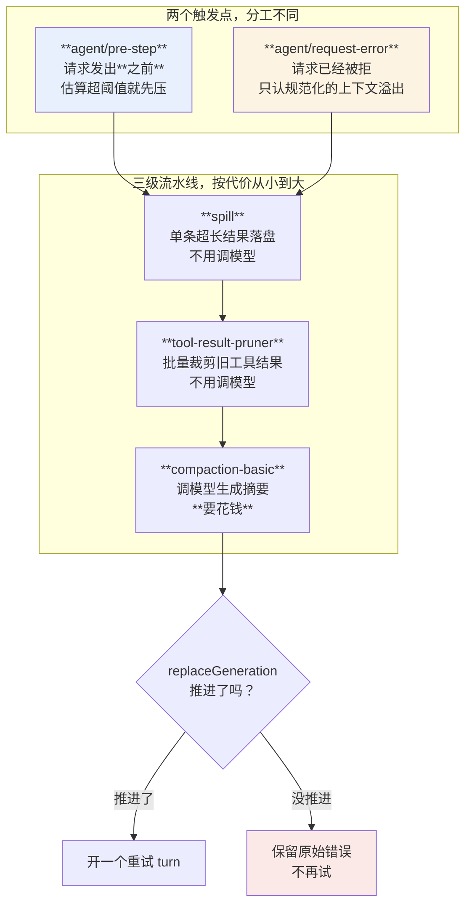

> **本章属于第四部分，是易腐区。** 这些子系统的实现细节最具体，也最可能在 rc 阶段被重做。不变量层（surface 的定义、触发点的分工、进展保证的思路）会留下来，具体的字段名和默认值可能变。
> 本章形态：【只读】。

第 2 章说上下文窗口是预算不是缓冲区。第 11 章算了前缀的账。这一章讲**预算超了之后怎么办**。

假设你已经从 Claude Code 或 Codex 那儿知道"上下文满了会自动压缩"。这一章只讲 dsh 独有的三件事：**它怎么度量、压缩怎么落到日志上、以及压缩重试为什么不会死循环。**

## 15.1 三个不相交的桶

先说度量，因为不度量就没法谈治理。

`token-meter` 把用量拆成**三个不相交的桶**：

| 桶 | 含义 |
|---|---|
| `uncachedInputTokens` | 这次真算了的输入 |
| `cacheReadTokens` | 命中前缀缓存、没重算的部分 |
| `cacheWriteTokens` | 写进缓存的部分 |

外加 `outputTokens`。推理 token 是 output 的细分，**不重复计**。

第 11 章那些实验要读的就是这几个字段。它们的价值在于：**"这次请求花了多少"和"其中多少是白花的"是分开的。** 只看总量看不出前缀被作废了。

**一次真实任务的用量轨迹**（DeepSeek 官方端点，六次模型调用，任务是分三步读一个 1200 行的文件并统计）：

| 第几次调用 | 未命中输入 | 输出 | 缓存命中 |
|---:|---:|---:|---:|
| 1 | 3,867 | 235 | 7,424 |
| 2 | 19,314 | 158 | 11,520 |
| 3 | 19,333 | 1,163 | 30,976 |
| 4 | **107** | 915 | **51,456** |
| 5 | 16,702 | 992 | 52,352 |
| 6 | **454** | 175 | **70,016** |
| **合计** | **59,777** | 3,638 | **223,744** |

**缓存命中占总输入的 78.9%。** 数据在 `assets/ch15/multi-step-session.jsonl`。

两处值得看：

**第 4 次和第 6 次调用，未命中只有 107 和 454。** 那两次是模型拿到工具结果后直接作答，没有新增大块内容——上下文里五万、七万个 token 几乎原样命中。

**第 2、3、5 次的未命中都在一万六到两万。** 那三次分别读进了大块文件内容，新增的部分必须重算。

**这就是"上下文是预算"的具体形态**：同样是七万 token 的上下文，第 6 次调用只花了 454 个未命中 token 的钱。**前缀稳定的时候，长上下文并不等于贵。** 反过来，如果每次都动一下前面的东西（第 11 章那些改动），这七万就要重算七万。

有个细节值得学：用量在请求失败时也计入，但同一个 `(turn, step)` 后来上报的最终用量会**替换**之前的样本，而不是叠加。这依赖会话日志的一条排序性质——一旦某个更晚的 step 报了用量，合法的日志里就不会再有更早 step 的用量。

## 15.2 估算和实测要分清

`token-meter` 还有几个**估算**字段，dsh 对它们的诚实程度值得单独讲。

`contextBreakdown` 把上下文拆成 `systemTokens` / `toolsTokens` / `messageTokens`，看起来很实用。但 README 里紧跟着一句警告：

> All three figures use the measurement service's fixed heuristic and are estimates: **they will not sum to `projectedTokens`** … **CJK text and JSON schemas underprice badly at four characters per token** … Present them as an approximate composition, **never as a total**.

三件事：

**一、启发式是"四个字符一个 token 加结构开销"。** 没有配置项，故意固定。

**二、中文和 JSON schema 会被严重低估。** 这对读这本书的人是直接相关的警告——**你跑中文项目，这个误差是系统性偏低的**。工具 schema 那 27 KB 里全是 JSON，同样低估。

**三、这三个数字不会加起来等于总量，别当总量展示。**

另一个字段 `projectedTokens` 的设计更能说明问题。它是「下一次请求大概要花多少」：**最近一次 provider 真实报的用量，加上从那之后 surface 增减部分的启发式重估。**

> **Only the delta is estimated**, so the figure stays anchored to the provider while reacting the moment content lands.

**只有增量是估的，基准锚在 provider 的真实数字上。**

这个字段为什么存在？README 给了理由，而且这个理由本身就是个好故事：

> compaction summarizes through a direct `ctx.llm.stream()` call and appends no usage of its own, so `pressureTokens` alone reports the pre-compaction prompt until an entire further turn completes.

**压缩自己要调一次模型，但那次调用不产生会话用量记录。** 所以如果只看 `pressureTokens`（最近一次真实用量），压缩完之后它还报着压缩前的大小，直到下一整个 turn 跑完。`projectedTokens` 就是为了填这个窗口期。

**这套「估算 vs 实测锚点」的方法论，是本章最能直接搬走的东西。** 度量一个会变的量时，把"有权威数据的部分"和"只能估的部分"分开，并且在文档里说清哪部分是估的。

顺带一个坑，README 自己列了：这几个占用率字段是**独立的 last-wins 记录，不是一次请求的原子观测**。换模型的瞬间，新的容量会和上一条路由的用量样本配在一起，直到下一次请求报上来。

## 15.3 三级流水线，各管一段

上下文压力上来时，dsh 有三道处理，按代价从小到大：

| 层 | 做什么 | 要不要调模型 |
|---|---|---|
| `spill` | 单个超长工具结果落盘，换一个取回凭据 | 不用 |
| `compaction-tool-result-pruner` | 批量裁剪旧的工具结果 | 不用 |
| `compaction-basic` | 选一段历史，调模型生成摘要替换掉 | **要** |

前两级是模型无关的，先跑。这个顺序有道理：**能不花钱解决的先解决**。压缩要调一次模型，那次调用本身也要花钱。

`compaction-basic` 的默认参数：

| 参数 | 默认 | 含义 |
|---|---|---|
| `thresholdRatio` | `0.8` | 到达 `上下文窗口 × 0.8` 就压缩 |
| `retainRatio` | `0.16` | 最近这部分原样保留，不进摘要 |
| `maxTokens` | `8192` | 摘要调用的生成上限 |
| `compactionRetries` | `1` | 第一次压完还超阈值，再试几次 |
| `maxOverflowRetries` | `1` | 撞上下文溢出后最多重试几次 |

还能按具体的 provider/model 覆盖（`modelPolicies`）。配错了 fail loud：`retainRatio` 不小于 `thresholdRatio` 会在插件加载时就报错。

**图 15-1：估算走主路径，溢出兜底；代次计数器防活锁**

## 15.4 两个触发点，分工不一样

压缩在 dsh 里挂在**两个**不同的事件上，这个分工是设计的一部分：

**`agent/pre-step` —— 管压力。** 在请求发出去**之前**判断：估算的 token 数超阈值了吗？超了就先压缩再发。这是主路径。

**`agent/request-error` —— 管溢出。** 请求已经发出去了，provider 说上下文超了。这是兜底路径。

而且第二条挂得很克制：`compaction-basic` 只认**规范化的上下文溢出**这一种错误，别的错误一概不接，交给 `llm-retry` 或者让它终止。

**为什么要两个？** 因为估算不准（见 15.2 那个中文低估的问题）。只靠 `pre-step` 的估算，迟早会有估低了、请求发出去被拒的情况。只靠 `request-error`，每次都要先浪费一次失败的请求。

两个一起用：估得准就省一次失败，估不准还有兜底。

## 15.5 压缩落到日志上的形状

第 7 章讲过 `surfaceOp: replace`，这里看它的实际用法。

压缩产生三个 `compaction/*` 事件，**全都是 log-only**——它们不进模型可见面：

| 事件 | 内容 |
|---|---|
| `compaction/start` | 拿到日志级的锁 |
| `compaction/summary` | 摘要正文、被遮蔽的范围和 seq 列表、token 数、这次摘要调用的信封（provider、model、usage） |
| `compaction/end` | 结束 |

**摘要本身不是新的事件类型，而是一条带 `surfaceOp: { op: 'replace', start, end }` 的普通 `user/message`。**

为什么这么设计？dsh 的理由是：**只有产生消息的事件才该进模型可见面。** 摘要本质上就是一条消息，没必要为它发明新的 surface 类型。

`compaction/summary` 里记的东西很全，目的是**让那次一次性调用能从日志加代码重建出来**——摘要文本、完整的 provider 原始输出、调用信封、用量。还有一个 `llmStreamCall: true` 标记，表示"产生这个结果确实消耗了本 context 的一次 `ctx.llm.stream()` 调用"。

**这是第 7 章那条规矩的延伸**：不光模型看到的要能重建，模型调用本身也要能重建。

## 15.6 一个必须记住的坑：surface 位置不是 seq 区间

`CompactionResult.shadowedRange` 的注释原话：

> a surface-**POSITION** span, not a numeric seq interval

`start` 和 `end` 是**模型可见面上的位置**，不是日志序号的区间。

而且 replace 之后，**`start` 可以大于 `end`**。

任何"按 seq 区间理解 surface"的心智模型都会在这里翻车。原因回到第 7 章那个 `surfaceOf()` 函数：surface 是折出来的，折的过程中 replace 会做 `splice`，位置会移动，而 seq 只增不减。两套坐标系。

## 15.7 为什么不会死循环

这一节是本章的技术核心。

压缩重试有个明显的风险：压完还是超阈值 → 再压 → 还是超 → 再压……

dsh 的防护是一条**进展保证**，在源码里就一句判断（`packages/compaction/compaction-basic/src/index.ts:191/201/219`）：

> **只有当剪枝或摘要推进了 surface 的替换代次，才开一个新的重试 turn；否则保留原始错误。**

`replaceGeneration` 是一个计数器，surface 每提交一次替换就 +1（`packages/core/session/src/surface.ts:370`）。

逻辑是：这次压缩如果没让代次前进，说明它**什么都没改变**——再试一次也不会有不同结果。那就别试了，把原来那个错误交上去。

三件事要说清楚：

**一、它防的是"无进展重试"，不是终止性。**

`replaceGeneration` 没有上界。这条保证说的是"每次重试都真的改变了 surface"，不是"重试次数有限"。真正限制次数的是 `compactionRetries` 和 `maxOverflowRetries` 那两个配置。

用准确的话说：**它防的是 livelock（活锁），不是保证 termination（终止）。** 两者是不同的性质，混起来说就是不严谨。

**二、为什么度量选代次，不选 token 数？**

因为 token 数是**启发式估算的**（15.2 那个四字符一 token），而代次是**权威计数**。

用一个估算值判断"有没有进展"，会出现"实际压缩了但估算没变"或者反过来的情况。用代次就不会——它要么加了要么没加。

**这条判断很值钱**：给一个可能反复触发的恢复路径设计进展度量时，**度量必须是权威的、离散的、单调的**，不能是估算的连续值。

**三、配套的坑就是 15.6 那个。** 代次推进意味着 surface 被 splice 过了，位置坐标和 seq 坐标进一步分离。

---

上下文治理讲完了。下一章讲 dsh 一个别处没有的能力：**把 Claude Code 和 Codex 当成子 agent 挂进来。**

对正在做选型的人，那一章的结论比技术细节更重要——它意味着你可以先不换底座。

---

> 本章来自《一切皆插件》开源版 · 作者「递归客」  
> 在线阅读完整书系：[inferloop.dev](https://inferloop.dev)  
> 源码仓库：[github.com/diguike/book-deepseek-harness](https://github.com/diguike/book-deepseek-harness)
