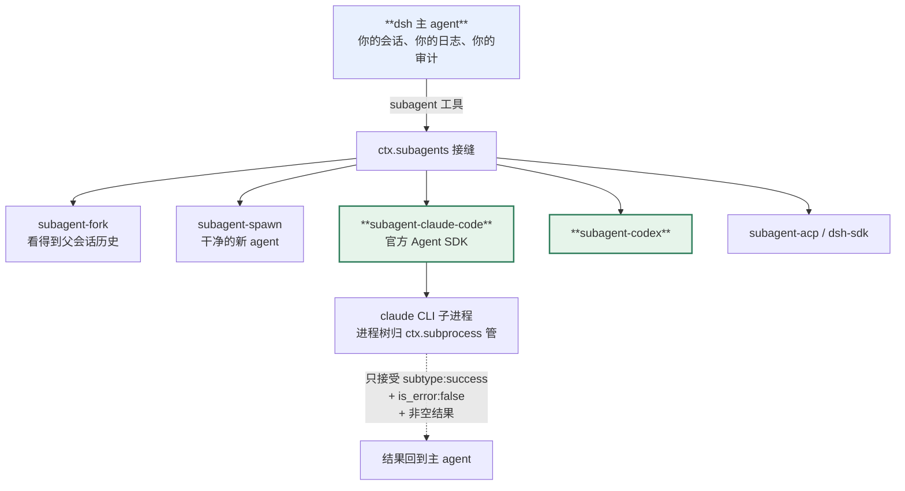

> **本章属于易腐区，而且是全书时效风险最高的一章。** 16.2 节讲的两个 provider 依赖第三方 SDK（Claude Agent SDK、Codex CLI），那两家自己也在快速迭代。这是**双重依赖**——dsh 变了它会变，那两家变了它也会变。
> 本章形态：【只读】。

第 4 章那张选型表里，「成品 harness」那一支下面有四家。选型会上最难受的地方在于：**你得先押注，才能知道押得对不对。**

dsh 给了一条别人给不了的路：**不换底座，先把现有的 Claude Code 或 Codex 当成子 agent 挂进来。**

这一章讲这条路怎么走，以及它的边界在哪。

## 16.1 结论先行：这是迁移路径，不是技术奇观

`packages/subagent/` 下有七个 provider：

| provider | 子 agent 是什么 |
|---|---|
| `subagent-in-process-driver` | 同进程里的一个新 agent |
| `subagent-fork-in-process` | 从当前会话 fork 出来的 agent，**看得到父会话已完成的历史** |
| `subagent-spawn-in-process` | 同进程新起的干净 agent，不继承历史 |
| `subagent-acp` | 通过 ACP 协议连出去的 agent |
| `subagent-dsh-sdk` | 另一个 dsh 进程 |
| **`subagent-claude-code`** | **官方 Claude Agent SDK 起的 Claude Code** |
| **`subagent-codex`** | **Codex** |

后两个不是玩具。它们的实际含义是：

> **你可以用 dsh 当外壳，把现有的 Claude Code / Codex 挂进来跑，观察一个季度，再决定要不要往里走。**

对选型的人来说这句话比后面所有技术细节都重要。你原有的投入不作废——CC 的配置、你团队的使用习惯、已经磨合好的 prompt，都还在那儿跑，只是外面多了一层能审计、能拦截、能换执行环境的壳。

## 16.2 但现在还装不上——实测

上一节那个结论是从源码和 README 读出来的。**动手装的时候撞墙了，这一节讲实测结果，因为它直接影响你能不能用这条路。**

三件事，全部可复现：

**一、这两个 provider 不在任何出厂 bundle 里。**

装完 `@deepseek-ai/dsh@0.1.0-rc.6`，`headless` profile 的树里只有两个 subagent provider：

```sh
$ dsh --profile headless --dump-config | grep 'id: subagent'
- id: subagent
- id: subagent-spawn-in-process
- id: subagent-fork-in-process
```

`subagent-claude-code` 和 `subagent-codex` 都没有。要用得自己装。

**二、它们发到 npm 了，但版本停在 `0.0.1-rc.1`。**

```sh
$ npm view @deepseek-ai/dsh-subagent-claude-code version
0.0.1-rc.1
$ npm view @deepseek-ai/dsh version
0.1.0-rc.6
```

内核已经走到 `0.1.0-rc.6`，这两个 provider 还停在 `0.0.1-rc.1`——**差了一整个次版本号**。同期停在 `0.0.1-rc.1` 的还有 `subagent-acp`、`subagent-dsh-sdk`、`tool-cordis`。

**三、装不上，peer 依赖冲突。**

```sh
$ npm i @deepseek-ai/dsh-subagent-claude-code@0.0.1-rc.1
npm error ERESOLVE could not resolve
npm error   peer @deepseek-ai/dsh-llm@"^0.1.0-rc.6" from @deepseek-ai/dsh-agent@0.1.0-rc.6
```

老版本的 provider 声明的 peer 范围和当前内核对不上，npm 直接拒绝。

**这三条合起来的结论是：**

> **「把 Claude Code 挂成 dsh 子 agent」这个能力在源码里是完整的，但在 2026-08-17 这个时间点，你没法通过 npm 装上它。**

**我试了强装。** `npm i --legacy-peer-deps` 确实能把包装进去，但**它把原本能跑的装置弄坏了**——npm 重排 `node_modules` 之后，主程序起不来：

```
Error [ERR_MODULE_NOT_FOUND]: Cannot find package '@deepseek-ai/cordis-plugin-group'
  imported from .../node_modules/@deepseek-ai/dsh-app-boot/lib/index.js
```

而且那个 provider 也没能进树（`--dump-config` 里找不到它）。最后只能删掉 `node_modules` 重装一遍才恢复。

**别用 `--legacy-peer-deps` 绕这个冲突。** peer 范围对不上是真实的不兼容，不是 npm 过于严格。

要用只有两条路：从源码 checkout 跑（`pnpm dsh`），或者等官方把这几个包的版本跟上。

**对选型的含义**：16.1 那句"先不换底座，挂进来观察一个季度"——**方向成立，但今天做不到开箱即用**。如果这是你选型的关键因素，先自己验证一遍它当时能不能装上，别照着这本书的描述做承诺。

这也是 rc 阶段的典型症状：**核心包在快速迭代，边缘包跟不上，而它们之间有 peer 约束。** 第 4 章那条"锁定风险"在这里有了具体形态。

## 16.3 `subagent-claude-code` 是怎么接的

`packages/subagent/subagent-claude-code/README.md` 描述得很细，挑几个有工程价值的点。

**进程归属交给 dsh 管。** provider 调官方 SDK 的 `query()`，但**只有在 SDK 的 `spawnClaudeCodeProcess` 钩子交出一个活的 CLI 句柄之后，这次运行才会被发布**。那个句柄归 `dsh-subprocess` 所有。

这个设计解决的是"孤儿进程"问题：如果发布之前失败或被取消，provider 会关掉 query、终止已经拿到的整个进程树、等它退出，然后才让 `start()` reject。**不会留下一个没人管的 CLI 进程。**

**凭证形状的环境变量会被主动剔除。** 这条藏在 subprocess 接缝里但很重要——要给子进程的 key 必须显式放进 `env`，不会自动继承。默认不泄露。

**结果判定极严。** provider 遍历完整的 SDK 消息流，**只接受**同时满足这几条的 `result` 消息：`subtype: "success"`、`is_error: false`、`result` 非空白，而且后面跟着正常的迭代器结束。

其余一律映射成 `error`：任何 SDK 错误子类型、标了 error 的 success、缺答案、迭代器失败、协议失败、进程失败。

**它既不产生 `max-tokens` 也不产生 `refusal`**——因为跨进程边界拿不到那些细粒度信息，与其猜不如不报。

**取消要赢得结果竞态。** 本地取消和 SDK 返回结果是在赛跑，取消必须赢。`dispose()` 是幂等的：中止运行、请 SDK 优雅关闭、走共享的进程树终止升级、等整棵树退出。

有一句话值得单独记：

> SDK graceful close expresses protocol intent; **the subprocess handle remains the authority for process quiescence.**

**优雅关闭表达的是协议意图，进程真的停没停由 subprocess 句柄说了算。** 跨进程编排里这是个通用教训——别信对方说"我关好了"，自己确认进程没了。



**图 16-1：把现有的 CC/Codex 挂进来当子 agent**。原有投入不作废，外面多了一层能审计、能拦截、能换执行环境的壳

## 16.4 `inheritsParentContext` 是描述，不是保证

接口上有个字段叫 `inheritsParentContext`，看名字像是在声明权限继承。README 特意澄清：

> `inheritsParentContext` is **descriptive rather than enforceable**. It says only whether the child sees completed parent conversation history (`fork` does; `spawn` and the out-of-process one-shot providers do not), **not whether it inherits tools, services, or authority.**

**它只说"子 agent 看不看得到父会话已完成的对话历史"，不说工具、服务、权限。**

权限是另一套机制，而且做得比这个严：

`captureDelegatedPolicyOverrides(parent)` 会在委派边界上把父会话的沙箱覆盖快照下来，并且**把子 agent 的审批策略钉死成 `'never'`——不管父 agent 自己是什么策略**。

理由很实际：委派出去的子 agent 是无人看管的。如果它触发一次审批询问，没人会去点确认，那次询问就会永远挂着。**钉成 never 意味着任何提权请求确定性地被拒绝，而不是卡死。**

这些覆盖会作为 `source: 'delegation'` 的 `sandbox/mode` 和 `approval/policy` 事件写进**子 agent 自己的日志**，写在 fork seed 之后——所以新策略压过旧种子状态，而且**子 agent 的有效策略能单独从它自己的日志重建**。

这是第 7 章那条规矩在委派场景的延伸：**每个会话的真相在它自己的日志里，不用去查父会话。**

还有一个细节：**沙箱的部署默认值不复制。** 如果父 agent 没有显式切过沙箱模式，它就不写 `sandbox/mode` 事件，子 agent 动态跟随部署默认值。只有显式覆盖才继承——**继承的是决定，不是默认值。**

## 16.5 控制面：让模型自己管子 agent

除了 `subagent` 这个发起工具，还有一组控制工具：

| 工具 | 干什么 |
|---|---|
| `list_agents` | 看有哪些子 agent |
| `send_message` | 给某个子 agent 发消息 |
| `interrupt_agent` | 打断某个子 agent |
| `report` | 子 agent 用它交结构化结果 |

这套东西让模型能自己编排多 agent，而不是只能"发起然后等结果"。

查询侧有两个方法值得注意，因为它们的约束很讲究：

`listChildren()` 列直接子 agent，带 `one-shot`/`continuable` 模式、`running`/`inactive` 活动状态、以及一个"有没有孙子"的提示。关键是——**它不加载也不恢复任何子会话**。只读活的会话存储和可选的持久化。

`listDescendants()` 展平整棵树，稳定的前序遍历，每项带 `parentId` 和相对根的 `depth`。

**"不加载就能列出来"这个约束很重要**：一棵深层的 agent 树，如果列一下就要把每个子会话都从磁盘读出来重放，那这个功能没法用。

## 16.6 Ralph：把编排做成插件而不是模式

`tool-ralph` 是 dsh 里我认为最能说明架构哲学的一个包。

它做的事是：**给一串全新的子 agent 交同一个不可变目标，一轮一轮做，直到完成或者用完预算。**

```
ralph({ objective: "把测试覆盖率提到 80%", maxRounds: 10 })
```

每一轮起一个**全新**的子 agent。它拿到的只有：不可变的目标、当前轮次和上限、一句"共享工作区是权威"的指令、以及上一轮的结构化交接。

**父会话的对话历史和之前子会话的历史都不种给它。工作区才是长期记忆。**

关键在 README 的第一句：

> It demonstrates a specialized orchestration policy **as an ordinary plugin** over `ctx.workflowEngine` and `ctx.subagents`: **no Ralph mode or fresh-agent loop is added to `agent-loop`.**

**agent-loop 里没有"Ralph 模式"这个东西。** 这套编排策略完全是一个普通插件，建在两个已有的接缝上。

这就是第 3 章那六个取舍的回报——一个相当特殊的编排范式，不需要动主循环一行代码。

几个约束设计得很硬：

- provider 必须**支持结构化输出**，而且必须报告 `inheritsParentContext: false`。不满足就拒绝启动
- provider 是配置里定死的，作为 `WorkflowStartRequest.subagentProvider` 传下去——**固定脚本无法检查或改变路由**，普通的 `workflow` 工具也不会因此多出一个 provider 选择器
- 交接报告有严格 schema：`status: continue | complete | blocked`，非空摘要、证据、下一步、阻塞说明。**无效、缺失、超长的报告让整个 workflow 失败**，而不是被截断或者被误当成"预算耗尽"
- 普通的子 agent 失败**不重试那一轮**，直接报错并保留上一次成功的交接

最后一条尤其值得学。为什么不自动重试？因为 Ralph 的每一轮都是"从头开始做同一个目标"，失败的那一轮本身就是一次尝试。自动重试等于悄悄多花一轮预算，而调用方看不到。

## 16.7 同会话的目标域：goal

Ralph 是"一串新 agent"，`goal` 是另一条路——**同一个会话里推进一个目标**。

它是事件溯源的：目标状态存在会话日志里，`defaultMaxGoalRounds` 默认 256。`goal-round-driver` 挂在 `agent/*` 事件上驱动续跑。

两者的分工，官方 glossary 说得清楚：**round 是外层策略的一次迭代，round 计数属于那个策略，不数会话里的每个 turn。** goal round 和 Ralph round 是两种不同的 round，各自计数。

第 2 章那张三层时间单位的图，到这里才完整。

## 16.8 我验证到哪一步

按本书的取证纪律，把边界划清楚。

**实测过的**（16.2 节那三条）：出厂 bundle 里没有这两个 provider、npm 上的版本停在 `0.0.1-rc.1`、装不上因为 peer 冲突。这三条都能用一条命令复现。

**没实测的**：16.3 到 16.7 讲的所有机制细节——进程树归属、结果判定的严格程度、取消竞态、委派时的权限钉死、Ralph 的交接契约。**这些来自源码和 README，不是运行观察。**

原因就是 16.2：装不上，跑不了。

如果你要在生产里走这条路（从源码 checkout，或者等版本跟上），建议自己先跑这四件事：

1. 起一次委派，确认**没有孤儿 CLI 进程**留下（`ps` 看进程树）
2. 中途取消，确认取消赢了结果竞态，整棵进程树退干净
3. 故意让子 agent 失败，看错误怎么映射——16.3 讲的那套"只接受严格成功、其余全映射成 error"的判定，在你的场景里可能把一些你认为算成功的情况判成失败
4. 确认子 agent 的审批策略确实被钉成了 `never`，一次提权请求会被确定性拒绝而不是挂起

---

下一章讲第四部分最后一块：**前端也是插件**，以及那个把它推到极致的能力——agent 在活着的进程里给自己写一个插件挂上去。

---

> 本章来自《一切皆插件》开源版 · 作者「递归客」  
> 在线阅读完整书系：[inferloop.dev](https://inferloop.dev)  
> 源码仓库：[github.com/diguike/book-deepseek-harness](https://github.com/diguike/book-deepseek-harness)
