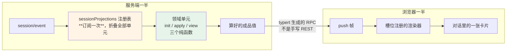

> **本章属于易腐区。** typert、api-gateway、conversation node 是 dsh 里最年轻的几个子系统。末节那个自修改能力更是明确的实验性功能——官方自己没把它放进任何出厂配置。
> 本章形态：【只读】。

第 1 章数过：129 行插件树里，**32 行是前端插件**，占四分之一。

这一章讲那四分之一是怎么回事。重点不是"怎么加一个前端组件"——官方 `docs/cookbook/adding-a-conversation-node.md` 有 233 行讲这个。重点是**为什么前端也能做成插件**，以及这件事需要哪些配套设计。

## 17.1 从浏览器里那张图开始

打开 `dsh web` 的页面，看源码，搜 `__DSH_BOOT__`：

```js
window.__DSH_BOOT__ = {
  "rev": "0ba0dcbd4d39",
  "entries": [
    {
      "id": "@deepseek-ai/dsh-typert-registry",
      "url": "/plugins/@deepseek-ai/dsh-typert-registry/client.js?rev=f41d56e0b747",
      "inject": []
    },
    {
      "id": "@deepseek-ai/dsh-api-gateway",
      "url": "/plugins/@deepseek-ai/dsh-api-gateway/client.js?rev=9e83e9d9c076",
      "inject": ["@deepseek-ai/dsh-typert-registry", "@deepseek-ai/dsh-client-connection"]
    }
  ]
}
```

38 个条目。每个有 id、URL、内容哈希，还有 **`inject`**。

**`inject` 这个词你在第 5 章见过。** 那是后端插件声明依赖服务用的字段。这里是同一个概念——浏览器那半按依赖顺序激活，和服务端那半用同一套心智模型。

整条链路是这样：

1. 一个 npm 包在 `package.json` 里声明 `dsh.client` 字段
2. 服务端的 `client-modules` 插件扫描 loader 已加载的条目，找出所有声明了 `dsh.client` 的
3. 组出上面那张图，注入到页面 `<head>` 的第一个 script
4. 每个包的浏览器半从 `/plugins/<id>/client.js` 取
5. 浏览器侧的模块表按 `inject` 的依赖顺序激活它们

URL 后面那个 `?rev=` 是内容哈希。改一行前端代码哈希就变，浏览器自然拿到新的那份，不用管缓存失效。

还有一个安全细节：注入 `window.__DSH_BOOT__` 时，`<` 会被转义——**因为插件可以往这张图里放字符串，不转义就能从 script 标签里跑出来**。

页面拿不到有效的 manifest 时**直接抛错，不降级启动**。这是第 13 章那条 fail-closed 原则的又一次出现。

## 17.2 前后端各半个插件

一个功能怎么做到"两半"，官方 cookbook 有完整例子。这里只讲结构。

服务端那半干的事：把领域状态算出来，通过投影送出去。
浏览器那半干的事：注册一个渲染器，把送来的成品值画成卡片。

对话界面里的每一种卡片——工具调用卡、计划卡、审批卡、子 agent 卡——都是这么来的。它们不是 UI 代码里的 `switch (type)`，是各自的包贡献的。

浏览器那半的注册长这样：

```ts
export const inject = ['conversationEvents', 'slots']

export function apply(ctx) {
  ctx.slots.inject('conversation.chat.node', () => ctx.slots.register({ ... }))
}
```

**槽位（slot）机制。** 服务端说"这里有一个节点，类型是 X，数据是这些"，浏览器侧注册了类型 X 渲染器的插件把它画出来。没有注册渲染器，节点就不显示——不会崩。

cookbook 里有一条约束值得注意：

> The keyed renderer consumes `node.data` and constrained Location hooks only; **it does not scan the Session event window, Contexts, or Chat Nodes.**

**渲染器只吃发给它的数据，不许自己去扫会话事件。** 这条约束是下一节那个设计成立的前提。



**图 17-1：框架驱动，领域计算，客户端只收成品**。`apply` 遇到不归自己管的事件必须返回**同一个引用**，增量才成立

## 17.3 框架驱动，领域计算

前端要显示"当前有几个待办""这次会话花了多少 token""计划进行到哪一步"这类状态。这些都是从会话日志里算出来的。

最直觉的做法是：让浏览器订阅事件流，自己折算。**dsh 明确不这么干。**

`session-projection` 这个接缝的原则，README 一句话说透：

> **The framework drives, the domain computes**：注册表订阅 `session/event` **一次**，把每个提交的事件穿过每一个单元；领域插件自己不持有订阅，**客户端从不折叠领域事件——它们收到的是算好的值。**

一个领域插件贡献一个 `ProjectionDefinition`，三个纯函数：

```ts
interface ProjectionDefinition<K, S> {
  init(): S                          // 初始状态
  apply(state: S, event): S          // 每个提交的事件过一遍
  view(state: S): SessionProjectionMap[K]   // 算出要发给客户端的值
}
```

外加一个校验器，在数据离开服务端之前验一遍 `view` 的输出。

有一条要求单独提一下，它是增量能成立的关键：

> `apply` … @returns the next state (**same reference when the event is not the unit's**)

**这个事件不归我管的时候，必须返回同一个引用**，不是一个内容相同的新对象。

为什么？因为框架靠引用相等来判断"这个单元的状态变没变"。变了才需要重新 `view`、重新推送、重新渲染。如果每次都返回新对象，那么每一个事件都会让所有投影单元全量重算重推。

**三个纯函数加一条引用相等的约定，换来的是增量更新和可持久化缓存。** 这个形状在函数式编程里有名字，但知道那个名字不会让你做出更好的决策——知道那条"不是我的就原样返回"的约定才会。

## 17.4 前后端之间不写 REST

服务端算好了值，怎么送到浏览器？

**不是手写 REST 接口。** dsh 有一套叫 typert 的东西：从 TypeScript 类型图**生成** RPC 调用描述符。

业务服务继承 `TypertRemoteService`，方法上标 `@Remote` 或 `@RemoteScope`。生成器扫类型，产出调用描述符；服务端的 gateway 和浏览器侧的 client 用**同一份**生成契约。

调用时 gateway 做的事：解析当前描述符、校验**精确的具名参数**、解析注册过的对象或 Context 身份、调用业务方法、**再校验返回值**。

有两个设计判断值得学：

**一、严格模式和 SRC 模式分开。** 严格模式读生成的描述符。SRC 模式是开发期兜底——给那些还没有严格定义的端点用，它解析简单的参数名，且**只接受 JSON 安全的值**。

**关键在这一句：撤回一个已经被观察到的严格定义会失败，而不是退回到弱校验。** 一旦某个端点有过严格定义，就不允许悄悄降级。这防的是"改着改着校验没了还没人发现"。

**二、错误分类很细。** `TypertGatewayError` 区分失败归属于：分发、绑定、provider、查找、Context、参数、还是编解码。跨进程调用出问题时，"是谁的错"比"出错了"有用得多。

## 17.5 自修改：agent 给自己写插件

现在讲把这套东西推到极致的那个能力。

`tool-cordis` 提供五个模型可见的工具：

| 工具 | 干什么 |
|---|---|
| `cordis_inspect_list` / `_query` / `_self` | 只读地查当前进程：有哪些服务、事件、活着的插件、工具、槽位树 |
| `cordis_define` | **记录**一个包的源码（host 半和/或 browser 半），只做语法检查，不执行 |
| `cordis_run` | 在 vm 沙箱里执行 host 半，并把 browser 半广播给所有打开的页面 |
| `cordis_stop` | 停掉，但定义还在，可以再跑 |
| `cordis_undefine` | 彻底删掉定义 |

**模型可以在活着的进程里写一个插件，挂上去，跑，然后卸掉。而且这个插件可以带前端。**

一个"运行中的动态包可以注册额外的模型可见工具"——也就是说 **agent 能给自己造工具**。

这件事之所以可能，全靠前面几章的东西：

- **第 6 章的可撤销 effect**：不能干净卸载的话，"跑一下试试"就是一次性的
- **第 5 章的 fiber 生命周期**：新插件按同样的规则激活和卸载
- **本章的 client modules**：browser 半能被广播给已经打开的页面
- **第 7 章的日志**：`dyn-<n>` 这个 id 同时骑在工具结果和**持久化的展示元数据**上——所以会话重放之后，那张卡片还能寻址到对应的动态包

## 17.6 但它不在出厂配置里

上一节听着很酷。必须紧跟着说清楚它的定位。

`docs/tool-catalog.md` 里对 `tool-cordis` 的标注是：

> **Not in any shipped tree** (a deliberate opt-in — dynamic package code reaches the real runtime)

**它不在任何出厂的配置树里，是刻意的选择加入，因为动态包的代码会碰到真实运行时。**

而且它有前置依赖：这套工具要注入 `ctx.dynamicCordisRunner`（由 `cordis-host-runner` 提供，那个包拥有定义注册表和 vm 沙箱）。**一个没装 runner 的组合，这些工具压根不会激活。**

所以现实的判断是：

**什么时候可以开？** 你自己的开发机、隔离的实验环境、明确知道自己在干什么的探索场景。

**什么时候别开？** 生产、共享环境、任何跑着别人代码或数据的地方。vm 沙箱不是安全边界——Node 的 `vm` 模块从来不宣称能隔离恶意代码。它防的是"意外"，不是"攻击"。

**我没有在本机跑通它，而且现在也装不上。** `@deepseek-ai/dsh-tool-cordis` 发到 npm 的版本是 `0.0.1-rc.1`，和 `subagent-claude-code` 一样掉队在旧版本上，peer 依赖和当前 `0.1.0-rc.6` 的内核对不上（第 16 章 16.2 有完整的实测记录，包括强装会把装置弄坏）。

所以这一节讲的机制来自源码和文档，**不是运行观察**。要试的话得从源码 checkout 跑。这一点按取证纪律标出来。

## 17.7 前端插件化换来了什么，代价是什么

回到第 3 章的取舍六：**默认开在浏览器，代价是终端用户不买账。**

这一章说明了收益的具体形态：

- 对话界面里每种卡片都可以由插件贡献，不用改 UI 代码
- 一个功能可以"前后端各半个包"，一起装一起卸
- 领域状态的计算和渲染分离，框架驱动、领域计算、客户端只收成品
- 前后端契约是从类型生成的，不是手写的

**这些在终端 UI 里做不到。** 终端能画的东西有限，而且没有"注册一个渲染器"这种概念。

代价也是实打实的：

- 一整套只为前端存在的机制——client modules、slots、projection、typert，四个子系统
- 这四个是 dsh 里最年轻的部分，也是最可能被重做的
- 习惯终端的用户要改工作流，而且目前**没有官方 TUI profile**

**要不要付这个代价，取决于你的 agent 产品是不是需要富交互界面。** 如果你的形态是 CI 里跑的一次性任务，这一整章对你没用，直接用 `headless` profile 就好。

---

第四部分结束。

最后一部分讲这本书真正想留给你的东西：**dsh 团队怎么维护一个 50 万行、人和 agent 共同参与的代码库**，以及那套方法里哪些你明天就能用。

---

> 本章来自《一切皆插件》开源版 · 作者「递归客」  
> 在线阅读完整书系：[inferloop.dev](https://inferloop.dev)  
> 源码仓库：[github.com/diguike/book-deepseek-harness](https://github.com/diguike/book-deepseek-harness)
