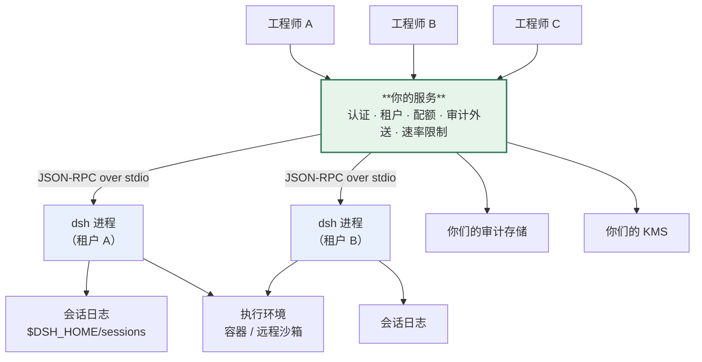

> 本章形态：【必写·实战】。读完应该能画出你自己的部署拓扑图，并填完末尾那份 12 项上线检查表。
> 官方明确把部署硬化写成了 out of scope，所以这一章没有官方文档可以参照——**它也是本书最不可替代的一章**。

第 4 章给了那三条硬事实和一句定位。这一章把定位变成方案。

## 18.1 为什么不能直接开给全组用

先把第 4 章那三条再摆一遍，因为这一章的每个决定都从它们出发：

`packages/host/apiproxy/README.md:81`：

> the gateway is a **single-user local service**

`packages/host/webserver/README.md:21`：

> **No TLS, auth, or origin policy** — binding a non-loopback address exposes the server to that network; deployment hardening (or fronting it with a real reverse proxy) is **deliberately out of scope for the dev-facing v1**.

`packages/client/connection/README.md:9`：

> `dsh web --host 0.0.0.0` is **intentionally unsupported** until remote access has an authentication layer. **The fence is a reachability policy, not authentication.**

第三条那个 fence 确实存在：每个 `/api` 请求都要校验 `Host` 头，必须是回环地址或者显式声明过的可信主机，用来防 DNS rebinding。**但它管的是"谁能连上"，不管"你是谁"。** 没有用户、没有登录、没有权限隔离。

有人会想：套一个反向代理加个 Basic Auth 不就行了？

**不行，而且原因不在网络层。** dsh 的整个数据模型里没有"用户"这个维度：会话按工作目录分组，凭证是进程级的，审批是给"正在看屏幕的那个人"的，`ctx.approval` 的语义就是"问一下当前用户"。你在外面加一层认证，进去之后所有人共用同一套凭证、同一批会话、同一个审批通道。

**所以正确的形态不是"把 dsh 暴露出去"，是"把 dsh 嵌进去"。**

## 18.2 正路：JSON-RPC over stdio

官方设计过这条路：`packages/sdk/server` 是一个插件，提供**按行分隔的 JSON-RPC over stdio**。配套有 TypeScript 客户端和 Python SDK。

它的接法很简单——`inject: ['agents']`，**按 sessionId 拿或创建一个 agent**。其余能力全部来自周围的 `cordis.yml`。

也就是说：你的服务端把 dsh 当**子进程**拉起来，通过 stdio 驱动它。



**图 18-1：dsh 作为引擎被嵌进你自己的服务**。绿色那层是你要写的，它承担 dsh 明确不做的四件事

绿色那一层是第 4 章那张成本表里唯一"没有接缝、得自己写"的部分。

## 18.3 一租户一进程，还是一进程多 session

这是第一个架构决定。

**一租户一进程**

- 隔离彻底：凭证、`$DSH_HOME`、会话存储、执行环境全部分开
- 一个租户把进程搞崩不影响别人
- 代价：进程数量线性增长。第 1 章测过冷启动 1.34 秒、常驻 196 MB——**100 个租户就是 20 GB**

**一进程多 session**

- 内存省，dsh 本来就支持一个进程里多个会话
- 但**凭证是进程级的**（`ctx.credentials` 从环境变量解析），多租户共用一份 key
- 会话虽然分开，但工具执行的沙箱策略、审批策略这些是进程级配置

**我的建议：按信任边界分进程，不按用户分。**

同一个团队、共用同一套凭证和执行策略的人，可以塞进一个进程；跨团队、跨凭证域必须分开。这样进程数是团队数量级，不是用户数量级。

再叠一层：**进程按需拉起、空闲回收**。1.34 秒的冷启动对交互场景可以接受（用户点"新建会话"到能用），比常驻 196 MB × N 划算得多。

## 18.4 凭证换成你们的 KMS

`packages/credentials` 是个标准三角色接缝，教条只有一句：**配置只携带引用，不携带密钥。**

配置里写的是 `apiKeyEnv: DEEPSEEK_API_KEY` —— 一个环境变量名。

平台化的做法是**换掉 provider**：写一个从你们 KMS 或 keyring 取值的实现，注册到 `ctx.credentials`。配置文件里那个引用不用改。

有三个现成的性质直接可用：

- **`resolve()` 每次操作重解一次，不缓存。** 所以轮换密钥不需要重启进程——你的 KMS 那边转了，下一次调用就用新的
- **`describe()` 只回答"配没配、来自哪、能不能写"，从不返回值。** 配置界面显示"已配置"不需要拿到密钥
- **遮蔽 fail loud**：同一个凭证在多处定义时报错，不静默取其中一个

## 18.5 审计外送，以及那个必须自己补的洞

`session-telemetry` + `session-telemetry-otel` 是现成的 OTLP/HTTP 导出。三档模式：

| 模式 | 行为 |
|---|---|
| `FULL` | 每条投影记录立刻交给 OTel SDK |
| `FEEDBACK_ONLY` | 只有用户主动提交 `feedback/record` 时，才回放并导出那之前的会话日志后缀 |
| `DISABLED` | **默认**。连 coordinator、provider、processor、exporter 都不构造 |

授权是**正向且 fail-closed** 的：只有 `FULL` 接受直接的 `emit()` 调用；`FEEDBACK_ONLY` 只把"已经存在会话日志里那个确切的 `feedback/record` 对象"当作同意，独立发出来的总线值一律忽略；`DISABLED` 连管道都不建，就算配了 exporter 也不建。

**这套授权模型设计得很干净，值得学。** 但有两个洞必须你自己补：

**洞一：这个接缝不自带任何脱敏规则。**

`FULL` 模式下离开这台机器的是完整的 `event.data`：用户和助手的消息全文、工具参数和结果（意味着命令输出和文件内容）、完整的系统提示和工具 schema、会话的工作目录。

第 14 章那个插件就是补这个洞的——在记录离开之前跑一遍脱敏规则。**上生产之前必须有这一层。**

**洞二：`shutdownTimeoutMillis` 到点会丢掉还没导出的记录。**

默认 3000 毫秒。对可观测性场景这可以接受（丢几条指标不致命），**对审计场景不可接受**——你不能接受"进程关得快所以那几条审计没了"。

补法是：审计不要只依赖这条链路。第 14 章那个插件把记录直接落本地文件，再由你的采集 agent 收走。**审计要有本地落盘这一跳，别做成纯内存转发。**

## 18.6 成本归因

平台要回答"这个月各团队花了多少"。

`token-meter` 提供的字段第 15 章讲过：三个不相交的桶加 output。归因需要的关联字段来自会话日志：

- `session.id` —— 每个会话的身份
- `session.parent_id` 加 `seed_length` —— 串起 fork 谱系。子会话的用量该算给谁，取决于你们的规则，但**谱系关系是现成的**
- OTel 那边靠 `(session.id, event.seq)` 去重

**一个警示写在这儿**：`llm-retry` 的 README 说了，always 模式会无限重试**永久性错误**（认证失败、配额用尽、无效请求），并且原话是「deployments own provider-specific cost and latency controls」——**成本和延迟的控制归部署方**。

翻译过来：**这是你的活，不是 dsh 的活。** 一个配错了的认证信息加上 always 重试，能烧掉一笔可观的钱。上线前把重试策略和熔断放进检查表。

## 18.7 内部分发：preset 和 bundle 两层

平台要发一套标准配置给各团队，还要允许他们微调。dsh 有两层可用：

**bundle 层（粗）**：发一个内部 npm 包，里面是你们的基础配置。各团队的 profile 把它列进 `dsh.profile.bundles`，再叠自己的 patch 层。第 12 章讲过合成规则。

**agent preset 层（细）**：`packages/preset/agent-presets`。一个 preset 是一个装着 `agent.cordis.yml` 的目录，三个性质对平台特别有用：

- **roster 每进程只挂一次**（standing scope），多个 session 共享同一份工具和 prompt 注册，不重复占内存
- **roots 带信任级别，只有 `user` 信任的 root 可写。** 平台发的那份放只读 root，团队自己的放可写 root
- **坏掉的 preset 以 `broken` 加原因列出，不是被跳过。** 这条很重要——静默跳过意味着某个团队的配置失效了却没人知道

分发的物理形态：内部 npm registry 发 bundle，`dsh plugin --profile x add` 装。preset 目录可以用配置管理工具下发。

## 18.8 灰度和回滚

第 12 章讲过 HMR 的事务性重组：改配置失败会**保留上一棵好树**并广播 `hmr/config-update-failed`。

平台层面的灰度建在这上面：

- 同一个 bundle 的两个版本可以在不同 profile 里并存
- 先给一个团队的 profile 换版本，观察
- 出事把那层 patch 撤掉，树自己退回去

再加一条运维纪律：**把每个 profile 的 `--dump-config` 输出纳入版本管理。** 升级之后 diff 它。rc 阶段的破坏性变更大多会先反映在这棵树的变化上——某行的 id 改了、config 字段换名了、某个包被拆了。这是你最早的预警信号。

## 18.9 执行隔离

第 13 章那个演示到这里落地：把 fs 和 subprocess 的 provider 换成指向隔离环境的实现，Bash、PTY、LSP 整体跟着走，二十几个工具零改动。

三个务必记住的点：

**一、延迟代价是真的。** 第 13 章实测：本地 7ms、同机容器 357ms，**51 倍**。远程还要再加网络往返。生产做法是常驻容器加 exec 进去，或者按会话池化——那是 provider 该优化的事，消费者不需要知道。

**二、两个接缝必须同源。** 第 13.7 节那个空白：`fs-e2b` 加 `subprocess-local` 是一个**合法但错误**的配置，类型系统不管，invariant 也不查。**把这条写进你们的配置校验里**，别指望框架帮你拦。

**三、沙箱不可用时它会拒绝执行。** 我在本机就撞到了（第 14 章那条真实的审计记录）：

```
Error: sandbox mode "workspace-write" is requested but no sandbox backend
is usable on this host; refusing to run the command unconfined.
```

**这是好事**，但你的部署脚本得保证目标机器上有可用的后端（Linux 装 bubblewrap，或者用 Landlock），否则 agent 一个命令都跑不了。

## 18.10 上生产前的 12 项检查

按上面的顺序整理成一份可以直接用的清单。

**架构**

1. dsh 是被你的服务嵌起来的，不是直接暴露的。确认没有任何 `--host 0.0.0.0`
2. 进程模型定了：按信任边界分进程，不按用户分。空闲回收策略有了
3. 认证、租户、配额、速率限制在外层实现，不指望 dsh

**凭证与数据**

4. `ctx.credentials` 的 provider 换成了你们的 KMS，配置文件里只有引用
5. 审计外送**有脱敏层**，跑过带敏感数据的实测，确认命中
6. 审计有**本地落盘**这一跳，不是纯内存转发（`shutdownTimeoutMillis` 会丢数据）
7. 会话日志的长期可读性有方案——`SESSION_FORMAT_VERSION` 是 `0`，无兼容承诺，**别直接依赖它的原始格式做审计资产**

**执行**

8. 目标机器上沙箱后端可用，跑过一次真实的 bash 调用验证
9. 如果换了执行环境：fs 和 subprocess 的 provider **同源**，配置校验里有这条
10. 执行延迟测过，容器不是每次现起

**成本与运维**

11. `llm-retry` 的策略审过，永久性错误不会无限重试；有熔断
12. 每个 profile 的 `--dump-config` 输出进了版本库，升级流程里有 diff 这一步

---

平台搭起来了。最后三章讲另一件事：**dsh 团队自己是怎么维护这个代码库的**，以及那套方法里哪些你明天就能用。

---

> 本章来自《一切皆插件》开源版 · 作者「递归客」  
> 在线阅读完整书系：[inferloop.dev](https://inferloop.dev)  
> 源码仓库：[github.com/diguike/book-deepseek-harness](https://github.com/diguike/book-deepseek-harness)
