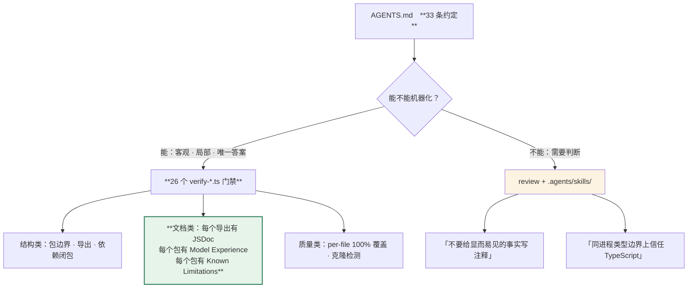

> 本章形态：【只读】，但末尾那两个门禁脚本建议在**你自己的仓库**里跑一遍。
> 本章讲的不是 dsh 怎么用，是 dsh 团队怎么写代码。**对读者的可迁移价值可能高于前面十八章。**

dsh 是一个 50 万行的代码库，由人和 agent 共同维护。它的工程约束体系是目前能找到的、最完整的公开样本。

这一章拆开它，回答一个具体问题：**哪些约定能变成机器门禁，哪些不能。**

## 19.1 先把数字说准

我第一轮调研时统计过 dsh 的工程约束规模，**五个数字全错，而且错的方向完全一致——都往"更宏大、更自动化、更严格"偏**。前言里交代过这件事，这里给准确版本：

| 我最初写的 | 实际 | 怎么错的 |
|---|---|---|
| AGENTS.md 约 40 条规则 | **33 条**（`grep -c "^- " AGENTS.md`） | 拍脑袋 |
| 几乎每条都配一个 verify 脚本 | `scripts/verify-*.ts` **34 个文件，其中 8 个是验证器自己的测试**，真门禁约 **26 个** | 数了文件名 |
| Agent Notes 1372 篇 | **688 篇**（1372 是含 `.zh.md` 的文件数） | 中英双语数了双倍 |
| docs 324 篇双语 | **英文 110 + 中文 105**（324 含 `.i18n.yaml`） | 同上 |
| 生成器会校验 `@mode` 一致性 | **不会**，原文是 "can check" | 把情态动词升级成断言 |

（**Agent Notes** 是 dsh 每个包里留给 agent 的交接笔记，20.3 节细说。）

**准确的说法是：33 条约定，约一半由 26 个门禁强制，其余靠 review 和 skill。**

这个更弱的说法一点不损伤论点，反而让本章的真问题浮出来了：**剩下那一半为什么不能机器化？**

## 19.2 能机器化的：客观的、局部的、有唯一答案的

先看能的那批。按门禁检查的东西分类：

**结构类** —— 包边界、导出、依赖关系

| 门禁 | 查什么 |
|---|---|
| `verify-package-invariants` | 包的结构约定 |
| `verify-package-paths` | 路径规范 |
| `verify-node-next-types` | NodeNext 模块解析下类型能不能被消费 |
| `verify-runtime-closure` | 运行时依赖闭包完整 |
| `check-workspace-constraints` | workspace 依赖约束 |
| `knip` | 死代码、没用到的导出 |

**文档类** —— 这一类是 dsh 最有特色的

| 门禁 | 查什么 |
|---|---|
| `verify-export-jsdoc` | **每个导出都有 JSDoc**，函数型导出必须有 `@param`/`@returns` |
| `verify-package-readme-model-experience` | 每个包 README 有 `## Model Experience` |
| `verify-package-readme-limitations` | 每个包 README 有 `## Known Limitations and Deferred Work` |
| `verify-doc-budgets` | 文档字数上限 |
| `verify-md-links` / `verify-doc-refs` | 链接和引用有效 |
| `verify-mermaid` | 图能渲染 |
| `verify-translation-pairing` | 中英文按段落配对，没漂移 |

**质量类**

| 门禁 | 查什么 |
|---|---|
| `test:coverage` | **per-file 100% 覆盖**（带显式豁免清单） |
| `jscpd` | 跨文件代码克隆 |
| `verify-cordis-config` | 配置里的裸包名必须出现在解析清单的依赖里 |

这些的共同点：**判断标准是客观的，检查范围是局部的，答案是唯一的。** 一个导出有没有 JSDoc，扫一遍 AST 就知道。

## 19.3 不能机器化的：需要判断的

AGENTS.md 里另外那些条，随便挑几条看：

> Do not comment on facts obvious from code.
> （不要给代码里显而易见的事实写注释。）

> Prefer symmetry for parallel values; unexplained asymmetry usually signals a missed extraction.
> （平行的值优先保持对称；无法解释的不对称通常意味着漏了一次抽取。）

> An empty `catch` names what it swallows and why nothing else can reach it; keep the `try` to one statement.
> （空的 catch 要写清它吞掉了什么、为什么别的到不了这里；try 里只放一条语句。）

> **Trust TypeScript at typed same-process boundaries.** Do not add runtime validation, fallback behavior, or hostile-input tests solely for values the static interface requires.
> （在同进程的类型化边界上信任 TypeScript。不要仅仅因为静态接口要求某个值，就给它加运行时校验、兜底行为或者恶意输入测试。）

最后这条特别值得看，因为它反直觉——**它明确禁止过度防御**。然后紧跟着列出哪些边界必须校验：解析器和配置、队列、模型和工具的 JSON、持久化和文件、worker、进程、wire。

**"哪里该校验、哪里不该"是一个判断，不是一条规则。** 机器能查"这里有没有校验"，查不了"这里该不该有校验"。

这就是那一半的性质。dsh 的处理办法是把它们交给 review 和 **skill**——`.agents/skills/` 下有一批给 agent 用的技能包，比如 `dsh-prose-standard`（散文标准）、`dsh-code-review`、`dsh-find-simplifications`。**规则给人看，skill 给 agent 用。**



**图 19-1：一半能机器化，一半不能**。绿色那格是本章建议你抄走的

## 19.4 头号可迁移实践

现在讲我认为这本书里最值得单独拎出来的一件事。

**每个包的 README 必须有 `## Model Experience` 小节，里面必须有 `#### KV Cache effect`。有机器门禁。**

`docs/cookbook/adding-a-package.md` 规定 KV cache 那段必须落进四种语义分类之一：

| 分类 | 含义 |
|---|---|
| `append-only` | 只往后追加，不动已有前缀 |
| `prefix-stable` | 满足某些条件时前缀不变，条件要写清楚 |
| `replacing` | 会替换更早的请求 token |
| `independent` | 独立的模型请求，和主链路前缀无关 |

而且要点名"本包哪些改动会让复用失效"。

**这条约束的本质是：把「这个包让模型看到什么、对缓存有什么影响」当成公开 API 来管。**

改了它就是 breaking change，所以要进 CI 门禁。

给做后端的读者一个类比：**这相当于把「模型可见面」当 OpenAPI 契约管。** 你不会允许有人静悄悄改一个对外接口的响应字段，同理不该允许有人静悄悄改模型看到的 token 序列。

### 分布要如实说

第 11 章给过统计，这里再强调一次，因为这是本章可信度的关键：

- 268 个包 README，**215 个**有 `#### KV Cache effect`
- 其中 **110 篇不到 80 字符**，是样板（最多的一句是 "None; this package neither assembles nor sends a provider request."）
- **58 篇超过 150 字符**，是实质分析

**覆盖率是真的，门禁是真的，"215 个包都写了硬货"不是真的。** 不碰模型请求的包写一句"与我无关"，这恰恰是这套机制该有的样子——它保证的是**每个包都被问过这个问题**，不是每个包都有话说。

### 一个真实的反例

第 11 章那个数据在这里有了另一层意义。

`system-prompt` 包的 README 里那句话：

> reordering changes cache shape but not semantic content

**"重排会改变缓存形状，但不改变语义内容"** —— 我在第 11 章量到的具体数字是：换两个工具的顺序，**缓存命中从 98.8% 掉到 0%**。

如果没有这条 README 约束，这个事实会藏在某个人的脑子里。有了它，它是这个包公开契约的一部分——任何人改这个包之前都会看到。

## 19.5 包自己带运行时不变式

除了静态门禁，dsh 还有一层运行时的。

每个包发一个 `./invariant` 伴生插件，用**自己的 npm 包名**注册检查。注册表（`ctx.invariants`）管选择、名字预留、子 fiber 生命周期、以及**把失败归属到具体的包**。

规矩很具体（AGENTS.md）：

> **Runtime invariants assert owned relationships.** Check authoritative event streams or mutable data, **not service or method presence, plugin metadata or effects, or fixed pure examples.**

**只能断言权威的事件流或可变数据，不能断言"某个服务存在""某个方法存在"。**

为什么？因为后者是静态结构，TypeScript 和门禁已经管了；不变式该管的是**运行中的关系**，比如第 9 章那条"请求里的消息必须等于从日志推导的结果"。

**一个术语澄清**：这是 runtime verification 意义上的**监视器**，不是 Hoare 逻辑那种静态验证过的不变式。**抓不到不等于成立。** 第 9 章讲那条等式时也强调过——它的有效性还依赖监听器顺序（靠 `prepend: true` 抢在可能短路的监听器前面）。

写清楚这个限定，比把它说成"定理"可信。

## 19.6 散文标准也是可执行的一部分

`.agents/skills/dsh-prose-standard/` 是一份给 agent 用的写作标准。挑几条：

> Comments and docs state **complete contracts and context, not reasoning transcripts.**
> （注释和文档陈述完整的契约和上下文，不是推理过程的流水账。）

> **Do not use metaphors.**
> （不要用比喻。）

> Before writing `contract`, `boundary`, or `shape`, ask whether a more exact term names the subject: write `response fields`, `JSON validation`, or `ESM exports` instead of `response shape`, `validation boundary`, or `module shape`.

最后这条最有意思：**在写"契约""边界""形状"这些词之前，先问有没有更精确的词。** 写 `response fields` 不写 `response shape`，写 `JSON validation` 不写 `validation boundary`。

`contract` 这个词被保留给真正的义务——前置条件、后置条件、不变式、兼容承诺。`boundary` 保留给真实的进程、wire、安全、事务、生命周期边界。

**这条是我在这本书里努力遵守却经常失守的一条。** 泛词好写，精确词要想。

## 19.7 在你自己的仓库加两个门禁

前面都是转述别人的。这一节给能直接跑的东西。

**门禁一：模型可见面必须有说明**

```ts
// scripts/verify-model-experience.ts
import { readdirSync, readFileSync, statSync } from 'node:fs'
import { join } from 'node:path'

const ROOT = 'packages'
const REQUIRED = '## Model Experience'
const CACHE = '#### KV Cache effect'
// 明确豁免的包，每一项都要写理由
const EXEMPT = new Set<string>([
  // 'packages/util/brand',  // 纯类型工具，不碰任何请求
])

const failures: string[] = []
for (const group of readdirSync(ROOT)) {
  const groupDir = join(ROOT, group)
  if (!statSync(groupDir).isDirectory()) continue
  for (const pkg of readdirSync(groupDir)) {
    const dir = join(groupDir, pkg)
    if (!statSync(dir).isDirectory()) continue
    if (EXEMPT.has(dir)) continue
    const readme = join(dir, 'README.md')
    let text = ''
    try { text = readFileSync(readme, 'utf8') } catch {
      failures.push(`${dir}: 没有 README.md`); continue
    }
    if (!text.includes(REQUIRED)) failures.push(`${dir}: README 缺 "${REQUIRED}"`)
    else if (!text.includes(CACHE)) failures.push(`${dir}: "${REQUIRED}" 里缺 "${CACHE}"`)
  }
}

if (failures.length) {
  console.error(`模型可见面说明缺失（${failures.length} 处）：`)
  for (const f of failures) console.error('  ' + f)
  console.error('\n每个包都要回答：它让模型看到什么？改动它会让多少前缀缓存失效？')
  console.error('不碰模型请求的包写一句 "None; this package neither assembles nor sends a provider request." 即可。')
  process.exit(1)
}
console.log('模型可见面说明：全部通过')
```

**这条门禁的价值不在于逼人写文档，在于逼人回答那个问题。** 大部分包写一句"与我无关"就过了，剩下那些会开始认真想。

**门禁二：注册必须返回 disposer**

第 6 章那条规矩的静态版本。检查所有名为 `register*` 的方法有没有返回值：

```ts
// scripts/verify-register-returns-disposer.ts
// 简化版：正则扫。生产版建议走 TypeScript AST。
import { readFileSync } from 'node:fs'
import { globSync } from 'node:fs'

const failures: string[] = []
for (const file of globSync('packages/**/src/**/*.ts')) {
  const text = readFileSync(file, 'utf8')
  const re = /^\s*(?:public\s+)?(register\w*)\s*\([^)]*\)\s*(?::\s*([^{]+))?\{/gm
  for (const m of text.matchAll(re)) {
    const [, name, ret] = m
    if (!ret || !/Disposer|\(\)\s*=>|void\s*\|/.test(ret)) {
      const line = text.slice(0, m.index).split('\n').length
      failures.push(`${file}:${line} ${name}() 没有声明返回 Disposer`)
    }
  }
}
if (failures.length) {
  console.error('注册方法必须返回撤销它的 disposer：')
  for (const f of failures) console.error('  ' + f)
  console.error('\n理由见第 6 章：不能干净卸载的东西，就不能热插拔。')
  process.exit(1)
}
```

**这两个脚本加起来不到 80 行，但它们守住的是这本书里两条最核心的约束。**

## 19.8 一句诚实的话

本章讲的这套流程，**原始材料是公开的**——AGENTS.md 在仓库根目录，`docs/postmortem/` 有 4 篇公开的事故复盘，cookbook 里有规范。

**这一章的价值在提炼和判断，不在挖到了独家素材。** 具体来说是三件事：把 33 条约定按"能不能机器化"分类、指出剩下那一半为什么不能、以及把最值得抄的那一条单独拎出来给了可运行的脚本。

如果你时间有限只抄一样，抄 `## Model Experience` 那条。**它零迁移成本，明天就能写进你的 PR 模板和 review checklist，而且它解决的是一个真实痛点——没人知道改一个包会怎么影响模型看到的东西和缓存命中。**

---

下一章讲另外半套：**文档怎么做到不会和代码脱节，以及一套让 prompt 改动无处遁形的回归测试。**

---

> 本章来自《一切皆插件》开源版 · 作者「递归客」  
> 在线阅读完整书系：[inferloop.dev](https://inferloop.dev)  
> 源码仓库：[github.com/diguike/book-deepseek-harness](https://github.com/diguike/book-deepseek-harness)
