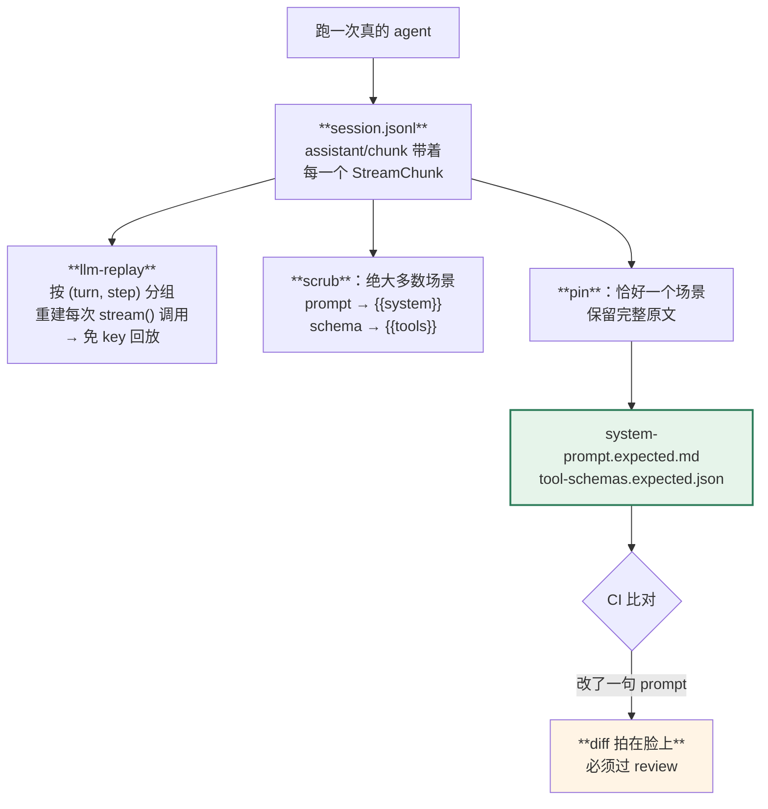

> 本章形态：【只读】＋一个可写的小工具（20.4 节那个生成器）。

上一章讲的是**约束**怎么变成门禁。这一章讲另外两件更难的事：

- **文档怎么做到不会和代码脱节**
- **prompt 和工具 schema 改了，怎么让它无处遁形**

第二件是全书对做 agent 的人最实用的一条工程实践，而且我在别处没见过同等完整的实现。

## 20.1 架构图是代码的投影

先看文档。

一般项目里，架构图是画的。画完那一刻它就开始过期，因为没有任何机制保证它跟着代码走。

dsh 的做法是**生成**。`scripts/` 下有一批生成器：

| 生成器 | 产出 |
|---|---|
| `gen-doc-graphs.ts` | 事件生产者/消费者矩阵、能力接缝图、agent 生命周期时序图 |
| `gen-config-catalog.ts` | 全部配置字段目录（3,151 行） |
| `gen-tool-catalog.ts` | 全部工具目录（1,873 行） |
| `gen-module-graph.ts` | 模块依赖图（1,638 行） |
| `gen-persistence-catalog.ts` | 持久化数据目录（944 行） |
| `gen-cordis-catalog.ts` | Cordis 服务与事件参考 |

数据源是 **TypeScript Program**——不是扫正则，是真的解析类型。

生成的文件头上带着这句：

```
<!-- Generated by scripts/gen-doc-graphs.ts - do not edit by hand.
     Run `pnpm run gen-doc-graphs` to regenerate. -->
```

**架构图不可能和代码脱节，因为它就是代码的投影。**

这句话的分量在于它改变了文档的性质：文档不再是"另一份需要维护的东西"，而是代码的一个视图。你改了事件声明，重新生成，矩阵自己就变了。

## 20.2 但它没那么全能

第 6 章提过一次，这里说完整——因为这是本书取证纪律的一个样本。

我最初写的是「生成器会校验 `@mode` 声明和实际分发点是否一致」。**这是错的。**

`scripts/gen-doc-graphs.ts` 里只有三处 `throw`，和事件相关的那处（第 1207 行附近）抛的是**"某个事件声明了却没有任何分发者"**——死词汇检查。

声明的 mode 和实际用的分发方法，是**并排渲染进同一张表**的：

```
| 事件 | Mode | 声明处 | 分发者 | 监听者 |
| `agent/pre-step` | `waterfall` | runtime-types.ts:231 | agent-loop (`waterfall`) | ... |
```

分发者那一列写着实际调用的方法名。**不一致靠人在 review 的 diff 里看出来。**

官方 primer 的原话也只是 "so the generated catalog **can** check declarations against dispatch sites" —— 是 "can"，我把情态动词升级成了断言。

**这个更弱的事实反而更有教学价值**，因为它示范了一种很便宜的一致性手段：

> **把两个真相并排摆在一起，让不一致自己现形。**

写一个真正的校验器要处理各种边界情况（间接分发、封装过的调用、故意绕过 `ctx.emit` 的场景——事件矩阵的说明里就提到"receiver 和事件名类型也覆盖了那些故意绕过 `ctx.emit` 的分发点，比如子 agent 的生命周期封装"）。而并排渲染成本近乎为零，覆盖率是 100%，代价只是需要有人看 diff。

**很多时候"让问题可见"比"自动拦截"性价比高得多。**

## 20.3 Agent Notes：688 篇，四态，归档即冻结

`.agents/notes/` 是 dsh 的设计决策库。

**688 篇**（含中译共 1,372 个文件），四种状态：

| 状态 | 数量 | 含义 |
|---|---|---|
| `implemented/` | 507 | 已实现 |
| `archived/` | 143 | 已归档 |
| `proposed/` | 25 | 提案 |
| `rejected/` | **11** | 被否决 |

`implemented/` 下再按 architecture / feature / bug-fix / process / simplification / testing 六类分目录。

两条规矩：

**一、非平凡改动必须在同一个 PR 里带一篇 Note。** 只有机械的、局部的编辑豁免。

**二、归档的 Note 冻结——不许改，也不许当作现行权威。**

第二条比第一条重要。ADR 实践里最常见的失败是：文档写了，但过时之后没人标记，后来的人照着一份过期的决策做事。**"归档即冻结"把这个问题从"要靠自觉"变成了"结构上不可能"**——归档目录里的东西按定义就不是现行的。

**和传统 ADR 的区别在于强制力。** ADR 通常是团队约定；dsh 这条有对应的检查脚本（`verify-agent-note-format`、`verify-agent-note-classification`、`verify-archived-agent-notes`）。**门禁 ≠ 倡议。**

对读这本书的人有个直接可用的判断：**rejected 只有 11 篇。** 加上 4 篇 postmortem，"他们试过什么、为什么放弃"的公开素材总共 15 篇。这本书里几处"他们否决过的方案"就是从这 15 篇里挑的——素材有限，所以我没把它做成每章的固定栏目。

## 20.4 给自己的项目写一个事件矩阵生成器

这一节是本章唯一动手的部分，把 20.1 那套搬到 mini-dsh 上。

思路：解析 TypeScript 源码，找出所有 `ctx.on('事件名', ...)` 和 `ctx.waterfall('事件名', ...)` 之类的调用，按事件名归并，输出一张表。

```ts
// mini-dsh/scripts/gen-event-matrix.ts
import { readFileSync, writeFileSync } from 'node:fs'
import { globSync } from 'node:fs'
import { relative } from 'node:path'

interface Site { file: string; line: number }
const listeners = new Map<string, Site[]>()
const dispatchers = new Map<string, { site: Site; mode: string }[]>()

const DISPATCH = /\bctx\.(emit|parallel|serial|bail|waterfall)\(\s*['"]([^'"]+)['"]/g
const LISTEN = /\bctx\.on\(\s*['"]([^'"]+)['"]/g

for (const file of globSync('packages/*/src/**/*.ts')) {
  const text = readFileSync(file, 'utf8')
  const at = (i: number) => ({ file: relative('.', file), line: text.slice(0, i).split('\n').length })

  for (const m of text.matchAll(DISPATCH)) {
    const [, mode, event] = m
    if (!dispatchers.has(event)) dispatchers.set(event, [])
    dispatchers.get(event)!.push({ site: at(m.index!), mode })
  }
  for (const m of text.matchAll(LISTEN)) {
    const [, event] = m
    if (!listeners.has(event)) listeners.set(event, [])
    listeners.get(event)!.push(at(m.index!))
  }
}

// 死词汇检查：有监听者但没有任何分发者
const orphans = [...listeners.keys()].filter((e) => !dispatchers.has(e))

const rows: string[] = [
  '<!-- 由 scripts/gen-event-matrix.ts 生成，不要手改。 -->',
  '',
  '# 事件矩阵', '',
  '| 事件 | 分发方式 | 分发点 | 监听者 |',
  '|---|---|---|---|',
]
for (const event of [...new Set([...dispatchers.keys(), ...listeners.keys()])].sort()) {
  const d = dispatchers.get(event) ?? []
  // 同一个事件被两种方式分发 → 并排列出来，不一致自己现形
  const modes = [...new Set(d.map((x) => x.mode))].join(' / ') || '—'
  const sites = d.map((x) => `${x.site.file}:${x.site.line}`).join('<br>') || '—'
  const ls = (listeners.get(event) ?? []).map((s) => `${s.file}:${s.line}`).join('<br>') || '—'
  rows.push(`| \`${event}\` | \`${modes}\` | ${sites} | ${ls} |`)
}

if (orphans.length) {
  rows.push('', '## 没有分发者的事件（可能是拼写错误）', '')
  for (const e of orphans) rows.push(`- \`${e}\``)
}

writeFileSync('docs/event-matrix.md', rows.join('\n') + '\n')
console.log(`事件矩阵已生成：${dispatchers.size} 个事件${orphans.length ? `，${orphans.length} 个没有分发者` : ''}`)
```

**注意 modes 那一行的处理**：同一个事件如果被两种方式分发过，就把两种并排列出来。这正是 20.2 那个思路——不写校验器，让不一致自己现形。

正则版够 mini-dsh 用。真项目建议走 TypeScript 的 AST，能处理变量间接引用的事件名。

## 20.5 免 key 回放：fixture 就是会话日志

现在讲测试。

`packages/test-support/llm-replay` 让测试**不用 API key** 就能跑完整的 agent。

它的关键设计是：**fixture 就是持久化的会话日志。**

```
<scenario>/session.jsonl        ← 这就是 fixture
```

为什么这能行？回到第 7 章：日志里有 `assistant/chunk` 事件，**每个 chunk 都是原始的 StreamChunk**。按 `(turn, step)` 分组，就能重建每一次 `stream()` 调用的完整 chunk 序列。

> Recording is therefore **"run the real agent once and harvest the `.jsonl`"**.

**录制就是"跑一次真的，然后把日志收走"。** 这个插件自己不录制——录制由快照测试框架做。

而回放是挂在 `llm/stream` waterfall 上的一个监听器（第 8 章那个"回放是策略型监听器"的测试就是这个原理）。

两个我认为特别聪明的设计：

**一、`{{fromRequest:<regex>}}` 占位符。**

有些值是静态录像没法知道的——比如模型必须回显的一个随机生成的 goal id。这个占位符在回放时**从活的请求里抓**：把请求消息的所有字符串叶子拼起来，用正则匹配，**最后一个匹配胜出**，取第一个捕获组填进去。

匹配不到、正则非法、占位符没闭合，**三种情况全部 fail loud**。

**二、`assertConsumed()`。**

在 teardown 时检查：每个脚本都被绑上了吗？每个游标都跑完了吗？

**这条防的是"测试其实没跑到那一步却绿了"**——比断言输出更重要，因为漏跑的测试是绿的。

## 20.6 pin + golden：让 prompt 漂移无处遁形

这是本章的重点，也是我认为整本书里对做 agent 的人最值钱的一条工程实践。

**问题是这样的**：你改了一句 system prompt，或者给某个工具的 description 加了一句话。测试全绿，因为断言的是行为结果。但模型看到的东西变了——可能变好，可能变坏，可能让第 11 章那 42 KB 前缀全部作废。**你不知道。**

`packages/test-support/acp-snapshot` 的解法分两半。

**第一半：绝大多数场景把 prompt 和 schema 抹掉。**

normalizer 里有一组 scrub 函数：

- `scrubSystemPrompts` —— prompt 文本换成 `{{system}}`
- `scrubToolSchemas` —— schema 换成 `{{tools}}`
- `scrubRequestHeaders` —— 请求头的大块内容换成占位符，**结构保留**

这样绝大多数快照测试不会因为改了一句 prompt 就全红——它们关心的是行为，不是 prompt 内容。

**第二半：在恰好一个场景里保留完整原文，落成 golden 文件。**

```
<pin-scenario>/system-prompt.expected.md
<pin-scenario>/tool-schemas.expected.json
```

这个场景叫 **pin**（钉子）。它把这一类请求头的完整内容钉住。

于是：**你改一句 prompt、加一个工具、动一下工具顺序，CI 立刻在 golden 文件上给你一个 diff。**

一整套配套约束保证这件事不会退化：

- **每个 header class 恰好一个 pin。** 多了报错、少了也报错
- **sidecar 内容不许重复。** 两个 pin 生成一样的内容会被拒——用 `systemPromptSource` 指向另一个 pin，**每份不同的版本只提交一次**
- **有合法的运行中 header 变化的 pin，要声明 `expectedHeaderChanges` 数量。** 共享来源的必须声明同样的数量，录制/刷新时会拒绝生成不同字节的申领者
- **未经 scrub 的 JSONL 头会被拒。** 防的是"某个场景忘了 scrub，把 prompt 全文提交进了普通 fixture"
- **子会话如果组出了不同的请求，可以单独声明 pin**（`pinsChildToolSchemas` / `pinsChildSystemPrompts`），而且**子会话的 prompt sidecar 必须和类 pin 不同**——冗余的副本会失败，防止悄悄漂移

**这套机制的价值一句话说完：它把"模型看到什么"变成了受版本管理、有 diff、需要 review 的资产。**

回收第 9 章那条等式：请求里的消息必须等于从日志推导的结果。有了这条不变式，**日志就等于模型看到的一切**；有了 pin + golden，**那份"一切"的每次变动都要过 review**。两者是一套。



**图 20-1：同一份日志，三种用法**。fixture 就是会话日志，pin 让 prompt 漂移无处遁形

## 20.7 和评测书的边界

作者另有一本书讲 agent 评测闭环。两件事容易混，划一下：

| | 管什么 |
|---|---|
| **评测** | agent 做得好不好——任务成功率、pass^k、回归 |
| **本章这套** | 我改了一行 prompt，**请求信封变了哪些字节** |

前者是效果，后者是**变更可见性**。

一个具体场景说明为什么两者都要：你把某个工具的 description 改短了。评测跑下来成功率没变（可能采样不够，也可能确实没影响），但 pin 的 diff 会告诉你：这次改动让 27 KB 工具 schema 里的一段变了，第 11 章那张表说前缀从那个位置起全部作废。

**评测回答"要不要改回去"，pin 回答"你到底改了什么"。**

## 20.8 覆盖率与双语流水线

两件小事，一句带过。

**per-file 100% 覆盖是 CI 门槛**（`test:coverage`，不是 `test`），带一份显式的豁免清单。`docs/testing.md` 里解释了为什么用 per-file 而不是总体——总体覆盖率会掩盖某个文件完全没测的情况。

**中英双语靠段落配对防漂移。** `*.md` / `*.zh.md` / `*.i18n.yaml` 三件套，`verify-translation-pairing` 检查两边按段落对得上。改了英文没改中文，门禁会报。

对多语言文档的项目，这个思路可以借鉴：**不要把翻译当成一次性任务，要有机制检测它和原文的偏离。**

---

工程方法讲完了。最后一章回到你自己：**这套东西里哪些能搬走，按团队规模怎么裁，以及什么时候不该学 dsh。**

---

> 本章来自《一切皆插件》开源版 · 作者「递归客」  
> 在线阅读完整书系：[inferloop.dev](https://inferloop.dev)  
> 源码仓库：[github.com/diguike/book-deepseek-harness](https://github.com/diguike/book-deepseek-harness)
